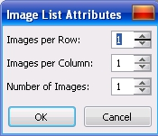

# Инструмент Image Sprayer tool (Распылитель) в Corel PHOTO-PAINT

Инструмент **Image Sprayer** (Распылитель) нельзя назвать рисующим в привычном понимании этого слова. Потому что он не рисует фигуры, линии и т. п., а «распыляет» заранее заготовленные изображения. Если вы уже работали в Corel Draw, то этот инструмент наверняка будет вам знаком, потому что **Image Sprayer** (Распылитель) имеет аналог в Corel Draw – _Sprayer_. Приемы работы, элементы управления и диалоговые окна этих инструментов также похожи. Однако, если в Corel Draw мы имели дело с векторными объектами, то в Photo-Paint будем иметь дело с растровыми изображениями. Эти изображения хранятся в виде списков, в файлах с расширением **.cpt**. Работа с этим инструментом достаточно проста. Один щелчок мышью размещает в окне изображения одну «картинку» из списка, а при рисовании инструментом, «картинки» последовательно появляются вдоль мазка. Как и другие инструменты, инструмент **Image Sprayer** (Распылитель) имеет свою собственную Панель свойств (рис. 1).

1\. Раскрывающийся список **Brush type** (Тип кисти) – предоставляет доступ к имеющимся заготовкам списков изображений.

2\. Кнопка **Load an image list** (Загрузить список изображений) – открывает диалоговое окно **Load an image list** (Загрузка списка изображений), в котором вы можете выбрать файл списка.

3\. Кнопка **Create spraylist** (Создать список аэрозолей) – открывает одноименное диалоговое окно **Create Spraylist**, для создания нового списка изображений.

4\. Кнопка **Reset** (Сброс) – возвращает список изображений к его сохраненному состоянию.

5\. Счетчик **Size** (Размер) – задает размер разбрызгиваемых изображений. Размер объектов задается в процентах к исходному. При выборе списка, размер устанавливается автоматически. Вы можете его изменить, если первоначальный размер вас не устраивает.

6\. Группа счетчиков **Images per dab and image spacing** (Количество изображений на штрих и интервалы между ними) – верхний счетчик задает количество изображений в штрихе, нижний расстояние между ними в мазке. Чтобы увидеть, как влияют значения в верхнем счетчике, установите значение, например, 2\. Тогда при одном щелчке мышью, появится ни одно изображение, а сразу два. Нижний счетчик задается расстояние между изображениями, которые появляются по длине мазка. Чем меньше значение, тем ближе будут рас-полагаться друг к другу разбрызгиваемые изображения.

7\. Группа счетчиков **Spread and fade out** (Авторасширение и затухание) – верхний счетчик определяет разброс элементов относительно проводимой линии. Нижний, задает степень затухания (увеличения прозрачности) при рисовании.

8\. Раскрывающийся список **Image sequence** (Последовательность изображений) – позволяет помещать изображения в различном порядке. Список возможных вариантов последовательностей состоит из трех пунктов: **Randomly** (Случайно); **Sequentially** (Последовательно); **By Direction** (По направлению). Если выбран вариант **Randomly** (Случайно), то изображения, составляющие кисть, размещаются в случайном порядке, а если **Sequentially** (Последовательно), то по очереди, однако первое изображение в списке не обязательно будет первым мазке. При использовании варианта **By Direction** (По направлению), смена изображений вдоль мазка будет изменяться при изменении направления мазка.

9\. Кнопка **Orbits** (Орбиты) – включает и отключает орбиты.

10\. Счетчик **Transparency** (Прозрачность) – задает степень прозрачности распыляемых изображений.

Помимо Панели свойств, элементы управления инструмента **Image Sprayer** (Распылитель) имеются в докере **Brush Settings** (Настройки кисти). Они полностью идентичны. Рассмотрим влияние различных параметров на получаемые результаты.

На рис. 2 показано влияние параметров **Images per dab and image spacing** (Количество изображений на штрих и интервалы между ними) на мазок кисти:  
_а_) – изображения входящие в состав кисти;  
_б_) – верхний мазок со значением **Images per dab** (Количество изображений) равным 1, нижний со значением **Images per dab** равным 25;  
_в_) – значение **Image spacing** (Интервал между изображениями) увеличено с 1 до 88.

В качестве исходных изображений были взяты два изображения из кисти **Rope**. Изменение _Количества изображений_ на штрих привело к их «уплотнению» в мазке (рис. 2 _б_). К чему приводит _Увеличение Интервала_ между изображениями входящими в список наглядно видно на рис. 2 _в_.

На рис. 3 показано влияние значений параметров **Spread and fade out** (Авторасширение и затухание) и **Image sequence** (Последовательность изображений) на мазок кисти:  
_а_) – увеличение значения **Spread** (Авторасширение);  
_б_) – увеличение значения **Fade out** (Затухание);  
_в_) – выбрана _Последовательность изображений_ – **Sequentially**;  
_г_) – выбрана _Последовательность изображений_ – **By Direction**

На рис. 4 показано изменение мазка кисти при включении орбит и центра. Мазки сделаны при следующих значениях параметров: **Size** (Размер) = 9; **Images per dab and image spacing** (Количество изображений на штрих и интервалы между ними) = 1 (верхний счетчик) и 50 (нижний); **Number of Orbits** (Количество орбит) = 2; **Radius** (Радиус) = 234; **Rotation Speed** (Скорость вращения) = 29.

На рис. 4 показан мазок кисти с включенным режимом **Orbits** (Орбиты) (вверху) и **Include Center** (Включить центр) (внизу).

Порядок размещения изображений входящих в список можно изменять по своему усмотрению. Для этого нужно нажать кнопку **Create spraylist** (Создать список аэрозолей) на Панели свойств (рис. 1). Открывшееся диалоговое окно **Create spraylist** (Создание списка аэрозолей) (рис. 5) содержит два списка: **Source Images** (Исходные изображения) и **Spraylist** (Список аэрозолей).

Левый список отображает все изображения, находящиеся в файле кисти, а правый – те, которые будут распыляться. Можно удалить выделенные изображения из списка **Spraylist** (Список аэрозолей) кнопкой **Clear** (Очистить). Кнопка **Add** (Добавить) добавляет выбранное изображение из списка **Source Images** (Исходные изображения) в список **Spraylist** (Список аэрозолей), а кнопка **Add All** (Добавить все) добавляет все изображения. Кнопки с двойными стрелками изменяют порядок объектов в списке **Spraylist** (Список аэрозолей), что приводит к изменению порядка их распыления.

С помощью докера **Brush Settings** (Настройки кисти) вы можете сохранить текущую кисть, как новый тип кисти. Для этого настройте необходимые параметры по своему усмотрению и в меню докера выберите команду **Save Brush** (Сохранить кисть) (рис. 6). В открывшемся диалоговом окне **Save Brush** (Сохранение кисти) в поле **Save new brush type as** (Сохранить новый тип кисти как) введите название нового типа кисти. Если вы создаете новый тип кисти на основе существующего, в этом поле будет название текущего типа кисти. В этом случае, при нажатии кнопки **ОК**, Photo-Paint выдаст предупреждение (**Brush type already exist. Overwrite it?**) о том, что существующий тип кисти будет заменен. Поэтому перед сохранением измените имя в поле **Save new brush type as** (Сохранить новый тип кисти как).

Новый тип кисти появится в раскрывающемся списке **Brush type** (Тип кисти). Этот список можно удалить с помощью команды **Delete Brush** (Удалить кисть).

С помощью команды **Edit Current Image List** (Редактировать текущий список изображений) этого же меню можно изменить изображения прямо в файле списка. При выборе этой команды Photo-Paint открывает файл соответствующий текущему списку. По умолчанию файлы списков хранятся в папке **C:\Program Files\Corel\CorelDRAW Graphics Suite X5\Custom Data\ImgLists**.

Можно создать свой собственный список изображений непосредственно из открытого документа. Для этого в меню докера **Brush Settings** (Настройки кисти) выберите команду **Save Document as Image List** (Сохранить документ как список изображений). При создании списка из изображения, Photo-Paint делит изображение на равные части по вертикали и горизонтали. Количество таких частей можно задать в появившемся диалоговом окне **Image List Attributes** (Атрибуты списка) (рис. 7). В этом окне имеется три счетчика. Счетчики **Images per Row** (Изображений в строке) и **Images per Column** (Изображений в столбце) определяют на сколько частей будет разбито изображение по горизонтали и вертикали соответственно. Значения в счетчике **Number of Images** (Количество изображений) изменяются автоматически в соответствии с значениями первых двух счетчиков.

Можно создать новый список из объектов. Для этого необходимо на листе разместить изображения преобразованные в объекты. После этого выберите в меню докера **Brush Settings** (Настройки кисти) команду **Save Objects as Image List** (Сохранить объекты как список изображений). Photo-Paint выдаст вопрос **Do you want to create a directional image list?** (Создать последовательный список изображений?). Если вы нажмете **Да**, то появится диалоговое окно **Directional Image List** (Последовательный список) с одним единственным счетчиком **Number of Images** (Количество изображений). В этом счетчике Photo-Paint автоматически укажет количество объектов находящихся в изображении. После нажатия **ОК**, откроется диалоговое окно **Save an Image to Disk** (Сохранения изображения на диск), где вы можете задать имя и расположение файла списка изображений.