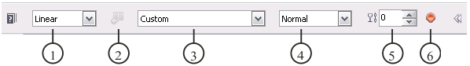
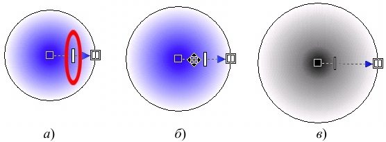

# Инструмент Interactive Fill (Интерактивная заливка) в Corel PHOTO-PAINT

В PHOTO-PAINT имеется еще один инструмент для заливки, очень похожий по своим свойствам на инструмент **Fountain Fill** (Фонтанная заливка). Инструмент **Interactive Fill** (Интерактивная заливка) позволяет применить заливку к изображению интерактивно. В отличие от градиентной (фонтанной) заливки, которая доступна при выборе инструмента **Fill** (Заливка), инструмент **Interactive Fill** (Интерактивная заливка) комбинирует стили **Fountain Fill** (Фонтанной заливки) с уровнями прозрачности.

Панель свойств для инструмента **Interactive Fill** (Интерактивная заливка) содержит все необходимые элементы управления для выбора типа градиента (линейный, конический, радиальный, эллиптический, прямоугольный, квадратный и т.д.), режима взаимодействия цветов, который будет использован во время заливки, стиля и максимального уровня прозрачности заливки. Установив все эти параметры, можно изменить конечные точки заливки и направление градиента перемещением маркеров настройки.

Набор элементов управления Панели свойств инструмента **Interactive Fill** (Интерактивная заливка) несколько отличается от имеющихся на Панели свойств инструмента **Fill** (Заливка) (рис. 1).

1\. Раскрывающийся список **Fill type** (Тип заливки) – предоставляет выбор типов заливок, в котором помимо основных типов (текстурная и растровая), доступны типы градиентной заливки (радиальная, коническая и т. д.). Тип **Flat** (Плоский) не имеет элементов управления. В панели свойств можно изменить только режим наложения. Этот тип заливки использует в данном случае цвет **Foreground Color** (Цвет переднего плана). Вы можете изменить цвет выбрав его из цветовой палитры, редактированием в окне **Foreground Color** (Цвет переднего плана) и любым другим способом. После выбора любого другого типа, в изображении появится интерактивный элемент управления заливкой.

2\. Кнопка **Edit fill** (Изменить заливку) – становится активной только при выборе типов **Bitmap** (Растровая) и **Texture** (Текстура). При нажатии этой кнопки появляются диалоговые окна для редактирования соответствующих типов заливок.

3\. Раскрывающийся список **Fill style** (Стиль заливки) – позволяет выбрать один из доступных стилей. Стиль определяет начальный и конечный цвета градиента, а также переход начального цвета в конечный.

4\. Раскрывающийся список **Merge mode** (Режим слияния) – позволяет выбрать режим наложения заливки на изображение.

5\. Счетчик **Transparency** (Прозрачность) – задает степень прозрачности заливки.

6\. Кнопка **Apply changes** (Применить изменения) – позволяет применить и сохранить в изображении внесенные заливкой изменения.

Работа с инструментом **Interactive Fill** (Интерактивная заливка) заключается в указании щелчком мыши положения начальной точки заливки и затем удерживая нажатой левую кнопку мыши, протащите ее до места, где будет располагаться конечная точка заливки. Это позволяет вам интерактивно, во время перетаскивания мыши, задать угол (направление) заливки и размер заливаемой области. Конечно, если вы примените _Интерактивную заливку_ к выделенной области или объекту, то размер залитой области не будет выходить за пределы выделения или объекта.

На рис. 2, в качестве примера приведен _Радиальный тип_ заливки. В центре находится начальная точка заливки, и на границе «ограничивающей окружности» конечная точка. Одним из элементов, позволяющих изменять заливку, является **Mid-point** (Центральная точка) (на рис. 2 _а_ обведена кружком), которую можно перемещать мышью, что приводит к сгущению цветов (рис. 2 _в_). Можно также перемещать саму заливку. Для этого наведите указатель мыши на линию, соединяющую начальную и конечную точки. Когда указатель мыши примет вид четырехнаправленной стрелки (рис. 2 _б_), вы можете переместить заливку на другое место. Для изменения цвета начальной или конечной точки, сделайте на ней двойной щелчок мышью, а затем в диалоговом окне **Node Color** (Цвет узла) выберите цвет. Для изменения цветов с помощью цветовой палитры, щелкните левой кнопкой мыши требуемый цвет в палитре, чтобы изменить цвет начальной точки или щелкните на цвете одновременно удерживая нажатой клавишу **Ctrl**, чтобы изменить цвет конечной точки. Можно произвольно добавлять новые точки с нужным цветом. Для этого на цветовой палитре выберите цвет и просто перетащите на линию соединяющую начальную или конечную точки. При необходимости, можно менять цвет добавленной точки, точно также как начальной или конечной. Положение добавленных точек можно менять, перетаскивая их мышью вдоль соединительной линии. Таким образом получая необходимые цветовые переходы, однако при использовании многоцветной заливки, использование средней точки становится невозможным. В многоцветной _Интерактивной заливке_, вы можете также менять местами добавленные цветовые манипуляторы. Если какой-либо из них вам уже не нужен, вы можете его удалить, щелкнув на нем правой кнопкой мыши и выбрав команду **Delete** (Удалить) или удалить сразу все добавленные цветовые манипуляторы, выбрав в контекстном меню любого из них команду **Delete All** (Удалить все). Начальный и конечный манипуляторы удалить нельзя.