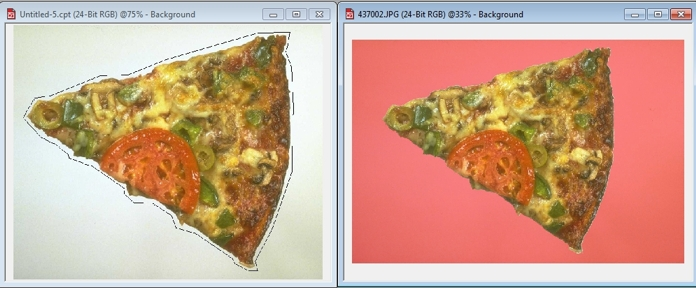

# Инструмент Lasso Mask (Маска лассо)

Инструмент **Lasso Mask** (Маска лассо) функционирует почти как инструмент **Freehand Mask** (Маска свободной формы) за исключением того, что границы выбранной области сжимаются и включают только те пиксели, цвет которых выходит за установленный порог чувствительности. Инструмент **Lasso Mask** (Маска лассо) используется для упрощения выбора цветов в обособленной области, т.е. такой области, которая окружена сильно отличающимися цветами.

**Для использования инструмента Lasso Mask (Маска лассо)**:

1\. Откройте всплывающее меню **Mask Tools** (Инструменты маски) и выберите инструмент **Lasso Mask** (Маска лассо).

2\. Щелкните мышью на изображении там, где нужно начать выделение. Цвет пикселя, на котором произошел щелчок, становится выбранным цветом. На основании этого цвета происходит выделение цветом.

3\. Расширьте область одним из ниже перечисленных методов:

*   Нажмите кнопку мыши и переместите мышь для выбора нужной области.
*   Щелкните мышью, чтобы установить точку трансформации, продолжайте переходить в следующую позицию и щелкать в других точках, пока область не окажется окруженной.

4\. Дважды щелкните мышью, чтобы зафиксировать выделение. Рамка выделения сжимается до тех пор, пока не будет достигнут цвет, выходящий за порог цветовой чувствительности. Все пиксели, цвет которых попадает в цветовой диапазон, включаются в защищенную область.

Для изменения диапазона чувствительности выделения в счетчике **Tolerance** (Допуск) введите значение от нуля до 100.

Большее значение **Tolerance** (Допуска) уменьшает количество пикселей, включаемых в выбранную область, так как больше цветов включаются в защищенную область. Для применения выделения с новыми параметрами повторите шаги предыдущей процедуры с 2 по 4.

Инструмент **Lasso Mask** (Маска лассо) удобен для выделения объектов, лежащих на достаточно однородном по цвету фоне. Достаточно грубо обрисовать объект, чтобы получить качественную маску (см. рис. ниже).

На рисунке: слева – приблизительно «очерченная» инструментом область вокруг объекта; справа – полученная в результате маска