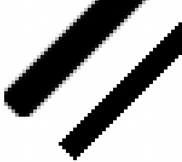

# Инструмент Line tool (Прямая) в Corel Photo-Paint

Для вызова инструмента **Line tool** (Прямая), раскройте список инструментов, щелкнув на треугольнике внизу кнопки **Rectangle tool** (Прямоугольник) и выберите инструмент **Line tool** (Прямая). Этот инструмент имеет небольшой арсенал доступных настроек, которые представлены на его Панели свойств (рис. 1).

Рассмотрим свойства инструмента расположенные на Панели свойств:  
1\. Кнопка вызова раздела Справки по данному инструменту.  
2\. Счетчик **Width** (Ширина) позволяет задать толщину создаваемой линии в пикселях. По умолчанию значение толщины равно 20, что соответствует очень толстой линии, так что лучше уменьшить предлагаемое значение.  
3\. Кнопка **Line color** (Цвет линии). Для изменения цвета создаваемой линии, щелкните на этой кнопке. Появится знакомое уже вам диалоговое окно **Foreground Color** (Цвет переднего плана) в котором вы можете задать цвет. Обратите внимание, что после выбора цвета, изменится и цвет на значке **Foreground Color** (Цвет переднего плана) в области управления цветом.  
4\. Раскрывающийся список **Shape joinst** (Соединения фигур) предоставляет вам на выбор варианты соединения сегментов линии (рис. 2).

*   **Butt** (Торец)
*   **Filled** (Заливка)
*   **Round** (Закругленные)
*   **Point** (Точка)

5\. Из раскрывающегося списка **Merge mode** (Режим слияния), вы можете выбрать необходимый режим слияния. О режимах слияния речь пойдет в следующем разделе.  
6\. Счетчик **Transparency** (Прозрачность) позволяет задать прозрачность создаваемой линии. Чем больше значение в этом счетчике, тем прозрачней будет создаваемая линия (рис. 4).  
7\. Кнопка **Anti-aliasing** (Сглаживание) позволяет включить/отключить режим сглаживания.  
8\. Переключение кнопки **New object** (Создать объект) указывает Photo-Paint, создавать линию в виде объекта или как обычную нарисованную линию.  
9\. Стандартная для Панели свойств кнопка **Hide options** (Скрыть параметры) позволяющая скрыть дополнительные элементы настройки.  
После перечисления основных элементов управления на Панели свойств, рассмотрим подробнее их влияние.

На рис. 2 показано влияние выбора типа соединения в раскрывающемся списке **Shape joinst** (Соединения фигур):  
а). **Butt** (Торец); б). **Filled** (Заливка); в). **Round** (Закругленные); г). **Point** (Точка).

Влияние параметра **Shape joinst** (Соединения фигур) очень заметно при создании ломанных линий, когда сегменты расположены по отношению друг к другу под углом. Кроме этого, обратите внимание расположение концов линий внизу и точек соединения вверху. Дело в том, что все эти линии были нарисованы между двумя базовыми линиями, что по идее должно было гарантировать одинаковую высоту полученных фигур. Однако этого не происходит, потому что Photo-Paint как бы «дорисовывает пиксели» для создания нужного типа соединения. На рис. 2 _в_) видно, как Photo-Paint скруглил концы линий и они получились ниже, чем на рис. 2 _а_) и _б_). А при выборе варианта **Point** (Точка), место соединения оказалось выше, чем в предыдущих случаях. Поэтому при рисовании линий, нужно учитывать, что при изменении типа соединения, может измениться длина сегментов.

Рассмотрим теперь влияние параметра **Transparency** (Прозрачность).

На рис. 3\. я нарисовал наклонную линию с значением прозрачности 0, а под ней другую, но при этом установил значение прозрачности 50\. На рисунке отчетливо видно, что сквозь нижнюю линию просматриваются цветы, что создает иллюзию "тени от линии".  
Здесь наглядно видно действие параметра **Transparency** (Прозрачность).

Параметр **Transparency** (Прозрачность) может принимать значения от 0 до 100\. Однако, если вы просто будете рисовать черную линию на белом фоне, например, установка прозрачности приведет к получению линии серого цвета. Но вы можете самостоятельно поэкспериментировать с влиянием цвета линии и прозрачности на конечный результат.

При создании наклонных линий, создается лестничный эффект, т. к. в растровой графике изображение состоит из пикселей, имеющих квадратную форму. Включение и отключение сглаживания позволяет создать иллюзию гладкости. На рис. 4 видно применение сглаживания к наклонной линии.

На рисунке показана исходная линия с отключенным параметром **Anti-aliasing** (Сглаживание) (справа) и такая же линия созданная при включенном режиме **Anti-aliasing** (Сглаживание) (слева).

Принцип работы _Сглаживания_ виден при большом увеличении. Как видно из рис. 4, при сглаживании Photo-Paint заполняет уступы линии с помощью пикселей серого цвета, что создает иллюзию гладкости. Кроме этого становится заметным и тот факт, что линия нарисованная с включенным параметром **Transparency** (Прозрачность) более толстая, хотя значение толщины в счетчике **Width** (Ширина) было одинаковым для обеих линий.

И наконец, последняя кнопка **New object** (Создать объект). Назначение этой кнопки также вполне станет очевидным, как только вы нарисуете линию при нажатой кнопке **New object** (Создать объект). Линия будет окружена рамкой «бегущих муравьев», а когда вы щелкните на инструменте **Object Pick** (Выбор объекта), то появится ограничивающая рамка с управляющими элементами в виде маленьких квадратов по углам и середине сторон рамки. Теперь вы можете эту линию переместить, наклонить и т. д., т. е. выполнять все действия, которые можно применить к объектам. При отключении этой кнопки, созданная линия будет обычной линией, изменить которую подобным образом уже будет невозможно.

Теперь рассмотрим действия при создании линии:

*   На панели **Toolbox** (Набор инструментов) выберите инструмент **Line tool** (Прямая);
*   На Панели свойств установите нужные вам параметры. Эти параметры нужно задавать до создания линии, а не после, т. к. после того как линия будет нарисована, их изменение не потянет за собой изменение созданной линии;
*   Щелкните мышью в точке, где линия должна начинаться, а затем выполните двойной щелчок на конечной точке. Если вы создаете ломаную линию, состоящую из нескольких сегментов, щелкайте мышью в точках начала и конца сегментов, а в конечной точке последнего сегмента выполните двойной щелчок. Двойной щелчок левой кнопкой мыши завершает создание линии. Также можно завершить создание линии, если на конечной точке щелкнуть мышью при нажатой клавише **Alt**.
*   Для рисования прямых линий или ровных линий через каждые 45 градусов (т. е. под углом 0 или 45, 90 градусов и т. д. ), удерживайте нажатой при создании линии клавишу **Ctrl**.