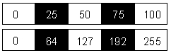
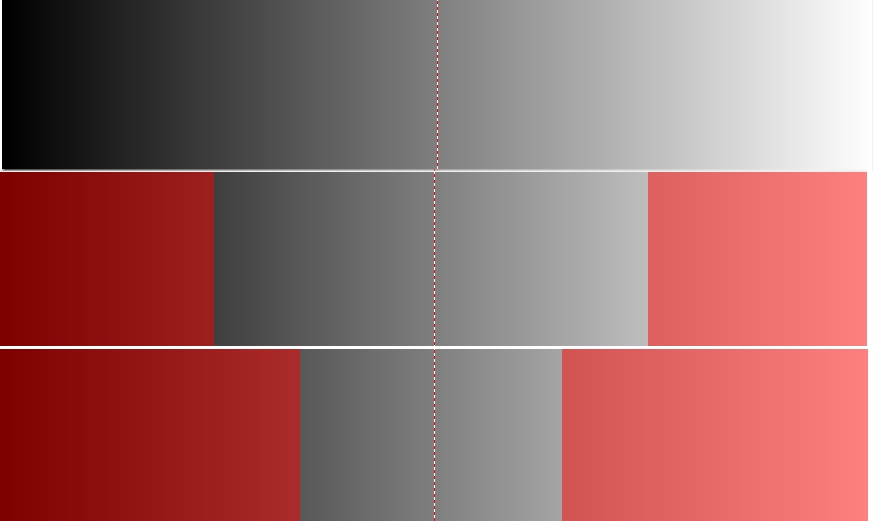
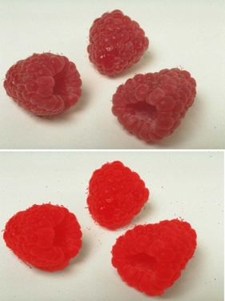
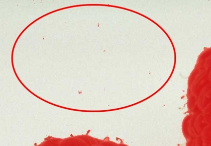

# Инструмент Magic Wand Mask (Маска волшебной палочкой)

Инструмент **Magic Wand Mask** (Маска волшебной палочкой) считается лучшим инструментом выделения практически всеми пользователями. На Панели свойств этого инструмента имеется всего два элементе управления: счетчик **Tolerance** (Допуск) и кнопка **Anti-aliasing** (Сглаживание). Этот инструмент хорошо подходит для определения редактируемой области однородного цвета или области (объекта) окруженной однородным цветом.

### Параметр Tolerance (Допуск)

**Tolerance** (Допуск) – параметр для регулировки цветочувствительности таких инструментов, как **Lasso Mask** (Маска лассо) и **Magic Wand Mask** (Маска волшебной палочкой). Кроме того, значение _Допуска_ также используется в диалоговом окне **Color Mask** (Цветовая маска) для определения того, какие пиксели будут выделены или защищены при создании выделения по цвету. Значения _Допуска_ изменяются в диапазоне от 0 до 100\. Пиксели включаются, если их значение оттенка серого попадает в указанное отклонение. Значения оттенка серого определяются по шкале от 0 до 255 (рис. 1).

Первая строка в иллюстрации представляет шкалу значений **Tolerance** (Допуска). Вторая строка отображает соответствующие значения оттенков серого. Если задать отклонение 25 и щелкнуть на пикселе, являющемся 50% черным, то 50% черный станет исходным цветом, т.е., цветом, на основе которого будет определяться диапазон цветов. Будут включены все пиксели с цветом 50% черный плюс/минус отклонение 25\. Другими словами, выбираются все пиксели с цветом в диапазоне от 25% черный (50 минус отклонение 25) до 75% черный (50 плюс отклонение 25), как показано выше.

С точки зрения шкалы оттенков серого, пиксель, являющийся 25% черным, имеет значение оттенка серого 64 (25% от 255); 75% черный - 192 (75% от 255). Это означает включение пикселей со значениями оттенка серого в диапазоне от 64 до 192.

При работе с изображениями в градациях серого параметр **Tolerance** (Допуск) достаточно прост. Как показано на рис. 2, я воспользовался инструментом **Wand Mask** (Маска волшебной палочкой) со значением параметра **Tolerance** (Допуск), равным 25, щелкнув в центре полосы градаций серого; при этом были выделены оттенки серого от 64 слева, до 192 справа от точки, в которой я щелкнул. После выбора команды **Mask > Remove** (Маска > Удалить) я уменьшил значение параметра **Tolerance** (Допуск) до 15 и щелкнул в той же точке, в результате чего с каждой стороны были выделены оттенки серого от 89 слева, до 165 справа.

При работе с цветными изображениями предсказать результаты применения инструмента **Magic Wand Mask** (Маска волшебной палочкой) достаточно сложно. Инструмент **Magic Wand Mask** (Маска волшебной палочкой) анализирует все три канала в изображении **RGB** или все четыре канала в изображении **CMYK**, после чего выделяет усредненное количество оттенков в соответствии со значением параметра **Tolerance** (Допуск). Именно по этой причине результаты применения инструмента **Magic Wand Mask** (Маска волшебной палочкой) порой оказываются непредсказуемыми.

Пример использования инструмента **Magic Wand Mask** (Маска волшебной палочкой) приведен на рис. 3.

Чтобы выделить фон, достаточно было несколько щелчков инструментом **Magic Wand Mask** (Маска волшебной палочкой) в режиме **Additive mode** (Аддитивный режим). При работе с _Маской волшебной палочкой_, для получения нужных результатов часто приходится подбирать значения **Tolerance** (Допуск). Однако, после получения некоторого опыта, вы сможете достаточно точно сразу определять какое значение необходимо выбрать. Я выбрал значение **Tolerance** (Допуск) равным 6.

Однако, если вы внимательно присмотритесь к выделенной области, вы заметите, что выделен не весь фон. В редактируемой области остались маленькие невыделенные участки, которые хорошо видно при увеличении масштаба (рис. 4).

Очень часто при выделении инструментом **Magic Wand Mask** (Маска волшебной палочкой) возникает такая ситуация. Эти невыделенные участки, как правило очень маленькие и разбросаны по всему изображению.

Бороться с этим можно несколькими способами. Можно щелкать инструментом **Magic Wand Mask** (Маска волшебной палочкой) в режиме **Additive mode** (Аддитивный режим) на «недовыделенных» участках. Однако это не самый удачный и трудоемкий способ. Можно при включенном режиме **Additive mode** (Аддитивный режим) переключиться на инструмент **Brush Mask** (Маска кисти) и «закрасить» необходимые области. Однако в Photo-Paint, для этих целей предусмотрена отдельная команда.

Для того, чтобы «удалить» (выделить) в редактируемой области мелкие защищенные участки изображения, не снимая выделения выполните команду **Mask > Mask Outline > Remove Holes** (Маска > Абрис маски > Удалить пустоты). В результате Photo-Paint автоматически добавит эти участки изображения к редактируемой области.