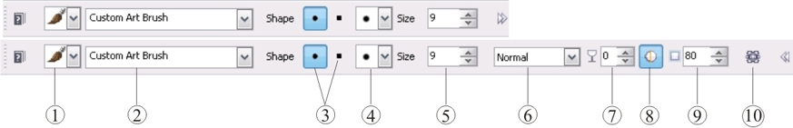
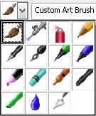
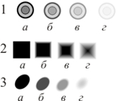

# Инструмент Paint tool (Кисть) в Corel PHOTO-PAINT

В Photo-Paint этот инструмент поражает своим многообразием и возможностями. Количество кистей входящих в состав программы, их разнообразие и множество настроек управляющих различными свойствами кисти, способны удовлетворить любую вашу потребность. Плюс к этому имеется возможность создания и сохранения собственных кистей.

Для работы с Кистью Photo-Paint дает в ваше распоряжение два основных способа управления настройками. Для управления самыми основными свойствами инструмента, используется Панель свойств (часто этого бывает достаточно), а для получения доступа к настройкам всех свойств этого инструмента, используется докер **Brush Settings** (Настройки кисти). Некоторые элементы управления имеющиеся на Панели свойств продублированы в этом докере. Так что вы можете выбирать по своему усмотрению, где изменять параметры.

Следует отметить, что в Photo-Paint имеется не один инструмент, в названии которого используется слово «Кисть». Однако это не должно вас вводить в заблуждение, т. к. эти инструменты нельзя в полном объеме назвать инструментами рисования, хотя они и вносят изменения в изображение.

На рис. 1 показаны два режима Панели свойств инструмента **Paint** (Кисть). Как видно из рисунка, при скрытии дополнительных элементов управления, остаются доступными лишь формы кончика кисти и ее размер, что бывает иногда удобно, если вы не хотите изменять настройки по умолчанию, кроме размера.

Давайте рассмотрим назначение и влияние элементов управления Панели свойств на вид штриха создаваемого кистью.

1\. Список **Brush category** (Категория кисти) – позволяет выбрать категорию кисти, имитирующую тот или иной инструмент рисования.

2\. Раскрывающийся список **Brush type** (Тип кисти) – позволяет выбрать тип кисти в пределах выбранной вами категории.

3\. Группа Shape (Фигура) – имеет в своем составе две кнопки, **Round nib** (Круглый кончик) и **Square nib** (Квадратный кончик), позволяющие переключаться между круглой или квадратной формы кисти или переключиться с другой формы кисти на круглую или квадратную. В эту же группу включен раскрывающийся список **Nib shape** (Форма кончика).

4\. Раскрывающийся список **Nib shape** (Форма кончика) – позволяет выбрать форму кисти из набора входящего в состав Photo-Paint. Если вы создали и сохранили свою кисть, она будет также включена в этот список.

5\. Счетчик **Nib size** (Размер кончика) – задает размеры кисти.

6\. Раскрывающийся список **Merge mode** (Режим слияния) – позволяет выбрать режим наложения краски.

7\. Счетчик **Transparency** (Прозрачность) – задает степень прозрачности мазка кисти.

8\. Кнопка **Anti-aliasing** (Сглаживание) – включает и отключает режим сглаживания, который предотвращает появление «лестничного эффекта» по краям мазка.

9\. Счетчик **Feather** (Размытие) – позволяет задать величину размытия краев кисти. Счетчик становится активным только при работе с круглой или квадратной формой кисти.

10\. Кнопка **Orbits** (Орбиты) – служит для включения и отключения режима рисования с орбитами.

Наверняка, первое с чего вы начнете знакомство с инструментом **Paint** (Кисть) – это список категорий.

В этом списке представлены категории кистей имитирующих различные инструменты рисования, например, фломастер или маркер. При выборе какой-либо категории, вы можете заметить, что значения параметров кисти на Панели свойств автоматически изменяются. В зависимости от выбора категории кисти изменяется и список типов кистей, в раскрывающемся списке **Brush type** (Тип кисти).

По умолчанию при выборе на панели **Toolbox** (Набор инструментов) инструмента **Paint** (Кисть), активна категория **Art Brush** (Художественная кисть). Тип кисти и ее настройки, которые установлены по умолчанию при выборе инструмента **Paint** (Кисть), соответствуют рисованию обычной кистью. Список типов кистей в этой категории довольно большой и больше, чем в остальных категориях. Мы не будем рассматривать подробно все категории и типы кистей, т. к. это в рамках книги просто невозможно. Но вы можете получить представление о них, самостоятельно изучив их, не меняя настроек на Панели свойств. В разделе посвященном инструменту **Paint** (Кисть) мы лишь рассмотрим элементы управления и их влияние на получаемый результат.

На изображении выше показано изменение мазка кисти в зависимости от значений **Transparency** (Прозрачность) и **Feather** (Размытие):  
1\. Влияние значений Прозрачности:  
_а_ – 0; _б_ – 30; _в_ – 60; _г_ – 90.  
2\. Влияние значений Размытия:  
_а_ – 0; _б_ – 30; _в_ – 60; _г_ – 100.  
3\. Совместное влияние значений Прозрачности (П) и Размытия (Р):  
_а_ – П=0, Р=0; _б_ – П=30, Р=30; _в_ – П=60, Р=60;  
_г_ – П=80, Р=100