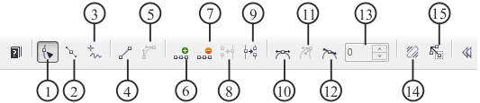
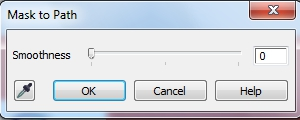

# Инструмент Path (Путь) в Corel PHOTO-PAINT

Инструмент **Path** (Путь) находится на панели **Toolbox** (Набор инструментов) в группе инструментов **Shape Tools** (Фигура). И хотя в этой группе собраны инструменты рисования, инструмент **Path** (Путь) несколько выделяется своими особенностями. Я не стал о нем рассказывать в [главе IV](../Instrumenty-risovaniya-i-zalivki-v-Corel-Photo-Paint/index.md), т. к. этот инструмент применяется по большей части для создания масок. Хотя сам по себе он конечно больше напоминает обычный инструмент для создания линий. Еще одна особенность этого инструмента заключается в том, что команды для работы с ним разбросаны в разных меню, точнее в меню **Mask** (Маска) и меню **Object** (Объект). Как и у всех инструментов этой группы, инструмент **Path** (Путь) имеет свою собственную _Панель свойств_. Если вы посмотрите на нее, то у вас сразу возникнет ассоциация с некоторыми инструментами CorelDraw, как например, _Кривая Безье_, _Фигура_ и _Кривая_. И это неспроста, т. к. он включает в себя возможности всех этих инструментов. Поэтому, если вы знакомы с соответствующими инструментами в CorelDraw, то работа с инструментом **Path** (Путь) не вызовет у вас никаких затруднений. Хотя, лично мое мнение, что аналогичные инструменты в CorelDraw, более гибкие и удобные в работе. Поэтому, когда немного ниже, мы будем рассматривать пример (который возможно, я вынесу отдельным уроком на сайте), я покажу, что гораздо удобней совместно использовать CorelDraw и Photo-Paint.

_Панель свойств_ инструмента **Path** (Путь) представлена на рис. 1\. Прежде чем перечислить элементы управления _Панели свойств_, оговорюсь, что локализованная русская версия в этом случае изобилует неудачными вариантами перевода кнопок, поэтому я буду дополнительно приводить более удачный вариант русификации, который был в более ранних версиях Photo-Paint.

1\. Кнопка **Shape** (Фигура) – переключает инструмент **Path** (Путь) в режим изменения формы путей с помощью перетаскивания узлов и сегментов.  
2\. Кнопка **Bezier** (Кривая Безье) – переключает инструмент **Path** (Путь) в режим рисования путей с помощью _кривых Безье_.  
3\. Кнопка **Freehand** (Свободная) – переключает инструмент **Path** (Путь) в режим рисования произвольных линий, если можно так выразиться, от руки. Более удачным на мой взгляд, было название этой кнопки – _Кривая_.  
4\. Кнопка **To line** (К линии) – превращает криволинейный сегмент в прямую линию. В предыдущих версиях, этот элемент управления так и назывался, _В линию_.  
5\. Кнопка **To curve** (К кривой) – превращает прямолинейный сегмент пути в криволинейный, что позволяет изменять форму сегмента. В предыдущих версиях, этот элемент управления так и назывался, _В кривую_.  
6\. Кнопка **Add node** (Добавить узел) – нажатие этой кнопки добавляет узел на пути.  
7\. Кнопка **Delete node** (Удалить узел) – нажатие этой кнопки удаляет выделенный узел.  
8\. Кнопка **Join nodes** (Соединить узлы) – нажатие кнопки соединяет начальный и конечный узел, дорисовывая прямолинейный сегмент по кратчайшему расстоянию.  
9\. Кнопка **Break node** (Разъединить узел) – нажатие кнопки разбивает путь в выделенном узле.  
10\. Кнопка **Symmetrical curve** (Симметрическая кривая) – превращает выделенный узел в симметричный. Этот элемент управления, раньше так и назывался. По сути, он не делал симметричную кривую, как можно было бы подумать из названия русского варианта этой кнопки.  
11\. Кнопка **Sharp curve** (Резкая кривая)  
12\. Кнопка **Smooth curve** (Сглаживание кривой)  
13\. Счетчик **Smoothing** (Сглаживание)  
14\. Кнопка **Elastic mode** (Гибкий режим)  
15\. Кнопка **Mask from Path** (Маска из пути)

### Что такое пути?

Пути состоят из прямолинейных и криволинейных сегментов с квадратиками на концах, называемых узлами. Путь, который полностью окружает некоторую область, называется замкнутым, а путь, который начинается и заканчивается узлами несоединенных сегментов, называется незамкнутым.  
Пути размещаются в слое, расположенном над изображением, и не зависят от его разрешения. Это означает, что изменение разрешения изображения на них не влияет. Пути предоставляют пользователю мощный прецизионный инструмент редактирования, позволяющий изменять изолированные сегменты созданной пользователем линии. Если необходимо использовать его позже, путь можно сохранить. Его можно использовать в другом изображении, или экспортировать окруженную им область как "обтравленное" растровое изображение.

### Как использовать пути?

Пути предназначены, в первую очередь, для формирования замкнутых и незамкнутых линий. После того как какая-либо часть изображения окружена путем, можно включить ее в рамку выделения, обвести ее кистью и экспортировать окруженную путем область как растровое изображение произвольной формы в программу рисования или макетирования, например, в CorelDRAW. Обвод кистью можно применить и к незамкнутому пути.  
Преимущество того, что линия задается как путь, а не как рамка выделения, в том, что пути хорошо редактируются и, хотя к технике редактирования и применяемым для этого инструментам надо привыкнуть, это окупает затраченные усилия. Можно по отдельности прецизионно редактировать каждый прямолинейный и криволинейный сегмент или же легко перемещать, добавлять, удалять и преобразовывать узлы.  
Пути предоставляют пользователю дополнительные возможности работы с изображением. Хотя средства работы с путями ограничены, возможности пользователя, использующего пути, не ограничены. Это гибкое средство. Если линия задана как путь, это не означает, что она навсегда останется таковой. Путь можно легко преобразовать в выделение, выделение в объект, объект в выделение и выделение в путь. Таким образом, можно выполнить любую операцию, имеющуюся в программе, над любой частью изображения, окруженной рамкой выделения или путем.

И хотя сказанное выше звучит весьма привлекательно, должен честно признаться, что инструмент **Path** (Путь), мой самый нелюбимый инструмент. Приспособиться к нему весьма не просто, однако в некоторых ситуациях, это единственный инструмент с помощью которого можно создать маску нужной формы. Например, при выделении объектов не имеющих четких, контрастных границ, позволяющих отделить их от фона, с помощью инструмента **Path** (Путь) это можно сделать без особых затруднений. Однако этот инструмент предпочтительно использовать для выделения форм. Имеется ввиду, когда объект имеет либо определенную геометрическую форму или плавные границы.

### Создание пути по сегментам

Создание пути подобно соединению точек; при каждом щелчке добавляется узел. Прямо-линейный или криволинейный сегмент соединяет новый узел с предыдущим. Для создания прямолинейного сегмента достаточно щелкнуть в начале и в конце соответствующего отрезка. Для создания криволинейного сегмента щелкните, потащите и отпустите в месте, определяющем направление пути. Во время перетаскивания перемещаются управляющие точки, указывая направление криволинейного сегмента в узле. Кривая появляется в тот момент, когда происходит щелчок, создающий следующий узел.  
При формировании пути в Corel Photo-Paint в зависимости от того, какой создается сегмент, прямолинейный или криволинейный, определяется тип узла. Однако возможности пользователя при этом не ограничиваются. Узлы можно произвольно добавлять, удалять и преобразовывать. Для создания узлов может потребоваться некоторая практика, и потому следует уделить некоторое время экспериментированию.

**Рисование прямолинейных сегментов пути:**

1\. Выберите инструмент **Path** (Путь) на панели **Toolbox** (Набор инструментов), в группе инструментов **Shape Tools** (Фигура) и на _Панели свойств_ щелкните на кнопке **Bezier** (Кривая Безье).  
2\. Щелкните в точке, где должно быть начало сегмента пути.  
3\. Щелкните в точке, где должен быть конец сегмента пути.  
4\. Для создания следующего сегмента повторите шаг 3.  
5\. Продолжайте, пока не будут созданы все необходимые сегменты.  
6\. Щелкните (при необходимости) на кнопке **Shape** (Фигура), на _Панели свойств_, а затем в окне изображения, для деактивации узлов пути.

**Рисование криволинейных сегментов пути:**

1\. Выберите инструмент **Path** (Путь) на панели **Toolbox** (Набор инструментов), в группе инструментов **Shape Tools** (Фигура) и на П_анели свойств_ щелкните на кнопке **Bezier** (Кривая Безье).  
2\. Щелкните в точке, где должно быть начало сегмента пути, и, не отпуская кнопку, перемещайте мышь.  
По мере перемещения управляющая точка удаляется от узла. Расстояние между управляющей точкой и узлом определяет изгиб кривой.  
3\. Отпустите кнопку мыши и щелкните в точке, которая должна быть концом сегмента.  
Появится новый узел, и криволинейный сегмент соединит его с первым узлом.  
4\. Для того, чтобы нарисовать следующий криволинейный сегмент, не отпуская кнопки мыши, перемещайте мышь.  
При этом появятся две управляющие точки. Они позволяют задать форму следующего сегмента. Угол отрезка, соединяющего управляющие точки, определяет наклон кривой.  
5\. Для добавления сегментов к пути повторите шаги 3 и 4.  
6\. Когда путь сформирован, щелкните (при необходимости) на кнопке **Shape** (Фигура), на _Панели свойств_, а затем в окне изображения, для деактивации узлов пути.

**_Примечание:_**  
Криволинейные сегменты имеют симметричные узлы.

Для рисования сегмента без изменения направления изгиба (т.е. с одной выпуклостью), перемещайте управляющую точку в том же направлении, в котором кривая проходит через концевой узел. Перемещение в противоположном направлении формирует криволинейный сегмент с гладким изменением направления изгиба (т. е. с двумя выпуклостями).  
Если необходимо скругленное соединение, не отпускайте кнопку мыши перед перемещением управляющих точек нового узла. Для того чтобы в точке соединения получился излом, перед перемещением управляющих точек отпустите кнопку мыши.

**Замыкание пути при его создании:**

Замыкание пути может потребоваться, когда предполагается использовать путь для создания растрового изображения неправильной формы, или же, когда необходимо создать физически отделенный сегмент пути, в то время как существующий путь должен оставаться на экране. Незамкнутый путь можно в любой момент преобразовать в замкнутый, используя следующую процедуру замыкания пути.

**Для замыкания пути при его формировании:**

1\. Нарисуйте все сегменты пути кроме последнего.  
2\. Установите указатель мыши на первый узел пути.  
3\. Когда рядом с курсором появится маленькая стрелочка, выполните щелчок.  
Когда создается последний сегмент, первый узел пути используется в качестве его последнего узла. Таким образом, путь становится замкнутым.

### Создание пути из маски

Если уже создана маска, но чувствуется, что будет полезно воспользоваться дополнительными возможностями, которыми обладает редактирование путей, можно превратить рамку выделения в путь, выполнить редактирование, а затем сделать обратное преобразование.  
Превращение маски в путь позволяет использовать возможности любого из инструментов **Shape** (Фигура) для прецизионного редактирования формы контура выделения. Путь всегда можно обратно преобразовать в маску. Для создания пути из выделения в окне изображения должна быть маска.

**Для создания пути из маски:**

1\. Создайте маску.  
2\. Выполните команду **Mask > Create > Path from Mask** (Маска > Создать > Путь из маски).  
Появится диалог **Mask to Path** (Маска по пути) (рис. 2).  
3\. С помощью ползунка **Smoothness** (Сглаживание) установите значение Сглаживания. Щелкните **OK**.

Создается новый путь и накладывается на выделение. Для того чтобы увидеть путь, надо щелкнуть на кнопке в виде пипетки. Параметр **Smoothness** (Сглаживание) оказывает влияние на «гладкость» пути и его форму. Чтобы иметь возможность видеть влияние этого параметра и точнее установить нужное значение, перед принятием изменений, щелкните на кнопке в виде пипетки, чтобы видеть вносимые изменения.