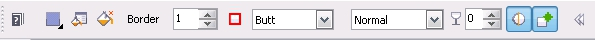

# Инструмент Polygon tool (Многоугольник) в Corel PHOTO-PAINT

Рисование инструментом _Многоугольник_ в Corel PHOTO-PAINT больше напоминает рисование с помощью инструмента **Line tool** (Прямая), чем рисование инструментом **Rectangle tool** (Прямоугольник). В отличие от CorelDRAW, например, здесь нельзя указать количество углов многоугольника, что несколько ограничивает гибкость данного инструмента. Вместо этого многоугольник создается путем рисования прямолинейных сегментов, которые и составляют стороны многоугольника. Однако многоугольник имеет свойства сходные со свойствами прямоугольника. Поэтому и Панель свойств представляет собой «усредненный вариант» Панелей свойств двух упомянутых инструментов (см. рис. ниже).

Как видно из рисунка, инструмент **Polygon tool** (Многоугольник) имеет элементы управления характерные, как для инструмента **Line tool** (Прямая), так и для инструмента **Rectangle tool** (Прямоугольник). Назначение этих элементов управления были описаны при рассмотрении этих инструментов.  
В заключение рассмотренных разделов о инструментах группы **Shape Tools** (Фигура) нужно упомянуть инструмент **Path tool** (Путь), который находится в этой же группе инструментов. Однако он не является инструментом рисования, а служит для создания выделенных областей, поэтому и рассмотрен будет в разделе о масках.