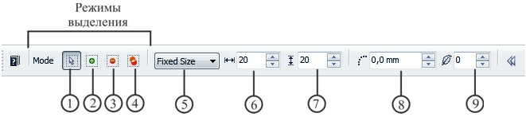
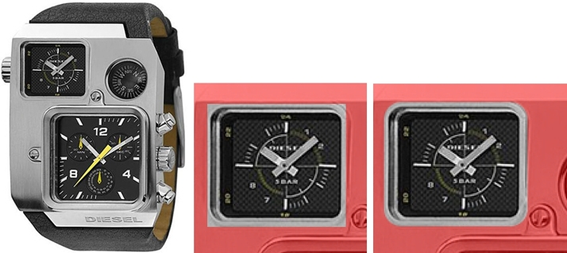
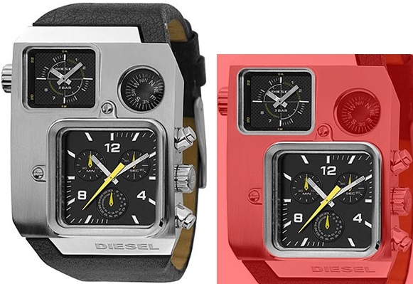
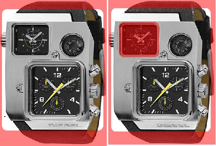
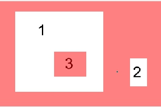
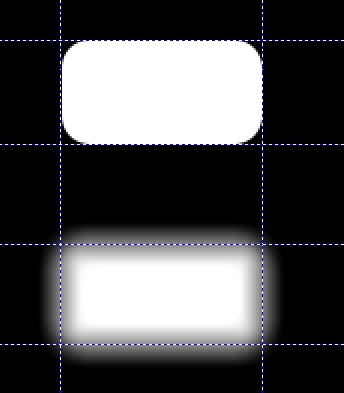

# Инструмент Rectangle Mask (Прямоугольная маска) в Corel PHOTO-PAINT

В Photo-Paint есть целая группа инструментов для выделения областей геометрической формы. Инструментам этой группы будет посвящено несколько разделов книги.

Инструменты **Rectangle Mask** (Прямоугольная маска), **Ellipse Mask** (Эллиптическая маска), **Freehand Mask** (Маска свободной формы) и **Path** (Путь) наилучшим образом подходят для создания выделенных областей геометрической формы. Начнем знакомство с инструментами этой группы с инструмента **Rectangle Mask** (Прямоугольная маска).

Для создания прямоугольной выделенной области используется инструмент **Rectangle Mask** (Прямоугольная маска), его значок находится на панели **Toolbox** (Набор инструментов), в группе инструментов **Mask Tools** (Инструменты маски).

Чтобы создать прямоугольную маску, выполните следующие действия:  
1\. Выберите инструмент **Rectangle Mask** (Прямоугольная маска) на панели **Toolbox** (Набор инструментов).  
Курсор при этом будет иметь вид перекрестия с пунктирным прямоугольником, символизирующим форму выделения.  
2\. Поместите курсор в любой угол области (например, левый верхний), которую хотите выделить.  
3\. Нажмите левую кнопку мыши.  
4\. Перемещайте курсор по любой диагонали от начальной точки. За курсором потянется тонкая линия, отмечающая текущий размер выделенной области.  
5\. Отпустите кнопку мыши. Теперь область очерчивает пунктирная рамка.

Для создания маски квадратной формы, после того, как начнете перемешать курсор (при нажатой левой кнопке мыши), нажмите и удерживайте нажатой клавишу **Ctrl**. Если удерживать нажатой клавишу **Shift**, то рамка будет прорисовываться от центра. А если одновременно удерживать нажатыми клавиши **Ctrl** и **Shift**, то будет прорисовываться квадратная рамка от центра.

Панель свойств инструмента **Rectangle Mask** (Прямоугольная маска) изображена на рис. 1.

Ниже перечислены элементы управления на панели свойств инструмента **Rectangle Mask** (Прямоугольная маска):

1\. Кнопка **Normal mode** (Обычный режим) – в этом режиме размер и расположение маски соответствует той области, которую вы «прорисовали» мышью. Другими словами, где и какого размера создана пунктирная рамка, такой и будет ваша маска.  
2\. Кнопка **Additive mode** (Аддитивный режим) – в этом режиме вы можете добавлять к уже созданной вами выделенной области, другие части изображения, увеличивая таким образом размер выделенной части изображения. При этом выделенные области не обязательно должны соприкасаться друг с другом. Другими словами, в этом режиме вы можете создать сколько угодно не связанных друг с другом выделенных областей в изображении.  
3\. Кнопка **Subtractive mode** (Режим вычитания) – этот режим противоположен _Аддитивному_ режиму. В этом режиме, вы можете только уменьшить размер выделенной области.  
4\. Кнопка **Overlap mode** (Режим наложения) – в этом режиме вы можете создать несколько пересекающихся друг с другом выделенных областей. Вновь создаваемые области, пересекающиеся с первоначальной редактируемой областью, будут из нее вычтены. Поэтому этот режим, чем-то напоминает _Режим вычитания_.  
5\. Раскрывающийся список **Style** (Стиль) – позволяет определить стиль (способ) задания редактируемой области.  
6\. Счетчик **Width** (Ширина) – этот счетчик становится активным, только при выборе стилей: **Column(s)** (По высоте) и **Fixed Size** (Фиксированный размер). Значения, указанные в нем, определяют ширину редактируемой области.  
7\. Счетчик **Height** (Высота) – этот счетчик становится активным, только при выборе стилей: **Row(s)** (По ширине) и **Fixed Size** (Фиксированный размер). Значения, указанные в нем, определяют высоту редактируемой области.  
8\. Счетчик **Corner Size** (Размер угла) – задает радиус скругления углов выделенной области.  
9\. Счетчик **Feather edge** (Край размытия) – задает ширину размытия краев выделенной области. Значения могут меняться от 0 до 100.

Перечисленные элементы управления мы будем рассматривать постепенно по мере ознакомления с возможностями маскирования. На рис. 2 приведен пример использования инструмента **Rectangle Mask** (Прямоугольная маска). Для большей наглядности был включен режим **Mask Overlay** (Наложение маски).

На рис. 2 показано слева направо: исходное изображение; выделена левая верхняя часть часов с параметрами по умолчанию; выделена левая верхняя часть часов с значением **Corner Size** (Размер угла) = 5.

Как видно на рисунке, маленькие часы в левом верхнем углу, имеют форму прямоугольника со скругленными углами. Если попытаться их выделить инструментом **Rectangle Mask** (Прямоугольная маска) с параметрами по умолчанию, то выделенная область не будет полностью соответствовать форме часов (рис. 2, по центру). Для того, чтобы маска имела нужную нам форму, сначала (до создания маски) я задал значение радиуса скругления в счетчике **Corner Size** (Размер угла) равным 5 мм. Теперь наша маска соответствует форме часов (рис. 2 справа). Если бы режим **Mask Overlay** (Наложение маски) был отключен, то вместо подкрашенной защищенной области, она была бы отделена от редактируемой области пунктирной рамкой, однако рамка была бы плохо видна на скриншоте, из-за чего и был выбран режим **Mask Overlay** (Наложение маски).

Рассмотрим теперь, как работают различные режимы выделения, кнопки которых находятся на панели свойств, в группе **Mode** (Режим). По умолчанию, активным является режим **Normal mode** (Обычный режим). В этом режиме, вы можете выделить только определенную часть изображения. При попытке выделить еще что-нибудь, предыдущая маска «исчезнет». Чтобы выделить несколько областей в изображении, необходимо переключиться на режим **Additive mode** (Аддитивный режим) (рис. 1).

Чтобы более наглядно представить действие режимов выделения, продолжим работать с предыдущим изображением, представленным на рис. 2\. Предположим, что вам нужно теперь выделить не только маленькие часики в левой верхней части, но и большие в нижней части. Для этого выделите маленькие часы, как было описано выше. Потом перейдите в режим **Additive mode** (Аддитивный режим), щелкнув соответствующую кнопку на Панели свойств. В счетчике **Corner Size** (Размер угла), установите значение 10 мм и выделите вторые часы (рис. 3).

Выполняя эти действия, вы можете установить значения в счетчике **Corner Size** (Размер угла) по своему усмотрению, а не обязательно, как у меня.

Теперь рассмотрим режим **Subtractive mode** (Режим вычитания). Выделите произвольную область изображения (рис. 4 слева).

Как видите, редактируемая область занимает большую часть изображения. Предположим, вам нужно уменьшить редактируемую область и увеличить защищенную. Для этого, после создания маски, вам нужно перейти в режим **Subtractive mode** (Режим вычитания), нажав соответствующую кнопку на Панели свойств и выделить «вычитаемую» область. На рис. 4 справа, я выделил маленькие часы в режиме **Subtractive mode** (Режим вычитания) и они добавились к защищенной области.

Режим **Overlap mode** (Режим наложения) также создает выбранные области, состоящие из нескольких участков. Разница между _Аддитивным режимом_ и _Режимом наложения_ заключается в том, что _Режим наложения_ исключает из области пересекающиеся участки. Пересекающиеся участки становятся частью защищенной области. Как работает инструмент **Rectangle Mask** (Прямоугольная маска) в _Режиме наложения_, показано на рис. 5.

На рис. 5:  
сначала бала создана маска;  
1 - редактируемая область.  
затем, в _Режиме наложения_, была добавлена редактируемая область внутри защищенной области.  
2 – добавленная редактируемая область.  
и потом внутри редактируемой области была создана защищенная область, т. е. в _Режиме наложения_, инструмент исключил из редактируемой области выбранный участок.  
3 – исключенный из редактируемой области участок.

### Параметр Feather edge (Край размытия)

Как и во многих других случаях, термин _Край размытия_ в русской версии PHOTO-PAINT Х5 не совсем правильно отражает суть дела. В ранних локализованных версиях, этот элемент управления назывался _Размывка краев_, что более правильно отражает действие этого параметра.

Размывка краев приводит к смягчению границ первоначальной выделенной области с обеих сторон. Как уже отмечалось ранее, PHOTO-PAINT «видит» все выделенные области как изображения в градациях серого – черный цвет соответствует невыделенным областям, градации серого – частично выделенным, а белый – полностью выделенным.

При размывке краев создается плавный переход между белыми и черными областями. Чем меньше значение размывки краев, тем переход короче; чем больше значение размывки краев, тем переход длиннее. Внешний вид перехода также зависит от разрешения файла. Например, если задать значение размывки краев 10 пикселей для изображения низкого разрешения эффект будет очень заметен.

При использовании инструмента **Rectangle Mask** (Прямоугольная маска), я рекомендую не обращаться к параметру **Feather edge** (Край размытия). Вместо этого предпочтительней пользоваться командой **Mask > Mask Outline > Feather** (Маска > Абрис маски > Размыть края), которая будет рассмотрена ниже в этой главе.

Чтобы наглядно представить, что представляет из себя размывка краев, создайте пустой документ с белым фоном. После этого, с помощью направляющих создайте «границы областей» одинакового размера (рис. 6). Создайте первую выделенную область, при значении параметра **Feather edge** (Край размытия) равным 0\. Затем включите на Панели свойств режим **Additive mode** (Аддитивный режим). В счетчике **Feather edge** (Край размытия) установите значение 20 и создайте вторую выделенную область. Включите режим **Paint On Mask** (Рисовать по маске) в меню **Mask** (Маска). Как видно на рис. 6, PHOTO-PAINT сделал плавный переход между белыми и черными областями.

На рис. 6 показано создание маски с различными значениями параметра **Feather edge** (Край размытия). Для облегчения создания двух одинаковых, расположенных друг под другом масок, использовались направляющие. Вверху – маска с значением **Feather edge** (Край размытия) равным 0; Внизу – маска с значением **Feather edge** (Край размытия) равным 20.

### Раскрывающийся список Style (Стиль)

При активном инструменте **Rectangle Mask** (Прямоугольная маска) можно выбрать один из четырех возможных стилей: **Normal** (Стандарт), **Fixed Size** (Фиксированный размер), **Row(s)** (По ширине) и **Column(s)** (По высоте) позволяющих определять форму и размер новой выделенной области. Стиль **Normal** (Стандарт) позволяет нарисовать выделенную область любой формы и размера. Чтобы выделить область, соответствующую фотографии размерами 130x180 мм, ширину следует задать равной 130, а высоту – 180\. При этом верхний левый угол выделенной области будет находиться в месте щелчка мышью. При использовании стиля **Fixed Size** (Заданный размер) применяются стандартные единицы измерения, заданные для линеек.

Стили **Row(s)** (По ширине) и **Column(s)** (По высоте) позволяют создать выделенную область заданной высоты или ширины, от одного края изображения до другого.