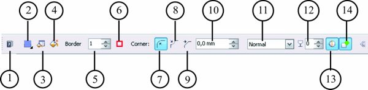

# Инструменты Rectangle tool (Прямоугольник) и Ellipse tool (Эллипс) в Corel PHOTO-PAINT

Работа с инструментом **Rectangle tool** (Прямоугольник) аналогична работе с инструментом **Line tool** (Прямая). Т. е. при создании прямоугольник порядок действий тот же – сначала на Панели свойств задаете необходимые параметры, а потом рисуете прямоугольник. Параметры доступные на Панели свойств для этого инструмента, показаны на рисунке.

1\. Кнопка вызова раздела Справки по данному инструменту.  
2\. Кнопка с раскрывающимся списком **Fill** (Заливка) – позволяет выбрать один из четырех типов заливки.  
3\. Кнопка **Edit fill** (Изменить заливку) – вызывает диалоговое окно соответствующее типу заливки, выбранному в п. 2 и изменить ее.  
4\. Кнопка **Disable fill** (Выключить заливку) – позволяет отключить заливку при создании прямоугольника. По умолчанию кнопка включена, что приводит к созданию прямоугольника с заливкой. Заливка которая будет применена к прямоугольнику отображается в _Области управления цветом_.  
5\. Счетчик **Outline width** (Толщина абриса) – задает толщину контура прямоугольника. Толщина задается в пикселях. Нулевое значение в счетчике соответствует прямоугольнику без контура.  
6\. Кнопка **Outline color** (Цвет абриса) – вызывает диалоговое окно **Foreground Color** (Цвет переднего плана), в котором вы можете выбрать нужный цвет для контура прямоугольника.  
7\. Кнопка **Round Corner** (Закругленный угол) – по умолчанию включена и задает радиус скругления углов прямоугольника, величина которого задается с помощью счетчика **Corner Size** (Размер угла).  
8\. Кнопка **Scalloped Corner** (Угол с выемкой) – позволяет рисовать прямоугольники с выемками на углах. Их размер задается с помощью счетчика **Corner Size** (Размер угла).  
9\. Кнопка **Chamfered Corner** (Угол с фаской) – позволяет рисовать прямоугольники с фасками на углах. Размер фасок задается с помощью счетчика **Corner Size** (Размер угла).  
10\. Счетчик **Corner Size** (Размер угла) – задает значение величины скругления, выемки или фаски, в зависимости от выбранного типа изменения углов прямоугольника.  
11\. В раскрывающемся списке **Merge mode** (Режим слияния), вы можете выбрать необходимый режим слияния.  
12\. Счетчик **Transparency** (Прозрачность) позволяет задать прозрачность создаваемого прямоугольника. Действие этого параметра такое же, как и в инструменте **Line tool** (Прямая).  
13\. Кнопка **Anti-aliasing** (Сглаживание) позволяет включить/отключить режим сглаживания. Действие параметра аналогично рассмотренному для инструмента **Line** tool (Прямая).  
14\. Переключение кнопки **New object** (Создать объект) указывает Photo-Paint, создавать прямоугольник в виде объекта или как обычный нарисованный прямоугольник.

Создание прямоугольника не вызовет у вас особых затруднений, т. к. оно аналогично рисованию прямоугольников в любой программе. Единственная особенность – для рисования квадрата, удерживайте нажатой клавишу **Ctrl**; для рисования от центра, удерживайте нажатой клавишу **Shift**; одновременное нажатие клавиш **Ctrl** и **Shift**, приводит к рисованию квадрата от центра.