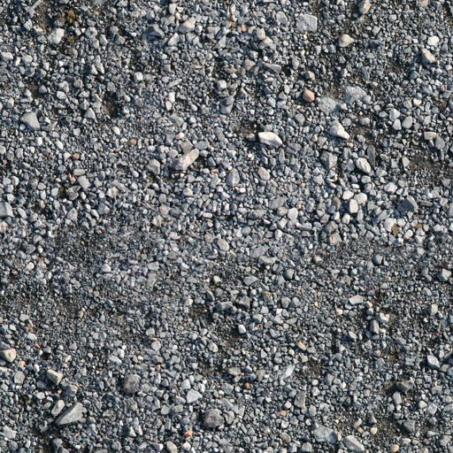

# Инструменты группы Brush Tools (Инструменты кисти)

### Инструменты Undo Brush (Отменить кисть) и Replace Color Brush (Кисть замены цветов)

Эти два инструмента находятся в одной группе инструментов – **Brush Tools** (Инструменты кисти) на панели **Toolbox** (Набор инструментов). Кисть **Replace Color Brush** (Кисть замены цветов) позволяет применить к изображению цвет фона, при этом она заменяет текущий цвет краски на цвет фона.

Инструмент **Undo Brush** (Отменить кисть) позволяет отказаться от последних изменений, выполненных инструментами **Paint** (Кисть), **Clone** (Клонирование), **Effect** (Эффект), **Fill** (Заливка), **Eraser** (Ластик), **Replace Color Brush** (Кисть замены цветов), в локальных областях изображения. Пиксели в тех местах изображения, где применяется данный инструмент, восстановят свое состояние и будут выглядеть также, как до последнего их изменения. Если вы совершили ошибочное действие несколько шагов назад, используйте инструмент **Clone From Saved** (Клонирование из сохраненного), чтобы вернуть части изображения к виду последнего сохранения.

**Для того чтобы восстановить части вашего изображения:**

1\. Откройте всплывающее меню **Brush Tools** (Инструменты кисти) на панели **Toolbox** (Набор инструментов) и выберите инструмент **Undo Brush** (Отменить кисть).  
2\. Щелкните мышью и протащите курсор в области изображения, к которой было применено последнее ошибочное действие.

**Для замены цвета текущей краски на цвет фона:**

1\. Откройте всплывающее меню **Brush Tools** (Инструменты кисти) на панели **Toolbox** (Набор инструментов) и выберите инструмент **Replace Color Brush** (Кисть замены цветов).  
2\. Щелкните мышью и протащите указатель курсора в области изображения, к которой нужно заменить цвет краски на цвет фона.

Так как оба эти инструмента находятся в группе **Brush Tools** (Инструменты кисти), то и Панель свойств этих инструментов также имеет сходные элементы управления с инструментом **Paint** (Кисть). Однако у инструмента **Replace Color Brush** (Кисть замены цветов) на _Панели свойств_ имеется еще один элемент управления – **Tolerance** (Допуск). Этот параметр определяет отклонения оттенков заменяемого цвета. Чем больше это значение, тем больше оттенков цвета краски будет заменено на цвет фона. Хотя область применения этих инструментов не совсем очевидна, однако в определенных ситуациях можно получить определенный эффект от их применения. Можно получать различные результаты, меняя такие параметры, как _Прозрачность_ и _Размытие_ кончика кисти.

Рассмотрим пример применения кисти **Replace Color Brush** (Кисти замены цветов). На рис. 1 исходное изображение.

Например, вам понадобиться заменить серую гальку, создав видимость присутствия песка. Это работа как раз для инструмента **Replace Color Brush** (Кисти замены цветов).

1\. Выберите инструмент **Eyedropper** (Пипетка), нажав клавишу **Е** (английскую). Щелкните на гальке, таким образом задав цвет краски. У меня получился цвет краски: **R:** 110; **G:** 117; **B:** 127\. У вас может получиться другой, в зависимости от места, где вы щелкните пипеткой.

2\. Переключитесь на инструмент **Replace Color Brush** (Кисти замены цветов), нажав клавишу **Q**. Дважды щелкните на образце **Background Color** (Цвет фона) в **Color control area** (Области управления цветом). Откроется окно **Background Color** (Цвет фона). Выберите в списке **Name** песчаный цвет – **Sand** (рис. 2).

3\. На _Панели свойств_ инструмента **Replace Color Brush** (Кисти замены цветов) установите в счетчике **Tolerance** (Допуск) значение равное 9\. Размер кисти можно выбрать по своему усмотрению. Я выбрал большую мягкую кисть размером 100\. Теперь можно просто закрасить все изображение. При этом не надо беспокоиться, что Photo-Paint закрасит что-то лишнее, мы ведь задали ему ограничение с помощью параметра **Tolerance** (Допуск).

В итоге получим изображение на рис. 3.

Сравнивая рисунки 1 и 3, видно, что мы за счет замены цвета добавили к гальке немного мокрого песка. В отличие от фильтров заменяющих цвет, с помощью кисти такую замену можно выполнить как во всем изображении, так и на определенном участке, что делает в ряде случаев использование этого инструмента самым оптимальным решением.

### Инструмент Effect (Эффект)

Этот инструмент используется чаще остальных при коррекции фотографий. Так же, как и инструмент **Paint** (Кисть), инструмент **Effect** (Эффект) включает несколько категорий кисти, причем самых разнообразных по своим свойствам и области применения. Практически все элементы управления _Панели свойств_ этого инструмента аналогичны с инструментом **Paint** (Кисть). Отличается лишь раскрывающийся список **Brush category** (Категория кисти) (рис. 4).

Как видно из рисунка, инструмент **Effect** (Эффект) включает в себя 12 категорий кистей, плюс к этому, в каждой категории имеется довольно большой набор типов кистей, доступных в раскрывающемся списке **Brush type** (Тип кисти), на _Панели свойств_. По большому счету, инструмент **Effect** (Эффект) делает то же, что и соответствующие фильтры, однако в отличие от фильтров, имеет то преимущество, что область воздействия определяется мазками кисти, что позволяет производить точную локальную коррекцию изображений. Несмотря на некоторые общие свойства, эффекты представляют собой относительно независимые инструменты. Есть еще одна маленькая отличительная особенность инструмента **Effect** (Эффект) от инструмента **Paint** (Кисть). При активном инструменте **Effect** (Эффект), в докере **Brush Settings** (Настройки кисти), в группе параметров **Stroke Attributes** (Атрибуты мазка) (рис. 5) и/или **Dab Attributes** (Атрибуты штриха) появляется кнопка **Toggle Cumulative** (Переключать накопление). Например, при выборе категории кисти, **Smear** (Смазывание), эта кнопка появляется в группе **Dab Attributes** (Атрибуты штриха), а при выборе категории **Smudge** (Размазывание) – в группах **Stroke Attributes** (Атрибуты мазка) и **Dab Attributes** (Атрибуты штриха).

На рис. 5: Группа параметров **Stroke Attributes** (Атрибуты мазка) инструмента **Paint** (Кисть) слева и для инструмента **Effect** (Эффект) – справа

Если кнопка **Toggle Cumulative** (Переключать накопление) нажата и режим активен, то при наложении линий во время мазка применяемый эффект усиливается.

Рассмотрим вкратце категории, входящие в состав инструмента **Effect** (Эффект):  
**Smear** (Смазывание) – инструмент производит такой же эффект, как если бы вы провели пальцем по жидкой краске. Степень эффекта определяется параметром **Transparency** (Прозрачности) кисти и, разумеется, значением ослабления мазка **Fade Out** (Затухание) (рис. 6). Пиксели изображения смещаются вслед за создаваемой линией.

На рис. 6: Влияние параметра **Transparency** (Прозрачность) на величину размазывания инструментом **Smear** (Мастихин). Слева – **Transparency** (Прозрачность) = 0; по центру – **Transparency** (Прозрачность) = 10; справа – **Transparency** (Прозрачность) = 50

**Smudge** (Размазывание) – похожий инструмент, имитирующий размазывание пастели. В отличие от предыдущего инструмента, вызывает небольшое смещение пикселей, в основном эффект достигается за счет специфического «зашумления». Сила эффекта регулируется параметрами: **Transparency** (Прозрачность) и значением **Amount** (Стекание). Помимо этого, сила эффекта сильно зависит от того, включен или нет переключатель **Toggle Cumulative** (Переключать накопление).

**Brightness** (Яркость) – инструмент для изменения яркости участков. Положительные значения **Amount** (Стекание) увеличивают, отрицательные – понижают яркость пикселей изображения. Как и в случае предыдущего инструмента, переключатель **Toggle Cumulative** (Переключать накопление) оказывает существенное влияние на силу эффекта. При отрицательных значениях параметра **Amount** (Стекание) инструмент работает довольно грубо. Для уменьшения влияния этой негативной особенности инструмента, необходимо устанавливать достаточно большое значение _Прозрачности_. Пример использования инструмента **Brightness** (Яркость) приведен на рис. 7\. На рисунке слева показано исходное изображение, а на рисунке справа обработанное. Самый темный цветок был местами осветлен, а самый верхний затемнен в складках лепестков. Я не менял по ходу обработки значение **Transparency** (Прозрачности) и значение **Amount** (Стекание). Хотя для достижения хорошего реалистичного эффекта, как вы сами понимаете, необходимо из-менять и значения параметров, и размеры, и жесткость кисти.

**Contrast** (Контрастность) – с помощью этого инструмента вы можете регулировать контраст. Кисть **Contrast** (Контрастность) повышает или понижает различие между светлыми и темными областями в выбранных областях. Положительные значения **Amount** (Стекание) увеличивают контраст, отрицательные – уменьшают. При увеличении контраста цвета становятся более яркими и чистыми, при понижении – «загрязняются». Пример использования кисти **Contrast** (Контрастность) показан на рис. 8.

На рис. 8: Пример применения кисти **Contrast** (Контрастность). Слева – исходное изображение – справа после обработки кистью

**Hue** (Оттенок) – инструмент для создания цветового сдвига. Регулируя величину **Amount** (Стекание) от -180° до +180°, вы определяете для изображения соответствующий сдвиг цветов по цветовому кругу. Нажатие кнопки **Toggle Cumulative** (Переключать накопление) приводит к наложению мазков внутри линии и вызывает «психоделический» эффект. Пример получаемого эффекта приведен на рис. 10.

На рис. 10: Пример использования инструмента **Hue** (Оттенок). Слева – исходное изображение. По центру: правый цветок обработан кистью однократно; левый – обработан кистью дважды. Справа – тоже самое, но при включенном режиме **Toggle Cumulative** (Переключать накопление)

**Hue Replacer** (Замена оттенков) — замена цветового тона пикселей изображения на цветовой тон **Foreground** (Переднего плана). Действие инструмента сходно с инструментом **Hue** (Оттенок) за исключением того, что переключатель **Toggle Cumulative** (Переключать накопление) не приводит к эффекту Психоделики.

**Sponge** (Губка) – позволяет избирательно изменять насыщенность участков изображения при помощи кисти. Можно получать различные виды эффекта, выбирая различные виды наложения на _Панели свойств_ или изменяя размер и форму применяемой кисти. Если параметр _Amount_ (Стекание) меньше нуля, то инструмент снижает насыщенность, и при значении -100 изображение переходит в оттенки серого (рис. 11). При значении **Amount** (Стекание) больше нуля, инструмент увеличивает насыщенность. Однако он выполняет это не всегда корректно (рис. 12, справа). Чтобы при помощи инструмента увеличить насыщенность, задайте очень небольшое значение **Amount** (Стекание), большую прозрачность и используйте различные режимы наложения.

На рис. 11: Результат применения инструмента **Sponge** (Губка) при значении параметра **Amount** (Стекание) = -100

На рис. 12: Результат применения инструмента **Sponge** (Губка) при значении параметра **Amount** (Стекание) = 30\. Для примера, я еще закрасил кусочек неба.

**Tint** (Оттенок) – позволяет затенять участки изображения цветом краски при помощи кисти. Можно получать различные виды эффекта, выбирая различные значения параметров **Amount** (Стекание) и **Transparency** (Прозрачности). При больших значениях параметра Amount (Стекание), цвет переднего плана полностью заменяет (закрашивает) изображение.

**Blend** (Перетекание) – позволяет избирательно смягчать расхождения между цветами или жесткими краями изображения при помощи кисти. Иногда с помощью этого инструмента можно убрать некоторые дефекты, однако в этом случае требуется тщательный подбор значений параметров.

**Sharpen** (Повышение резкости) применяется для усиления резкости. Eго сила также управляется параметрами **Amount** (Стекание) и **Transparency** (Прозрачность). Поскольку усиле-ние резкости производится методом увеличения контраста между всем пикселами, оказавшимися на пути курсора, при использовании инструмента, то вероятно появление сдвигов цвета. Чтобы избежать появления постороннего цвета в изображении, прибавляйте резкость понемногу и «отключите» **Toggle Cumulative** (Переключать накопление).

**Undither** (Супермастихин) – позволяет создавать сглаженный переход между смежными пикселями различных уровней цвета и яркости. Добавляет промежуточные пиксели, значения которых находятся посередине между значениями смежных пикселей. Используйте этот инстру-мент для удаления пылинок и царапин, а также сглаживания шероховатых краев.

**Dodge/ Burn** (Осветление/Затемнение) – наиболее часто используемый инструмент при коррекции яркостей цветовых диапазонов. Т. к. фильтры с аналогичными функциями воздей-ствуют на все изображение или выбранную область, то применение инструмента **Dodge/ Burn** (Осветление/Затемнение) становится незаменимым при локальной коррекции, а также в случаях, когда создание маски затруднено.