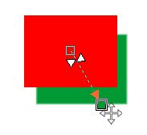

# Инструменты группы Interactive/Transparency Tools

### Инструменты группы Interactive/Transparency Tools (Инструменты интерактивной прозрачности)

Мы уже рассмотрели с вами ранее два инструмента этой группы: **Object Transparency Brush** (Кисть прозрачности объекта) и **Object Transparency** (Прозрачность объекта), когда рассматривали прозрачность объектов.  
Нами остались нерассмотренными два инструмента: **Drop Shadow** (Тень) и **Color Transparency** (Прозрачность цвета). Эти инструменты находятся на панели **Toolbox** (Набор инструментов) в группе инструментов **Interactive/Transparency Tools** (Инструменты интерактивной прозрачности).

### Инструмент Drop Shadow (Тень)

Назначение этого инструмента весьма очевидно – создание тени объекта. По умолчанию, именно этим инструментом на панели **Toolbox** (Набор инструментов) представлена вся группа (рис. 1).

Хотя работа с этим инструментом и не представляет особых сложностей, но тем не менее, требует определенной тренировки для освоения влияния различных параметров на свойства тени.  
Этот инструмент имеет собственную _Панель свойств_ (рис. 2).

1\. Раскрывающийся список **Preset** (Заготовка) – позволяет выбрать заготовку тени (рис. 3).

Этот список дает доступ к различным заготовкам тени, что очень удобно. Можно выбрать любую из них и потом просто подкорректировать остальные свойства тени. Также, во время выбора заготовки, справа появляется миниатюра, позволяющая увидеть какой вид тени представляет данная заготовка.

2\. Кнопка **Add preset** (Добавить заготовку) – позволяет добавить текущие настройки в виде заготовки тени, для использования в будущем.

3\. Кнопка **Delete preset** (Удалить заготовку) – позволяет удалить созданную вами заготовку.

4\. Раскрывающийся список **Shadow color** (Цвет тени) – позволяет задать цвет тени.

5\. Элемент управления **Shadow direction** (Направление тени) – позволяет задать угол тени (рис. 4).

Угол тени можно задать двумя способами: с помощью клавиатуры, введя соответствующее значение в поле элемента управления, либо щелкнуть на кнопке в виде треугольника направленного вниз и мышью переместить интерактивный элемент задания угла тени.

6\. Счетчик **Shadow offset** (Смещение тени) – позволяет задать расстояние между тенью и объектом.

7\. Счетчик **Shadow fade** (Расплывание тени) – позволяет настроить затухание на краях тени. При увеличении значения этого параметра, края тени становятся более прозрачными.

8\. Счетчик **Shadow stretch** (Растяжение тени) – позволяет настроить длину тени.

9\. Счетчик **Shadow transparency** (Прозрачность тени) – позволяет управлять прозрачностью тени.

10\. Счетчик **Shadow feathering** (Размытие тени) – позволяет увеличивать резкость или размывать края тени.

11\. Раскрывающееся меню **Feathering direction** (Направление размытия) – позволяет выбрать направление смягчения краев тени (рис. 5).

12\. Раскрывающееся меню **Feather edge** (Край размытия) – позволяет выбрать тип размытия (рис. 6).

13\. Кнопка **Copy shadow properties** (Скопировать свойства тени) – позволяет скопировать свойства тени с одного объекта на другой.

Чтобы создать тень, необходимо сначала выделить объект. Затем щелкните на инструменте **Drop Shadow** (Тень) мышью или нажмите горячую клавишу **S**. Создать тень можно двумя способами, интерактивно – просто удерживая нажатой левую кнопку мыши протащить ее в нужном направлении, либо задав необходимые значения на _Панели свойств_.

После создания тени вы можете интерактивно изменять некоторые ее параметры. Для этого у созданной тени имеются интерактивные элементы управления. Чтобы немного попрактиковаться в этом, создайте обычный прямоугольник и тень для него (рис. 7).

В данном случае тень была создана интерактивно. Я просто протащил мышь от центра красного квадрата вниз вправо. Цвет тени зеленый. Можно изменить направление тени, переместив конечный маркер тени. Когда вы наведете на него мышь, указатель примет вид четырехнаправленной стрелки, как на рис. 7\. Теперь можно менять ее направление. На рисунке также видно два интерактивных элемента управления тени, в виде двух белых треугольников. Управление с помощью этих элементов, также не вызовет у вас трудности, т. к. их можно переместить только вдоль прямой соединяющей начальную и конечную точки тени. Когда вы наведете указатель мыши на любой из них, появится всплывающая подсказка (рис. 8).

Я специально для наглядности совместил на рис. 8 обе подсказки. Как видите, один элемент – **Transparency**, управляет прозрачностью, другой – **Feather**, управляет размытием тени. Чем ближе вы будете сдвигать эти элементы управления к конечной точке тени, тем больше будет прозрачность и размытие тени.

Можно также переместить тень. Для этого наведите указатель мыши на начальную точку тени (или около нее). Указатель мыши примет вид четырехнаправленной стрелки. Теперь тень можно переместить в другое место. Однако такое перемещение, к сожалению не происходит плавно. Тень перемещается скачкообразно, привязываясь к узловым точкам. И хотя этих точек не видно, но стоит присмотреться, куда перемещается начальная точка тени, как вы увидите, что она привязывается к средним точкам на сторонах прямоугольника, либо к центру.

Обратите внимание, что при перемещении конечной точки тени, автоматически изменяются значения **Shadow direction** (Направление тени) и **Shadow offset** (Смещение тени) на _Панели свойств_. Также, в зависимости от типа выбранной заготовки, становятся активными или неактивными некоторые элементы управления на _Панели свойств_.

Главным недостатком инструмента тень в Photo-Paint, на мой взгляд – это невозможность создать у объекта внутреннюю тень. Давайте немного поэкспериментируем, чтобы на небольшом примере посмотреть на поведение тени, в зависимости от некоторых параметров.

В качестве объекта для эксперимента будем использовать обычный прямоугольник, чтобы не слишком усложнять рассмотрение свойств тени. Но, как работает тень на залитом прямоугольнике, мы уже вкратце рассмотрели и особых сложностей в этом случае нет. А что будет, если такой же прямоугольник будет без заливки? Другими словами, наш объект имеет контур, но внутри пустой, что-то типа рамки. Таких объектов встречается великое множество, не только среди геометрических фигур, но и в тексте, и при создании эффектов на фотографиях.

Создадим прямоугольник без заливки (рис. 9 а). На _Панели свойств_, в раскрывающемся списке **Preset** (Заготовка) выберем вариант **Medium Glow** (Среднее свечение), а в списке **Shadow color** (Цвет тени), выберем красный цвет. Остальные параметры оставим пока без изменения (рис. 9 б).

Как видите, Photo-Paint создал тень, как снаружи, так и внутри прямоугольника. Давайте посмотрим, какие параметры дали нам такой вид тени. За это отвечает два элемента управления на _Панели свойств_: **Feathering direction** (Направление размытия) и **Feather edge** (Край размытия). Понятное дело, что параметр **Feather edge** (Край размытия) влияет только на внешний вид краев тени и в меньшей степени на размер и размытие (рис. 10).

На рис. 10 показано влияние параметра **Feather edge** (Край размытия) на вид тени. 1 – **Linear** (Линейные); 2 – **Squared** (Квадратичные); 3 – **Flat** (Плоские); 4 – **Inverse Squared** (Обратные квадратичные); 5 – **Gaussian Blur** (Размытость по Гауссу).

А вот самое любопытное начинается, когда мы понаблюдаем за влиянием параметра **Feathering direction** (Направление размытия) (рис. 11). При этом значение **Shadow offset** (Смещение тени) = 0.

На рис. 11 показано влияние **Feathering direction** (Направление размытия) в том порядке, в котором расположены варианты направления размытия на _Панели свойств_: 1 – **Inside** (Внутрь); 2 – **Middle** (Среднее); 3 – **Outside** (Наружу); 4 – **Average** (Усредненное).

Довольно странная получилась картина. По умолчанию, при выборе заготовки **Medium Glow** (Среднее свечение), в выпадающем меню **Feathering direction** (Направление размытия) устанавливается значение **Outside** (Наружу) (рис. 11 (3)). Варианты 2 и 4 похожи между собой и вид тени можно как-то логически объяснить. А вот вариант 3 менее объясним, что касается варианта **Inside** (Внутрь) (рис. 11 (1)), его объяснить невозможно никак. По логике вещей, при выборе направления тени внутрь, Photo-Paint должен был создать тень внутри прямоугольника, чего не произошло, а при варианте **Outside** (Наружу), Photo-Paint почему-то решил, что внешняя часть прямоугольника не только снаружи, но и внутри него.

Этот недостаток инструмента **Drop Shadow** (Тень) «вылазит боком», когда необходимо создать некоторые спецэффекты. По этой причине, некоторые эффекты в Photo-Paint невозможно создать (или крайне затруднительно), в отличие от того же Photoshop, который «понимает все как надо».

Также есть некоторые особенности и в случае искажения объекта имеющего тень. Вернемся к нашему исходному прямоугольнику. Создадим тень, аналогично тому, как мы сделали выше. Но сначала обратим свой взор к докеру **Objects** (Объекты). Когда вы создадите объект и назначите ему тень, то в докере рядом с названием объекта появляется маленькая пиктограммка (обведена кружком), символизирующая наличие у объекта тени (рис. 12).

Если объект не имеет тени, то двойной щелчок в докере приведет к появлению диалогового окна **Object Properties** (Свойства объекта). А если вы сделаете двойной щелчок на этой маленькой пиктограмме, то это приведет к переключению на инструмент **Drop Shadow** (Тень). Диалоговое окно **Object Properties** (Свойства объекта) также появится в случае двойного щелчка левее пиктограммы.

Теперь вернемся к нашему прямоугольнику с тенью. Давайте исказим его форму с помощью инструмента **Object Pick** (Выбор объекта). Переключитесь на _Панели свойств_ этого инструмента в режим **Distort** (Искажение) и наклоните его немного (рис. 13).

Обратите внимание, как Photo-Paint исказил форму прямоугольника. Стороны прямоугольника становятся тоньше по мере приближения к левому верхнему углу, чего не скажешь о тени. Хотя по логике вещей, более тонкая линия должна иметь более узкую тень. Вернем прямоугольник в исходное состояние нажав **Ctrl + Z**. Теперь щелкнем в докере **Objects** (Объекты) на объекте правой кнопкой мыши. В контекстном меню выберем команду **DropShadow > Combine Shadow** (Тень > Объединить тень). Это приведет к объединению тени со связанным с ней объектом. В докере **Objects** (Объекты), рядом с названием объекта пиктограмма исчезнет. Исказим прямоугольник аналогично тому, как мы это только что делали (рис. 14).

Теперь картина поменялась. Тень утончается вместе с объектом. Этот факт надо учитывать при использовании инструмента **Drop Shadow** (Тень).

В этом же меню есть еще две команды. Первая из них – **Delete Shadow** (Удалить тень), позволяет удалить тень объекта. Вторая команда – **Split Shadow** (Отделить тень), отделяет тень от объекта. При этом автоматически создается объект из тени, что вы можете наблюдать в докере **Objects** (Объекты). Теперь исходный объект и объект из тени можно менять независимо друг от друга. На рисунке 15 я отделил тень от прямоугольника и немного сдвинул в сторону объект получившийся из тени.

На этом можно было бы закончить знакомство с инструментом **Drop Shadow** (Тень), но я хочу вкратце сказать еще о двух элементах управления на _Панели свойств_.

Рассмотрим короткий пример. Создадим надпись с названием нашего любимого сайта (рис. 16) и переключившись на инструмент **Drop Shadow** (Тень), в раскрывающемся списке **Preset** (Заготовка) выберем тип **Hard pers LT Fade** (Жесткая перспектива влево вверх).

Дополнительно станут активными два элемента управления: **Shadow fade** (Расплывание тени) и **Shadow stretch** (Растяжение тени). При выборе данной заготовки, по умолчанию значение **Shadow fade** (Расплывание тени) = 60, а **Shadow stretch** (Растяжение тени) = 40.

Уменьшение значения **Shadow fade** (Расплывания тени) приводит к тому, что она становится менее прозрачной, а увеличение **Shadow stretch** (Растяжения тени) приводит к удлинению тени.

На рис. 17 показан результат изменения этих параметров. Я установил значения: **Shadow fade** (Расплывания тени) = 10 и **Shadow stretch** (Растяжения тени) = 65,5.

### Инструмент Color Transparency (Прозрачность цвета)

Это очень полезный инструмент, когда речь заходит об удалении какого-либо цвета в изображении. Кроме того, легкость удаления цвета с помощью этого инструмента не может не порадовать пользователя. Однако этот инструмент требует наличия хотя бы одного выделенного объекта. Если вы попробуете щелкнуть этим инструментом на фоне, то Photo-Paint выдаст вам предупреждающее окно (рис. 18).

Это предупреждение гласит: «Этот инструмент требует, чтобы хотя бы один объект был выделен». Поэтому при работе с изображением в котором нет объектов, необходимо преобразовать фон в объект.

Как говорилось выше, этот инструмент находится на панели **Toolbox** (Набор инструментов), в группе инструментов **Interactive/Transparency Tools** (Инструменты интерактивной прозрачности). Можно также вызвать инструмент нажав горячую клавишу – 2 (двойка на цифровой клавиатуре не вызывает этот инструмент).

Как и прочие инструменты Photo-Paint, он имеет свою собственную _Панель свойств_, хотя и весьма скромную (рис. 19).

Как видите, инструмент **Color Transparency** (Прозрачность цвета) имеет всего три элемента управления. Рассмотрим их в порядке следования на _Панели свойств_.

*   Счетчик **Tolerance** (Допуск) – определяет диапазон оттенков цвета, на который будет воздействовать инструмент **Color Transparency** (Прозрачность цвета).
*   Счетчик **Smoothing** (Сглаживание) – определяет плавность перехода прозрачных пикселей к окружающим цветам.
*   Кнопка **Apply to clip mask** (Применить для маски обрезки) – создает маску обрезки из объекта, к которому была применена прозрачность цвета.

Влияние параметра **Tolerance** (Допуск) объяснять не нужно, т. к. понятно, что чем больше его значение, тем больше оттенков цвета станут прозрачными.

А вот влияние параметра **Smoothing** (Сглаживание), хотя вроди и понятно, но увидеть его влияние не всегда просто. Чтобы увидеть в действии работу элементов управления **Smoothing** (Сглаживание) и **Apply to clip mask** (Применить для маски обрезки), рассмотрим небольшой пример.

На рис. 20 показано исходное изображение.

Для выполнения данного упражнения, я вывел направляющие, чтобы во время экспериментов делать всегда щелчок в одной и той же точке изображения. При выполнении всех последующих действий, значение **Tolerance** (Допуск) не менялось и было равно 10.

Сначала я выбрал значение **Smoothing** (Сглаживание) равным 0 (рис. 21).

Затем вернул изображение в исходное состояние, изменил значение **Smoothing** (Сглаживание) на 20 (рис. 22).

Стрелкой на рисунках показано место, где более или менее заметно влияние параметра **Smoothing** (Сглаживание). В остальных частях изображения изменение значения Smoothing (Сглаживания) практически не заметно.

Теперь посмотрим, что мы можем извлечь из опции **Apply to clip mask** (Применить для маски обрезки). Когда вы нажмете эту кнопку и примените инструмент **Color Transparency** (Прозрачность цвета), то в докере **Objects** (Объекты) увидите созданную маску обрезки (рис. 23).

Вот тут можно извлечь все выгоды масок обрезки. Для этого стоит в докере **Objects** (Объекты) щелкнуть сначала на значке «**+**» между объектом и его маской, чтобы убрать его, а затем на самой маске. Она станет выделенной в докере и вокруг нее появится красная рамочка (на рис. 23 такая рамочка видна вокруг объекта). Дальнейшие действия не вызовут у вас затруднений. Закраска черной кистью будет скрывать (делать прозрачными) закрашиваемые области, а закраска белой кистью, наоборот, восстанавливать изображение. Эта возможность очень полезна, т. к. позволяет подкорректировать результаты работы инструмента **Color Transparency** (Прозрачность цвета). Т. к. во время работы, прозрачными могут стать те части изображения, которые должны остаться, то восстановить их можно как раз таким способом. Или же наоборот, если инструмент **Color Transparency** (Прозрачность цвета) не до конца сделал прозрачными нужные участки изображения, то можно черной кистью исправить положение.