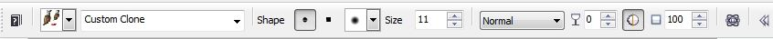

# Инструменты группы Touch-up Tools (Инструменты ретуширования)

### Инструменты группы Touch-up Tools (Инструменты ретуширования)

В отличие от других инструментов, рассматриваемых в этом разделе, все инструменты этой группы применяются для коррекции. Остальные инструменты применяемые для коррекции разбросаны по разным группам. Эта группа (рис. 1) находится на панели **Toolbox** (Набор инструментов) и состоит из трех инструментов: **Red Eye Removal** (Устранение эффекта «красных глаз»); **Clone** (Клонирование); **Touch-up Brush** (Кисть ретуширования).

На панели **Toolbox** (Набор инструментов) эта группа представлена инструментом **Red Eye Removal** (Устранение эффекта «красных глаз»).

### Инструмент Red Eye Removal (Устранение эффекта «красных глаз»)

Думаю, название самого инструмента говорит само за себя и область его применения также весьма очевидна. Врядли можно найти сейчас человека, который не сталкивался на практике с появлением этого эффекта на фотографиях. Особенно четко его видно на фотографиях сделанных с вспышкой в очень темных помещениях. По своему опыту могу сказать, что этот инструмент нельзя назвать идеальным решением для борьбы с этим дефектом. Инструмент **Red Eye Removal** (Устранение эффекта «красных глаз») далеко не всегда справляется со своими обязанностями и часто дает результаты далекие от ожидаемых. Это связано в первую очередь с тем, что после применения этого инструмента, цвет глаз может оказаться совсем не тот, который должен быть на самом деле. Для борьбы с этим дефектом есть другие способы. Однако, раз уж мы рассматриваем инструмент **Red Eye Removal** (Устранение эффекта «красных глаз»), кратко остановимся на его применении.

Т. к. инструмент **Red Eye Removal** (Устранение эффекта «красных глаз») по большому счету является разновидностью кисти, то и его _Панель свойств_, также имеет элементы управления схожие с инструментом **Paint** (Кисть). Однако в отличие от последнего, _Панель свойств_ позволяет изменить только размер и форму кисти. Единственный параметр, специфичный именно для этого инструмента – **Tolerance** (Допуск) имеющий значения от 1 до 5\. Этот параметр оказывает влияние на степень проявления эффекта устранения красноты.

Чтобы применить инструмент **Red Eye Removal** (Устранение эффекта «красных глаз»), вам потребуется увеличить масштаб изображения, чтобы удобно было подобрать размер кончика кисти по размеру глаза. Затем просто щелкните на зрачке для удаления красноты.

### Инструмент Clone (Клонирование)

Коррекция с помощью инструмента **Clone** (Клонирование) состоит в замене области дефекта образцами из близлежащих областей – клонировании области. Этот инструмент аналогичен инструменту _Штамп_ в Photoshop. Этот инструмент используется чаще всего для заполнения пробелов, сгибов, сколов и разрывов на фотографиях. Панель свойств инструмента **Clone** (Клонирование) показана на рис. 2.

Как видно из рисунка, _Панель свойств_ практически идентична с _Панелью свойств_ инструмента **Paint** (Кисть). На ней расположены те же элементы управления. Также настройка параметров инструмента **Clone** (Клонирование) доступна в докере **Brush Settings** (Настройки кисти). Единственное отличие заключается в наборе инструментов, в раскрывающемся списке **Brush category** (Категория кисти) (рис. 3).

В составе инструмента **Clone** (Клонирование) имеется 5 категорий кистей: собственно сам инструмент **Clone** (Клонирование); **Impressionism Clone** (Импрессионистское клонирование); **Pointillism Clone** (Пуантилистское клонирование); **Clone From Saved** (Клонирование из сохраненного); **Clone From Fill** (Клонирование из заливки).

Инструмент **Clone** (Клонирование) позволяет копировать фрагменты изображения. Задайте источник (исходную точку во фрагменте изображения, который собираетесь копировать), затем установите кисть в точке назначения и перемещайте ее, создавая таким образом копию. Кисть **Clone From Saved** (Клонирование из сохраненного) не клонирует изображение, в том смысле, что не дает исходной и целевой точки. Она позволяет восстановить части изображения к виду последнего сохранения. Это средство является основном методом восстановления изображения. Техника использования инструмента **Clone** (Клонирование) весьма проста.

**Для клонирования области изображения:**

1\. На панели **Toolbox** (Набор инструментов) щелкните на инструменте **Clone** (Клонирование).  
2\. На _Панели свойств_ нажмите стрелку рядом с указателем категории инструмента.  
3\. Выберите один из типов инструмента клонирования.  
4\. Выберите кисть в раскрывающемся списке **Brush type** (Тип кисти).  
5\. Щелкните правой кнопкой мыши на изображении, задав таким образом источник клонирования.  
6\. Переместите курсор в место назначения.  
7\. Щелкните мышью и буксируйте курсор, создавая копию. Нажмите и удерживайте клавишу **Ctrl**, чтобы ограничить направление перемещения источника (например, по горизонтали или вертикали).

Инструмент **Impressionism Clone** (Импрессионистское клонирование) использует для рисования заданный цвет с установленными вами вариациями мазка и цвета. Вы выбираете точку, проводите линию.  
Инструмент **Pointillism Clone** (Пуантилистское клонирование) рисует цветными точками, из которых складывается копия изображения, выполненная в «пуантилистской» манере. Используя цветовые вариации и разные формы кистей, вы легко сможете добиться отличных изобразительных эффектов.  
Инструмент **Clone From Fill** (Клонирование из заливки) создает клонированное изображение на основе текущего варианта заливки. Этот инструмент можно рассматривать как специальную кисть для рисования образцом заливки.

### Инструмент Touch-up Brush (Кисть ретуширования)

Инструмент **Touch-up Brush** (Кисть ретуширования) служит для удаления трещин, пятен и царапин на фотографиях. Этот инструмент появился в составе Corel Photo-Paint начиная с 12-й версии. _Панель свойств_ этого инструмента показана на рис. 4.

Во многих ситуациях этот инструмент способен исправить или устранить дефект одним щелчком мыши. Т. к. инструмент **Touch-up Brush** (Кисть ретуширования) по большому счету является разновидностью кисти, то и на _Панели свойств_ присутствуют характерные элементы управления. Специфичными являются только раскрывающийся список **Strength** (Сила) и кнопка **Merged source** (Источник слияния). Пункты в раскрывающемся списке **Strength** (Сила) определят степень проявления эффекта. При устранении небольших дефектов, достаточно выбрать пункт **Low** (Низкое), чтобы дефект полностью исчез. Кнопка **Merged source** (Источник слияния) служит для одновременного применения эффекта к объекту (если таковой имеется) и к фону и является одновременно переключателем.

Рассмотрим маленький пример применения инструмента **Touch-up Brush** (Кисть ретуширования). Исходное изображение показано на рис. 5\. Это «кусок» моей фотографии, когда я был еще молодым. В те дни цветная фотография еще была не так распространена как сейчас, а тем более это любительское фото. Я отсканировал эту фотографию. Ну и как видно, на фотографии дефектов хоть отбавляй. Там и зернистость и отсутствие резкости, шумы и чего только нет. В этом примере, я не буду заниматься ретушированием и приведением в порядок всей фотографии. Я хочу показать, как можно убрать некоторые дефекты именно с помощью инструмента **Touch-up Brush** (Кисть ретуширования).

Чтобы было понятней о каких дефектах пойдет речь, я увеличил часть лица и обвел красными овалами дефектные места (рис. 6). Теперь отчетливо видны царапины, мелкие сколы эмульсии, пятна и еще целый букет дефектов. Скажу сразу, большой скол эмульсии, проходящий через глаз, ликвидировать с помощью **Touch-up Brush** (Кисти ретуширования) не получится.

Используя кисть **Touch-up Brush** (Кисть ретуширования), можно избавится от этих дефектов. Меняя силу эффекта и размер кисти, я убрал указанные дефекты (рис. 7), кроме большой трещины, как я и говорил выше.

Пятно на щеке удалилось одним щелчком мыши на нем. Скол на носу удалялся немного иначе. Пришлось варьировать размер кисти и силу эффекта, а также удалять используя короткие мазки кистью в разных направлениях. Пятна на лбу также удалились за несколько щелчков на них мышью.