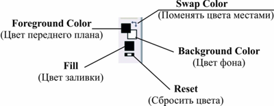

# Инструменты управления цветом краски, заливки и фона в Corel Photo-Paint

Как вы сами понимаете, работать в Photo-Paint без использования цвета невозможно. Цвет используется везде, и при работе с любым инструментом рисования, и при работе с заливкой, и во многих других случаях. Photo-Paint имеет в своем арсенале достаточно средств для выбора цвета и работы с ним. Сейчас мы рассмотрим основные возможности выбора цвета, которые имеются в приложении.

В любой момент времени работы в Photo-Paint, вы будете иметь дело именно с одним из этих основных цветов. Для управления этими основными цветами, внизу панели **Toolbox** (Набор инструментов) имеется область **Color control area** (Область управления цветом).

Образец **Foreground Color** (Цвет переднего плана) показывает текущий цвет переднего плана, применяемый для всех инструментов рисования и всего текста. В более ранних версиях Photo-Paint этот образец цвета назывался **Paint** (Цвет краски). На мой взгляд, этот вариант названия более подходящий и лучше отображает назначение этого цвета.

Образец **Background Color** (Цвет фона) показывает текущий цвет фона, отображаемого при удалении частей фона или увеличении размера бумаги. Здесь нужно внести немного ясности в это определение. Вы можете задаться вопросом, как может отображаться «цвет фона», если мы удалили его часть? Дело в том, что в Photo-Paint само изображение и является фоном. Об этом недвусмысленно говорит информация в докере **Objects** (Объекты). Опять же, в более ранних версиях Photo-Paint (Corel Photo-Paint 9, например) этот образец цвета назывался **Paper** (Цвет бумаги), что было более понятным для пользователя термином.

Образец **Fill** (Цвет заливки) показывает текущий цвет заливки, который применяется для инструментов фигур и заливки. Т. к. мы еще не рассматривали инструменты рисования, то забегая наперед скажу, что при рисовании инструментом прямоугольник, например, полученная фигура сразу же будет по умолчанию залита цветом заливки, в отличие от рисования прямоугольника в Corel Draw. По умолчанию в Photo-Paint цвет заливки – черный.

Если вы в процессе работы изменили цвета переднего плана и фона, то при необходимости вы можете восстановить эти образцы к их состоянию по умолчанию. Для этого служит значок **Reset** (Сбросить цвета). По умолчанию, для цвета переднего плана назначен черный цвет, а для цвета фона – белый.

Переключатель **Swap Color** (Поменять цвета местами) позволяет переключаться с цвета переднего плана на цвет фона. В этом случае цвет переднего плана станет белым, а цвет фона – черным, если конечно у вас выставлены образцы цвета по умолчанию.

Задать цвет переднего плана, заливки или фона довольно просто. Перечислим сначала основные способы задания цвета, а затем рассмотрим более подробно средства Photo-Paint, которые позволяют непосредственно работать с цветом.

**>** Для выбора цвета **Foreground Color** (Цвет переднего плана):  
– щелкните левой кнопкой мыши на нужном цвете в цветовой палитре;  
– в меню палитры выберите пункт **Set Paint Color** (Установить цвет кисти);  
– выберите тот же пункт в контекстном меню палитры;  
– дважды щелкните на образце цвета в области **Color control area** (Область управления цветом) и в открывшемся диалоговом окне **Foreground Color** (Цвет переднего плана) выберите нужный цвет

**>** Для выбора цвета **Background Color** (Цвет фона):  
– щелкните левой кнопкой мыши на нужном цвете в цветовой палитре удерживая нажатой клавишу **Ctrl**;  
– в меню палитры выберите пункт **Set Paper Color** (Установить цвет фона);  
– выберите тот же пункт в контекстном меню палитры  
– дважды щелкните на образце цвета в области **Color control area** (Область управления цветом) и в открывшемся диалоговом окне **Background Color** (Цвет фона) выберите нужный цвет

**>** Для выбора цвета **Fill** (Цвет заливки):  
– щелкните правой кнопкой мыши на нужном цвете в цветовой палитре;  
– в меню палитры выберите пункт **Set Fill Color** (Установить цвет заливки);  
– выберите тот же пункт в контекстном меню палитры  
– дважды щелкните на образце цвета в области **Color control area** (Область управления цветом) и в открывшемся диалоговом окне **Select Fill** (Выбор заливки) выберите нужный цвет.