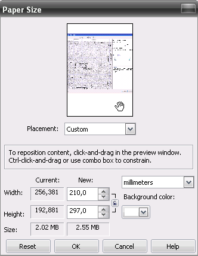

# Изменение размера бумаги в PHOTO-PAINT

Команда **Paper Size** (Размер бумаги) предназначена для настройки размеров бумаги. Она применяется для настройки размера листа бумаги, на котором находится изображение. Выбор команды приводит к открытию одноименного диалогового окна.

В области просмотра находится уменьшенная копия изображения. В счетчиках **Width** (Ширина) и **Height** (Высота) задайте новый размер бумаги по горизонтали и вертикали. Тут же, вы можете указать единицы измерения, выбрав их в раскрывающемся списке. Кнопка с изображением замка определяет режим изменения размеров — если она нажата (при этом отображается закрытый замок), то значения ширины и высоты изменяются пропорционально.

В полях **Size** (Размер) приведен размер документа до и после изменения размера. По умолчанию, размер бумаги равен размеру самого изображения. Однако вы можете установить истинный размер бумаги, который будете использовать в дальнейшем при печати. Если размер бумаги больше размера изображения, то при увеличении ее геометрических размеров дополнительное пространство заполнится фоновым цветом. Цвет фона вы можете выбрать прямо в диалоговом окне, в раскрывающемся списке **Background color** (Цвет фона). При уменьшении размера бумаги, изображение будет обрезано в соответствии с новыми размерами.

Кроме собственно изменения размера бумаги, можно также сдвигать изображение относительно ее границ. Для этого просто поместите курсор на область просмотра, указатель мыши примет вид руки, и перетащите картинку или выберите положение изображения на листе бумаги в раскрывающемся списке **Placement** (Размещение). Если вы решите восстановить первоначальные значение, нажмите кнопку **Reset** (Сброс).