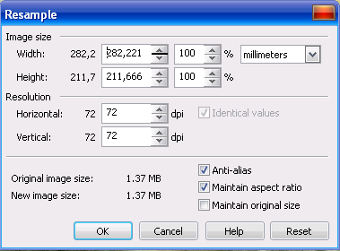

# Изменение размеров изображения в Corel PHOTO-PAINT

Одно из самых простых действий, которое вы можете выполнить над изображением, только приступив к знакомству с PHOTO-PAINT, это изменить его размер. Несмотря на то, что это делается просто и не требует особых навыков и знаний, не следует думать, что в дальнейшем вы не будете использовать эти команды.

Итак, одной из довольно часто выполняемых операций, является изменение размера. Понятно, что если у вас имеется изображение размером со стандартный лист формата А4, а вам нужно получить изображение, например, размером 6х9 см, то вам без изменения размеров не обойтись. К счастью, в Corel PHOTO-PAINT это сделать очень просто. Для этого служит команда **Image > Resample** (Изображение > Изменить разрешение). После выполнения этой команды, появится диалоговое окно **Resample** (Изменить разрешение).

В области **Image size** (Размер изображения) находится четыре значения. В **Width** (Ширина) и **Height** (Высота) указаны ширина и высота изображения соответственно. Значения указаны в единицах измерения, которые вы выбрали в раскрывающемся списке, в правой части области. По умолчанию, текущие размеры изображения приняты за 100%. Поэтому, изменить их вы можете двумя способами, указав точные размеры в полях Width (Ширина) и Height (Высота) или указав новые размеры в процентном отношении к исходным размерам. Например, если вы зададите значение 50%, то изображение будет уменьшено в 2 раза.

В области **Resolution** (Разрешение), в поле Horizontal (По горизонтали), указано текущее разрешение изображения по горизонтали, а по вертикали – в Vertical (По вертикали). Вы можете изменить эти значения, однако следует учитывать, что увеличение разрешения исходного изображения не поднимет качество, а уменьшение приведёт к его потери. К изменению размера и разрешения изображения следует прибегать тогда, когда это действительно необходимо и можно пренебречь некоторой потерей качества. Флажок Identical values (Одинаковые значения), по умолчанию установлен, но не активен. Этот флажок отвечает за то, будут ли у вас в полях одинаковые значения. Если вы сбросите этот флажок, это даст вам возможность изменять разрешение по горизонтали и по вертикали независимо друг от друга. Другими словами, вы сможете установить в полях разные значения.

_На заметку: добиться некоторого псевдоулучшения качества, повышая разрешение изображения, можно только с помощью специальных плагинов или применения серии определённых фильтров. Одним из таких плагинов является PhotoZoom Pro (включён в дистрибутив CorelDRAW GS X5)._

В нижней части окна имеется два поля **Original image size** (Исходные размеры) и **New image size** (Новый размер изображения). В первом из них указан исходный размер в мегабайтах, в другом, новый размер изображения, который получится после применения изменений.

И наконец, группа флажков, в нижней правой части этого окна. Установка флажка **Anti-alias** (Со сглаживанием) позволяет сгладить края изображения при применении изменений. Флажок **Maintain aspect ratio** (Сохранять пропорции) отвечает за пропорциональное изменение размеров, т.е. при изменении размера по высоте, например, размер по ширине будет изменяться автоматически таким образом, чтобы пропорции изображения не нарушались. Если сбросить этот флажок, то становится активным флажок **Identical values** (Одинаковые значения). В этом случае, можно его сбросить и изменять разрешение по горизонтали и вертикали независимо друг от друга.

Флажок **Maintain original size** (Сохранять размер файла) связывает между собой размер и разрешение. Чтобы увидеть взаимосвязь между размером и разрешением, за которую отвечает флажок Maintain original size (Сохранять размер файла), установите флажок и попробуйте изменить разрешение. И вы увидите, что значения в полях Width (Ширина) и Height (Высота), так же изменяются.

Если вы хотите отменить изменение настроек, которые внесли в окне и вернуть их к значениям по умолчанию без закрытия окна, нажмите кнопку **Reset** (Сброс) или **Cancel** (Отмена), чтобы отказаться от изменений и закрыть окно.