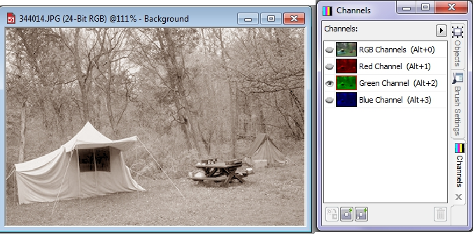
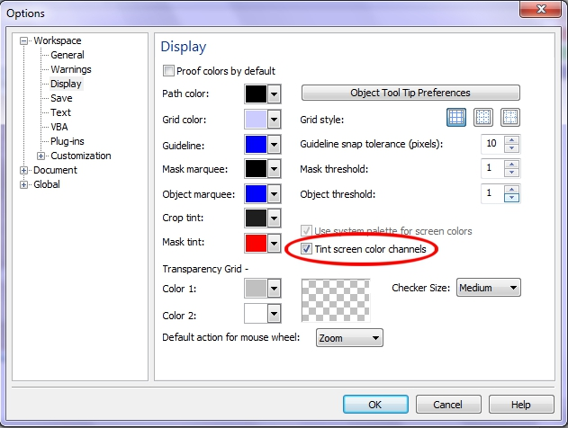
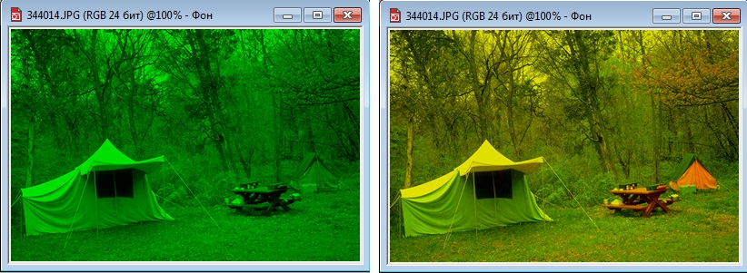
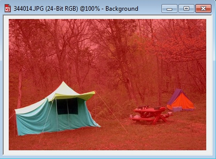
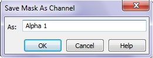
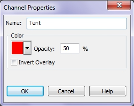
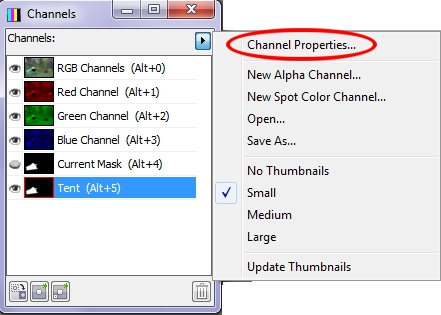
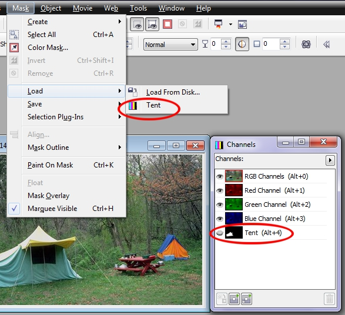

# Каналы в Corel PHOTO-PAINT

Цветные изображения, которые вы видите в Photo-Paint, чаще всего состоят из трех цветовых каналов: красного (Red), зеленого (Gгeen) и синего (Blue). Чаще всего, поскольку большинство из нас работают в цветовом режиме **RGB** – стандартном режиме для изображений и режиме работы мониторов. Если же полученное изображение вы планируете печатать, тогда вам понадобится обратиться к цветовому режиму **СМУК** (в котором используется четыре цветовых канала), однако, поскольку чаще всего мы работаем в режиме **RGB**, в настоящей книге предполагается, что вы работаете в режиме **RGB**.

Я предполагаю, что вы ничего не знаете о каналах, поэтому в этом разделе мы начнем со знакомства с каналами, комбинациями клавиш, а также операциями, которые можно выполнять при работе с докером **Channels** (Каналы).

Если у вас на экране не отображается докер **Channels** (Каналы), то вызвать его можно тремя способами: выполнить команду **Window > Dockers > Channels** (Окно > Окна настройки > Каналы); нажать комбинацию клавиш **Ctrl + F9** или щелкнуть правой кнопкой мыши на изображении и выбрать в контекстном меню команду **Channels** (Каналы).

При отображении докера **Channels** (Каналы) оказываются выделенными все цветовые каналы. Это связано с тем, что по умолчанию все три канала (а также составной канал **RGB**) активны. На самом деле вы видите результаты наложения красного, зеленого и синего каналов. Вы получаете полноцветное изображение **RGB**, с которым и имеете дело большую часть времени работы с Photo-Paint. Однако всегда можно просмотреть отдельный цветовой канал, щелкнув на его названии в докере **Channels** (Каналы) (рис. 1).

По умолчанию каналы отображаются в оттенках серого, однако при желании подобное положение можно изменить.  
Если вы предпочитаете видеть каналы в оттенках соответствующего цвета (красного, зеленого и синего), а не в оттенках серого, откройте диалоговое окно **Options** (Параметры). После этого перейдите на страницу **Display** (Монитор) и установите флажок **Tint screen color channels** (Использовать оттенки для каналов цвета на экране) (рис. 2), после чего щелкните на кнопке **ОК**. Теперь каналы будут отображаться в цвете.

При изменении режима просмотра, изменяется отображение изображения при просмотре разных каналов. Щелкните на зеленом канале в докере **Channels** (Каналы), и вы увидите, что канал больше не представлен на экране в градациях серого – теперь он зеленый.

Это хорошая возможность быстро понять, каким образом на основе трех цветовых каналов образуются изображения **RGB**.  
В данном случае, поскольку мы щелкнули на зеленом канале, изображение выглядит зеленым. Теперь добавим еще один канал, чтобы вы поняли, как наложение двух каналов приводит к расширению диапазона оттенков. Перейдите к докеру **Channels** (Каналы) и щелкните в первом столбце слева от миниатюры красного канала. Этот канал станет видимым, а в столбце отобразится значок в виде глаза, который и указывает на то, что канал является видимым. Как видите, в изображении теперь появились оттенки красного, благодаря чему стало заметно гораздо больше деталей.

А теперь щелкните в первом столбце напротив синего канала; вы получите комбинацию красного, зеленого, синего каналов — полноцветное изображение. Теперь скройте зеленый канал, щелкнув на небольшом значке глаза; вы увидите результаты совмещения красного и синего каналов.  
Чтобы вернуть обратно отображение каналов в оттенках серого, снова откройте диалоговое окно **Options** (Параметры) и сбросьте флажок **Tint screen color channels** (Использовать оттенки для каналов цвета на экране).

Для отображения каналов есть достаточно простые сочетания клавиш. Для красного канала **Alt+1**, для отображения зеленого канала достаточно нажать комбинацию клавиш **Alt+2**, для отображения синего канала нажмите комбинацию клавиш **Alt+3**. Чтобы отобразить совмещенный канал **RGB** (все три канала), нажмите комбинацию клавиш **Alt+0**.

Если вы добавите дополнительные каналы, Photo-Paint присвоит им комбинации клавиш для их отображения. Создайте новый канал, щелкнув на кнопке **New Alpha Channel** (Создать альфа-канал) в нижней докера **Channels** (Каналы). В появившемся одноименном диалоговом окне нажмите кнопку **ОК** (изображение станет черным, поскольку по умолчанию новый канал отображается черным цветом).

В докере **Channels** (Каналы) вы увидите в самом низу канал **Alpha 1** (Альфа 1). Теперь нажмите комбинацию клавиш **Alt+0** для возвращения к совмещенному каналу **RGB** (при этом вы снова увидите исходную фотографию). Затем перейдите к новому альфа-каналу (он залит черным цветом); для этого достаточно нажать комбинацию клавиш **Alt+4**. Продолжайте перемещение между каналами, последовательно нажимая комбинации клавиш **Alt+1**, **Alt+2**, **Alt+3** и, наконец, **Alt+4**, чтобы отобразить альфа-канал (который остается черным до тех пор, пока мы что-то на нем не нарисуем белым цветом).

В случае изображения **СМYК** для просмотра отдельных каналов используются комбинации клавиш с **Alt+1** по **Alt+4**, а альфа-каналы начинаются с канала 5\. Поэтому нажатие комбинации клавиш **Alt+4** приводит к отображению черного канала изображения **СМYК**, а не альфа-канала.

Одно из самых популярных применений каналов – сохранение выделенных областей, что позволяет в любой момент снова загрузить их при редактировании изображений. Например, в данном случае создадим выделенную область вокруг палатки. После создания выделенной области вокруг палатки с помощью инструментов маски, внешний вид палатки можно изменять самыми разными способами. А после этого вы наверняка снимите выделение. А как быть в том случае, если вы решите внести еще ряд изменений? Неужели придется создавать выделенную область с самого начала? Да, если только вы предусмотрительно не сохранили выделенную область, прежде чем снимать выделение. Если вы сохранили выделенную область, для ее восстановления потребуется всего пару секунд. Сохраненная область представляет собой канал, доступ к которому всегда можно получить, обратившись к докеру **Channels** (Каналы). Этот новый канал не оказывает влияния на существующие красный, зеленый и синий каналы. Вместо этого создается дополнительный канал – так называемый _альфа-канал_.

Наш первый шаг состоит в создании выделенной области вокруг палатки в изображении (рис. 4).

Выделить палатку вы можете любым удобным для вас способом. Я использовал инструмент **Brush Mask** (Маска кисти).

Для сохранения выделенной области как канала, выполните команду **Mask > Save > Save as Channel** (Маска > Сохранить > Сохранить как канал). В результате на экране отобразится диалоговое окно **Save Mask As Channel** (Сохранение маски как канала) (рис. 5).

Если щелкнуть на кнопке **ОК**, выделенная область будет сохранена как новый канал в докере **Channels** (Каналы); при этом для него будет задано стандартное название **Alpha 1** (Альфа 1). Если вы предпочитаете другое названия, введите его в поле **As** (Как). Для того чтобы снова изменить название канала, в любой момент дважды щелкните на текущем названии и в диалоговом окне **Channel Properties** (Свойства канала) в поле **Name** (Имя) введите более подходящий вариант (рис. 6), после чего нажмите кнопку **ОК** (я назвал его **_Tent_**).

Диалоговое окно **Channel Properties** (Свойства канала) можно также вызвать из контекстного меню альфа-канала или выбрав из меню докера **Channels** (Каналы) команду **Channel Properties** (Свойства канала) (рис. 7)

Если посмотреть на докер **Channels** (Каналы), можно заметить, что цветовые каналы (которые и формируют цветное изображение) остались без изменения, однако в нижней части докера отображается новый канал. На его миниатюре отображается белый контур палатки на черном фоне.

Это и есть новый канал, который вы создали самостоятельно. Обратите внимание, что если вы сначала не создали выделенную область, а просто создали новый канал (щелкнув на кнопке **New Alpha Channel** (Создать альфа-канал) в нижней части докера **Channels** (Каналы), канал будет отображаться просто черным. Попробуйте это сделать, после чего удалите лишний канал нажав кнопку **Delete Current Channel** (Удаление текущего канала) в виде мусорной корзины, в нижней части докера.

Не «переключая» каналы, сделайте новый канал **Alpha 1** (Альфа 1) видимым (на рис. 7 этот канал переименован в канал **_Tent_**), щелкнув в первом столбце перед миниатюрой канала. Теперь канал будет выглядеть как красное наложение. При этом вы должны заметить два момента: во-первых, палатка все еще отображается в цвете, поскольку выделенная область «вырезает» отверстие в канале черного цвета; во-вторых, черные участки отображаются красным цветом.

При необходимости увидеть отдельный альфа-канал (как мы уже делали это раньше при работе с отдельными цветовыми каналами) сначала щелкните на значке канала **RGB**, после чего нажмите комбинацию клавиш **Alt+5**. Кроме того, можно сразу щелкнуть на значке канала **Alpha 1** (Альфа 1) в докере **Channels** (Каналы). В результате видимым окажется только альфа-канал. На данном этапе можно отредактировать выделенную область, рисуя белым или черным. Используя белый цвет, вы добавите к редактируемой области новый участок; используя черный цвет, вы вычитаете из выделенной области соответствующие участки. Однако, чтобы сделать это, вам придется удалить текущую маску, которая по-прежнему еще активна, что видно в докере **Channels** (Каналы). Она отображается в нем, как **Current Mask** (Текущая маска).

Теперь можно оценить визуальное представление выделенной области, белые участки – это и есть выделенная (редактируемая) область, а черные участки соответствуют невыделенным (защищенным) частям. Если вы решили снова отобразить выделенную область, используйте команду **Mask > Load > Alpha 1** (Маска > Загрузить > Альфа 1) (рис. 8).

Так как я переименовал **Alpha 1** (Альфа 1) на **_Tent_**, то на рис. 8 в меню и докере отображается название **_Tent_**.

Если щелкнуть на миниатюре совмещенного канала **RGB** (при этом можно щелкать как на буквах **RGB Channels**, так и на миниатюре слева), вы снова увидите выделенную область (не нужно щелкать на значке в виде глаза; щелкните именно на миниатюре канала). Как вы уже знаете, канал **RGB** часто называют _совмещенным_ или _композитным_, поскольку он получен после наложения всех трех цветовых каналов.

Помимо рассмотренных действий с каналами в докере **Channels** (Каналы), каналы часто используются при коррекции и восстановлении фотографий, а также используются в различных фильтрах. В этой же главе ставилась задача ознакомить вас с самыми простыми и основными сведениями о каналах. В следующих главах этой книги, мы будем часто сталкиваться с различными способами применения каналов, в том числе не вошедшими в эту главу, что позволит вам в конечном итоге освоить работу с ними и применять это на практике.