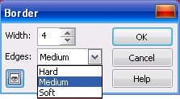
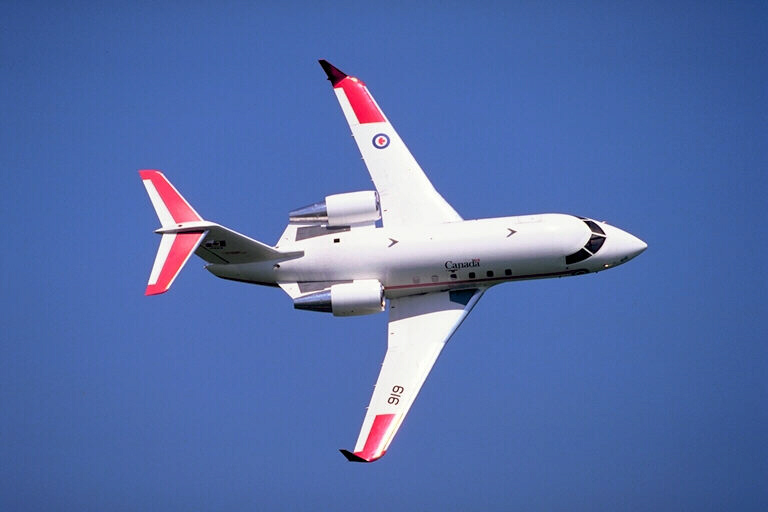
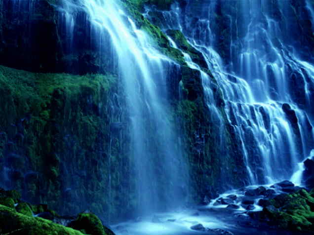
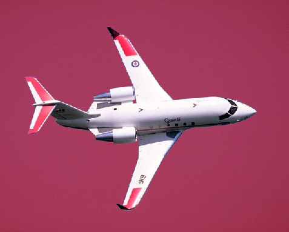
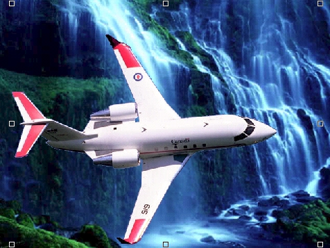
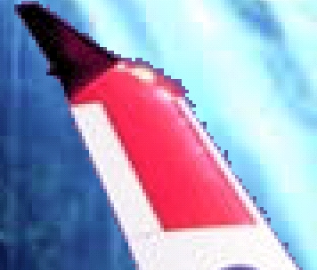
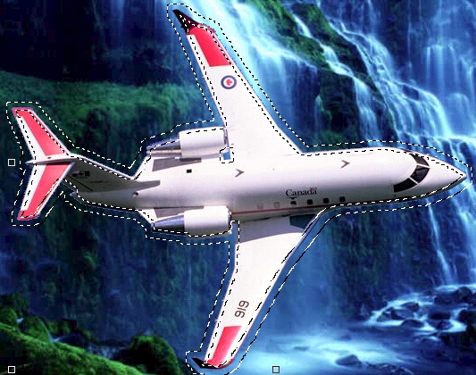
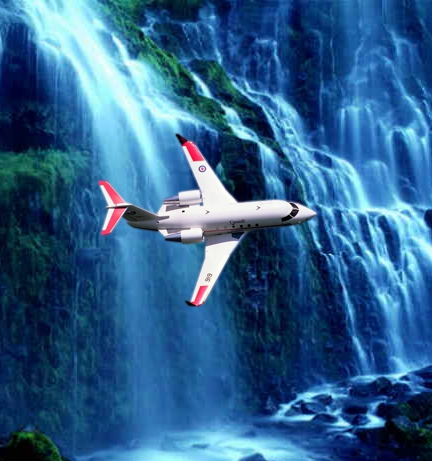

# Команда Border (Граница)

Команда **Border** (Граница) преобразует имеющуюся рамку в две рамки, которые имеют одинаковую форму и один центр, но отделены друг от друга определенным количеством пикселей. Команда предназначена для создания выбранной области в виде рамки.

Для вызова диалогового окна **Border** (Рамка) изображенного на рис. 1, выполните команду **Mask > Mask Outline > Border** (Маска > Абрис маски > Граница). Команда **Border** (Граница) удаляет участки выбранной области. Получившаяся в результате выбранная область обрамляет защищенные пиксели изображения. Выбранная область в виде «двойной рамки» используется для обрамления частей изображения с определенным цветом, текстурой или эффектом.

**Для создания выделения в виде «двойной рамки»:**

1\. Выберите режим **Normal** (Стандарт).  
2\. При помощи инструментов в группе **Mask Tools** (Инструменты маски) на панели **Toolbox** (Набор инструментов) определите выбранную область.  
3\. Выполните команду **Mask > Mask Outline > Border** (Маска > Абрис маски > Граница).  
4\. В поле **Width** (Ширина) введите значение.  
Введенное значение прибавляется к обеим сторонам рамки выделения. Например, если введено значение 10, то в результате получится бордюр шириной 20 пикселей.  
5\. Из раскрывающегося списка **Edges** (Края) выберите тип края.

Вообще-то говоря, применение команды **Border** (Граница) не столь очевидно при попытке ее реального применения. Однако в сочетании с другими командами Photo-Paint, эту команду прекрасно можно использовать при создании "составных" изображений. Чтобы лучше разобраться с областью применения команды **Border** (Граница), давайте рассмотрим пример.

На рис. 2 и 3 представлены два исходных изображения.

Наша задача, разместить самолет делающий вираж, на фоне водопада.

1\. Сначала выделим самолет. Для этого можно использовать либо инструмент **Magic Wand Mask** (Маска волшебной палочкой), либо команду **Color Mask** (Цветовая маска), хотя можете по своему усмотрению пользоваться другим инструментом. Проще всего в этом случае выделить не самолет, а небо, а затем применить команду **Mask > Invert** (Маска > Инвертировать), чтобы инвертировать маску и сделать выделенным самолет. Полученная маска показана на рис. 4.

2\. Выполните команду **Edit > Copy** (Правка > Копировать) или нажмите соответствующую кнопку на _Стандартной_ панели инструментов, чтобы скопировать самолет в буфер обмена.

3\. Теперь вставим самолет в изображение с водопадом **(Edit > Paste > Paste As New Object** (Правка > Вставить > Вставить как новый объект)). Т. к. размеры исходных изображений были разными и имели разное разрешение, вставленный самолет занял большую часть изображения (рис. 5). Обратите внимание, в докере **Objects** (Объекты) появился новый объект с стандартным названием _Object 1_.

4\. Сразу после вставки самолета, присмотритесь на части вокруг крыльев. По краям крыльев остались части неба, которые создают голубую кромку в некоторых местах самолета (рис. 6). Разместим самолет в нужном месте изображения, перетащив его мышью и затем уменьшим с помощью угловых манипуляторов. Здесь можно полагаться на свой вкус и желания, хотим ли мы показать самолет летящим у самого водопада или разместить его ближе на переднем плане.

Для удаления нежелательного «обрамления» вокруг самолета, чтобы он нормально слился с новым фоном, воспользуемся командой **Border** (Граница), но сначала создадим маску.

5\. Выполните команду **Mask > Create > Mask from Object(s)** (Маска > Создать > Маска из объектов) или нажмите комбинацию клавиш **Ctrl + M**.

6\. Выполните команду **Mask > Mask Outline > Border** (Маска > Абрис маски > Граница). В появившемся диалоговом окне **Border** (Рамка), в поле **Width** (Ширина) установите значение 4, а в раскрывающемся списке **Edges** (Края), выберем тип **Medium** (Среднее). В результате по контуру самолета появится двойная рамка выделения (рис. 7). Теперь мы можем убрать остатки старого фона вокруг самолета и сгладить края, чтобы обеспечить плавный переход между самолетом и новым фоном.

Следует отметить, что значение **Width** (Ширина) можно будет задать меньше, т. к. при уменьшении размера самолета, ширина голубой кромки вокруг самолета тоже уменьшится.

7\. Воспользуемся в данном случае другой возможностью размывки краев. Для этого выполните команду **Effects > Blur > Gaussian Blur** (Эффекты > Размытость > Размытость по Гауссу). В диалоговом окне, с помощью ползунка установите значение параметра **Radius** (Радиус) равным 2,8\. Нажмите **ОК**. Опять же, при сильном уменьшении размера самолета, значение **Radius** (Радиус) можно выбрать меньше.

8\. Выполните команду **Mask > Remove** (Маска > Удалить) или нажмите клавиши **Ctrl + R**.

9\. Теперь нам остается только объединить самолет с фоном. Для этого выполните команду **Object > Combine > Combine Objects With Background** (Объект > Объединить > Объединить объекты с фоном). Окончательный результат показан на рис. 8.

Конечно, в книге приведены уменьшенные копии изображений, отчего просмотреть результаты воздействия отдельных команд практически невозможно. Однако, выполняя работу над изображениями, вы на своем компьютере сможете видеть все пошаговые изменения.