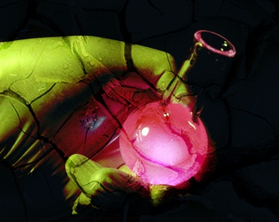

# Команда Calculations (Вычисления)

В меню **Image** (Изображение) доступна полезная команда – **Calculations** (Вычисления). Можно изменить существующее изображение или создать новое составное изображение, дополняя сведения о каналах одного изображения сведениями о канале другого изображения. Вычисления в режиме слияния выполняются в пикселях и применяются для указанного канала, открытого изображения или нового файла. Можно использовать вычисления, чтобы исправить изображения путем слияния каналов одного изображения или двух изображений, созданных с помощью разделения одного изображения. Можно создать эффект наложения путем слияния различных изображений.

Для применения команды **Calculations** (Вычисления) должно быть выполнено ряд требований:

*   Изображения, которые будут использованы при применении команды, должны быть открыты. При применении команды у вас не будет возможности указать файл, который еще не был открыт.
*   Изображения, которые будут использованы при применении команды, должны обладать абсолютно одинаковыми размерами (желательно).
*   При применении команды **Calculations** (Вычисления) можно совместно использовать изображения **RGB**, **LAB**, **CMYK**, а также изображения в градациях серого.
*   Команду можно использовать для перемещения выделенных областей между файлами.

Команда **Calculations** (Вычисления) позволяет объединить изображение с таким же изображением, однако использует только один канал в градациях серого. Команда **Calculations** (Вычисления) создает новый канал, черно-белый документ или активную выделенную область, однако никогда не создает цветное изображение.

Как показано на рис. 1, диалоговое окно команды разделено на четыре основных части – **Source 1** (Источник 1), **Source 2** (Источник 2), **Method** (Метод) и **Destination** (Назначение). Кроме того, если установить флажок **Use mask from** (Использовать маску из) в группе параметров **Method** (Метод), в окне будет доступно 10 раскрывающихся списков и три флажка **Invert** (Инверсия). Поэтому неудивительно, что многие люди просто избегают команды **Calculations** (Вычисления).

Однако поработав немного с этой командой, вы убедитесь, что ничего страшного и сложного в диалоговом окне **Channel Calculations** (Вычисления над каналами) нет. Чтобы проще было разобраться с этим диалоговым окном, мы сейчас рассмотрим пример по созданию составного изображения на основе двух разных изображений.

Чтобы команда **Calculations** (Вычисления) смогла работать с несколькими файлами, желательно, чтобы все изображения были одинаковых размеров. Для этого:  
1\. Откройте изображения к которым решили применить команду **Calculations** (Вычисления). Щелкните на более "важном" изображении, чтобы активизировать его.  
2\. Выполните команду **Image > Resample** (Изображение > Изменить разрешение) для того, что-бы получить информацию о размерах и разрешении изображения. Затем откройте второе изображение и снова выполните команду **Image > Resample** (Изображение > Изменить разрешение), но на этот раз для того, чтобы привести размер и разрешение второго изображения в соответствие с первым. Для этого в диалоговом окне **Resample** (Изменить разрешение) установите необходимые значения параметров.

Для примера работы с командой **Calculations** (Вычисления), я решил к одному изображению добавить текстуру, взятую из другого изображения, чтобы получить что-то наподобие абстракции. Исходные изображения показаны на рис. 2.

Для работы с командой **Calculations** (Вычисления) не имеет значения, какое из изображений будет активно в данный момент, вы можете по своему усмотрению установить любое из них в качестве **Source 1** (Источника 1) и **Source 2** (Источника 2).

Исходное изображение (слева) имело разрешение 180 **dpi** и размер 123х98 **мм**, а текстура, разрешение 72 **dpi** и размер 270х180 **мм**. Поэтому для выполнения нашей задачи, разрешение текстуры я изменил на 180 **dpi**. Однако я не стал изменять размеры текстуры с помощью команды **Image > Resample** (Изображение > Изменить разрешение), а просто с помощью инструмента _Обрезка_ обрезал текстуру до нужного размера.

3\. Выполните команду **Image > Calculations** (Изображение > Вычисления). В появившемся диалоговом окне **Channel Calculations** (Вычисления над каналами) установить настройки, как показано на рис. 3\. Для предварительного просмотра результатов нужно нажать кнопку **Preview** (Просмотр).

Обратите внимание, что в области **Source 1** (Источник 1), в качестве источника была выбрана текстура, а в области **Source 2** (Источник 2) изображение руки с колбой, а также был установлен флажок **Use all channels** (Использовать все каналы).

Полученный результат показан на рис. 4.

Вы можете экспериментировать с различными режимами наложения, прозрачностью и другими параметрами. На конечный результат также влияет, какое из изображений будет использоваться в качестве _Источника 1_ и _Источника 2_.