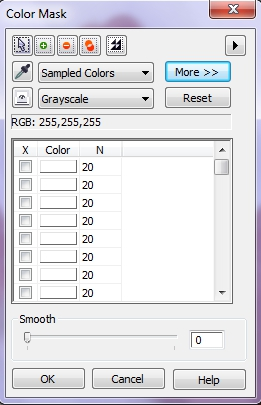
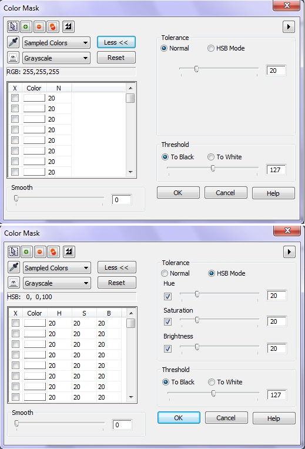

# Команда Color Mask (Цветовая маска) в Corel PHOTO-PAINT

Находящаяся в меню **Mask** (Маска) команда **Color Mask** (Цветовая маска) может быть также использована для создания выделений, учитывающих указанный цвет. Преимущество команды _Цветовая маска_ заключается в том, что заданные цвета включаются в выбранную или защищенную область по всему изображению, а не в границах одной указанной области. Один или несколько цветов могут быть выбраны при помощи инструмента _Пипетка_. Выбранные цвета могут быть частью выбранной области или защищенной области. Предварительный просмотр непосредственно в окне изображения, дает возможность просмотреть результаты выделения и настроить его форму, изменив значение **_Допуска_**, без наложения маски.

В диалоговом окне **Color Mask** (Цветовая маска) (рис. 1) результаты создания выделения могут быть представлены оттенками серого, белой заливкой, черной заливкой или подкрашиванием невыделенного. Цвет быстрого выделения можно изменить при помощи диалогового окна **Параметры**, находящегося в меню **Tools** (Инструменты).

Функции диалогового окна **Color Mask** (Цветовая маска) недоступны, если обрабатывается черно-белое, 16-битовое изображение в оттенках серого или двутоновое изображение.

Цвета могут быть как защищенными (т.е. все остальные цвета можно изменять), так и изменяемыми (т.е. остальные цвета изображения защищены от изменения).

Эта команда используется как для выделения нескольких различных цветов изображения, так и для выделения цветов, расположенных в различных изолированных друг от друга областях изображения.

**Для создания цветового выделения сделайте следующее:**

1\. Выберите **Mask > Color Mask** (Маска > Цветовая маска).  
Если в диалоговом окне остались цвета от предыдущей работы, нажмите кнопку **Reset** (Сброс).

2\. Выберите **Sempled Colors** (Цвета по образцу) из раскрывающегося списка в верхней части диалогового окна.  
Другие значения параметров списка применяются для автоматического выбора цветов без использования инструмента _Пипетка_.

3\. Выберите на диалоговом окне инструмент _Пипетка_.

4\. Укажите цвет на изображении.  
Этот цвет появится в поле цвета в левой стороне диалогового окна.

5\. Для задания дополнительных цветов повторите шаг 4.

6\. Щелкните на значке **_Просмотр_** (в виде кнопки с глазом), чтобы проверить маску перед ее применением.  
Затушеванная красным цветом область защищена от изменений. Чтобы удалить подкрашивание невыделенного, щелкните на значке **_Просмотр_** еще раз.

**Для настройки чувствительности на определенный цвет выделения:**

1\. Выберите **Mask > Color Mask** (Маска > Цветовая маска).

2\. Найдите цвет в раскрывающемся списке предлагаемых цветов, в верхней части диалогового окна.

3\. Введите в числовое поле, связанное с данным цветом, значение Допуска от 0 до 100.  
Большее значение **_Допуска_** расширяет рамку выделения, меньшее уменьшает рамку, включая только выбранный цвет. Если используется режим **HSB Mode** (Режим HSB), введите значение Допуска в каждое числовое поле.

4\. Повторите данную процедуру для каждого дополнительного цвета.

5\. Нажмите кнопку **ОК**, чтобы применить выделение с переопределенным значением _Допуска_.  
Выбранные цвета могут быть отменены, если в списке цветов снять флажки, стоящие напротив каждого цвета.

По умолчанию диалоговое окно **Color Mask** (Цветовая маска) открывается в режиме **Normal** (Стандарт) и выглядит, как на рис. 1\. Но для переключения в режим **HSB Mode**, нужно нажать кнопку **More** (Больше), чтобы получить доступ к дополнительным параметрам (рис. 2).

На рис. 2 показан вид диалогового окна **Color Mask** (Цветовая маска) в режиме **Normal** (Стандарт) – вверху и режиме **HSB Mode** – внизу.

Близость цветов вычисляется точно так же и для инструмента **Magic Wand Mask** (Маска волшебной палочкой): либо одинаково по всем каналам в модели **RGB**, либо по каждому индивидуально в модели **HSB**, в зависимости от положения переключателя в области **Tolerance** (Допуск). Если выбран первый способ (**Normal**), то в списке цветов есть одна колонка с порогом **N**. Когда выбран второй способ, вместо нее появляются три колонки **Н**, **S** и **В**, соответствующие величине _Допуска_ по каналам **HSB**.

Дополнительные сведения о работе с командой **Color Mask** (Цветовая маска) будет рассказано в этой книге дальше.