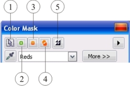
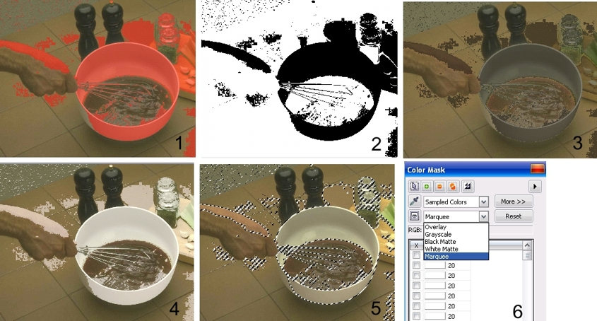
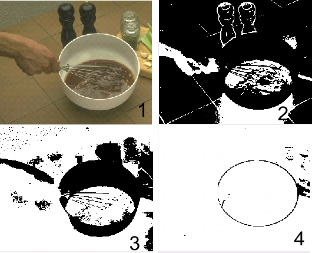
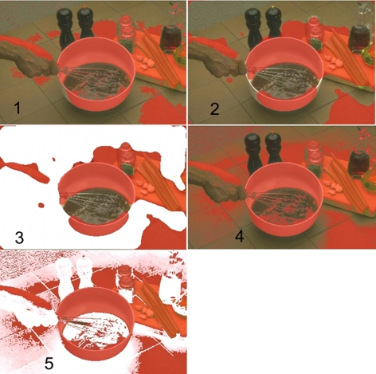
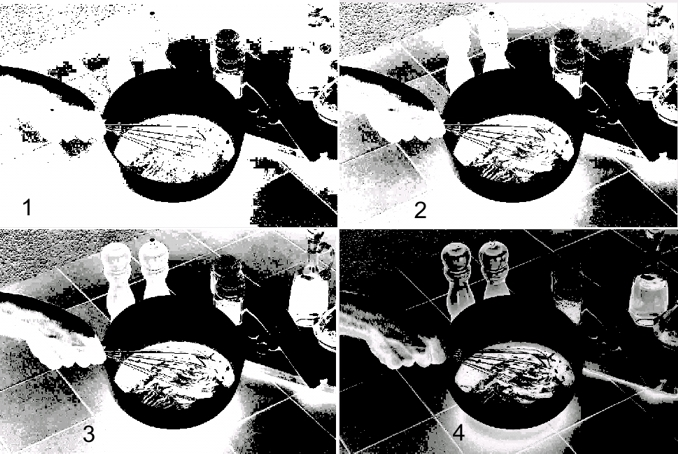
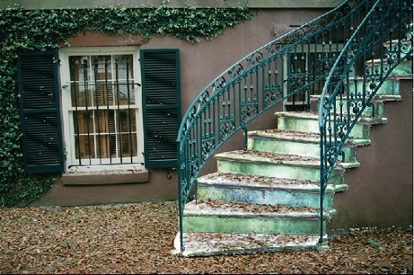
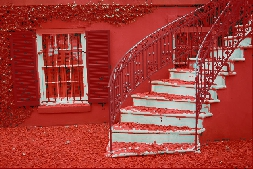
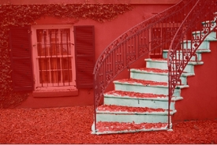
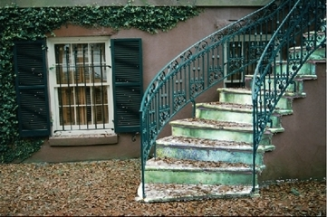

# Команда Color Mask (Цветовая маска)

Как я уже говорил в главе "[Маски, каналы и объекты](../Maski-kanaly-i-obekty.-Osnovnye-svedeniya./index.md)", после краткого знакомства с основными элементами диалогового окна **Color Mask** (Цветовая маска) и его элементами управления, мы рассмотрим более подробно возможности этого инструмента. Команда **Color Mask** (Цветовая маска) – это «интеллектуальная» версия инструмента **Magic Wand Mask** (Маска волшебной палочкой), поскольку она позволяет создавать выделенные области на основе цвета и цветовых тонов, а также просматривать их с гораздо большей точностью и степенью контроля, чем инструмент **Magic Wand Mask** (Маска волшебной палочкой).

Используя диалоговое окно, можно добавлять или убирать из выделенной области различ-ные оттенки. Чтобы максимально эффективно использовать команду **Color Mask** (Цветовая маска), необходимо четко понимать назначение основных параметров диалогового окна **Color Mask** (Цветовая маска).

В верхней части окна **Color Mask** (Цветовая маска) расположен ряд кнопок (рис. 1), что позволяет использовать этот инструмент во всех режимах маски.

1 – режим **Normal** (Стандарт);  
2 – режим **Additive mode** (Аддитивный режим);  
3 – режим **Subtractive mode** (Режим вычитания);  
4 – режим **Overlap mode** (Режим наложения);  
5 – кнопка _Инвертировать маску_

Однако следует заметить, что кнопки режимов выделения и кнопка для инвертирования маски, не зря расположены в этом окне. Если вы выделили какую-то часть изображения одним из инструментов маски, то текущий режим выделения никак не скажется на работе команды **Color Mask** (Цветовая маска). Например, вы выделили часть изображения с помощью инструмента **Brush Mask** (Маска кисти) в режиме **Additive mode** (Аддитивный режим). Потом хотите продолжить выделять другие части изображения в том же режиме с помощью команды **Color Mask** (Цветовая маска). В этом случае, после выполнения команды **Mask > Color Mask** (Маска > Цветовая маска), вам необходимо в диалоговом окне также выбрать режим **Additive mode** (Аддитивный режим).

Для просмотра текущей маски в окне изображения, предназначена кнопка _Просмотр_, в виде кнопки с изображением глаза. При нажатой кнопке _Просмотр_, каждый сделанный вами щелчок в изображении с помощью _Пипетки_ (или добавление цвета в список цветов другим способом), сразу же повлечет за собой изменение в окне изображения. Photo-Paint предлагает 5 различных видов просмотра выделенной области, с помощью раскрывающегося списка расположенного рядом с кнопкой _Просмотра_ (рис. 2 (6)). С помощью различных режимов просмотра (рис. 2) удобно не только выбирать предпочтительный режим просмотра выделенной области, но и легче увидеть влияние других элементов управления на работу команды **Color Mask** (Цветовая маска), что особенно полезно при изучении этой команды. Команда **Color Mask** (Цветовая маска) предоставляет следующие режимы просмотра:

*   **Overlay** (Наложение) – наложение красноватого прозрачного слоя на защищенные области.
*   **Grayscale** (Оттенки серого) – защищенные области отображаются черным цветом, а редактируемые – белым.
*   **Black Matte** (Черный матовый) – наложение черного прозрачного слоя на защищенные области.
*   **White Matte** (Белый матовый) – наложение белого прозрачного слоя на защищенные области.
*   **Marquee** (Рамка) – отображение пунктирной линии вокруг редактируемой области.

На рис. 2 показаны различные режимы просмотра выделенной области:  
1 – **Overlay** (Наложение);  
2 – **Grayscale** (Оттенки серого);  
3 – **Black Matte** (Черный матовый);  
4 – **White Matte** (Белый матовый);  
5 – **Marquee** (Рамка)

Ползунок **Tolerance** (Допуск) определяет, какие оттенки выбранного в списке цвета попадут в выделенную область. Чем выше значение порога, тем больше оттенков попадет в выделенную область. Особенность установки _Допуска_ в диалоговом окне **Color Mask** (Цветовая маска) состоит в том, что если вы _До_ выбора образца цвета установите значение **Tolerance** (Допуск), то будут выделены области с учетом этого значения. Изменение значений _Допуска_ с помощью ползунка, _После_ щелчка _Пипеткой_ в изображении, не повлечет за собой никаких изменений. В этом случае, для изменения значения **Tolerance** (Допуска), необходимо менять его значение в поле расположенном в списке цветов (рядом с выбранным цветом). При этом вы будете видеть, что маска меняется в соответствии с новыми значениями _Допуска_.

Чтобы более наглядно видеть изменения вносимые различными параметрами, лучше использовать режим просмотра **Grayscale** (Оттенки серого) или **Overlay** (Наложение). На рис. 3 показано влияние значений параметра **Tolerance** (Допуска) на размер выделенной области. Чтобы его было более наглядно видно, был выбран режим просмотра **Grayscale** (Оттенки серого).

На рис. 3 показано влияние параметра **Tolerance** (Допуск) на размер выделенной области (черный цвет соответствует защищенным областям).  
1 – исходное изображение;  
2 – значение **Tolerance** (Допуск) = 10;  
3 – значение **Tolerance** (Допуск) = 20;  
4 – значение **Tolerance** (Допуск) = 50

Однако наибольшую гибкость при создании выделенных областей, можно достичь в режиме **HSB Mode** (Режим HSB). При переходе в ражим HSB, вы можете определять выделенную область используя любой из параметров: **Hue** (Оттенок); **Saturation** (Насыщенность) или **Brightness** (Яркость). Причем, что особо важно, для выделения в этом режиме вы можете использовать, как все параметры вместе, так и по отдельности, устанавливая или сбрасывая необходимые флажки. Значение параметра **Tolerance** (Допуск), в этом случае определяется для **Hue** (Оттенка); **Saturation** (Насыщенности) или **Brightness** (Яркости) индивидуально.

Еще один элемент управления, находящийся в диалоговом окне **Color Mask** (Цветовая маска) – ползунок **Smooth** (Сглаживание). Многие считают параметр **Smooth** (Сглаживание) диалогового окна **Color Mask** (Цветовая маска) аналогом команды **Smooth** (Сглаживание) в подменю **Mask Outline** (Абрис маски) меню **Mask** (Маска). Команда **Smooth** (Сглаживание) предназначена для сглаживания краев выделенной области, однако параметр **Smooth** (Сглаживание) также определяет, какие оттенки выбранного цвета будут включены в выделенную область и степень защищенности различных оттенков, благодаря чему возможно сохранение плавных цветовых переходов. На рис. 4 показана разница между действием команды **Smooth** (Сглаживание) и действием параметра **Smooth** (Сглаживание) диалогового окна **Color Mask** (Цветовая маска).

Сначала была создана маска с помощью команды **Mask > Color Mask** (Маска > Цветовая маска), рис. 4 (1). Значение параметра **Smooth** (Сглаживание), было выбрано равным 0\. Затем была применена команда **Mask > Mask Outline > Smooth** (Маска > Абрис маски > Сглаживание) со значением **Radius** (Радиус) равным 50, рис. 4 (2). Чтобы лучше было видно получившуюся маску, я залил изображение белым (кроме внутренней части тарелки и солянки, они на рисунке остались темными), как видно на рис. 4 (3). На рис. 4 (4) представлена маска полученная после выполнения команды **Color Mask** (Цветовая маска) со значением параметра **Smooth** (Сглаживание) равным 50\. Сравнивая рисунки 4 (2) и 4 (4), уже можно заметить разницу в получившейся маске. И наконец, на рис. 4 (5) для лучшего отображения маски, я залил изображение белым цветом. Как видите, при использовании параметра **Smooth** (Сглаживание), Photo-Paint создал не просто маску, а «замаскировал» область с различной степенью защищенности, с учетом оттенков цвета.

На рис. 5 представлены примеры того, как увеличение значения параметра **Smooth** (Сглаживание) приводит к уменьшению оттенков, включенных в выделенную область (соответствующие изменения представлены маской в градациях серого). Создание хорошей выделенной области с помощью команды **Color Mask** (Цветовая маска) требует баланса между значением параметра **Smooth** (Сглаживание) и количеством оттенков, включаемых в выделенную область.

На рис. 5 показана маска в режиме просмотра **Grayscale** (Оттенки серого) с различными значениями параметра **Smooth** (Сглаживание):  
1 – **Smooth** (Сглаживание) = 0;  
2 – **Smooth** (Сглаживание) = 25;  
3 – **Smooth** (Сглаживание) = 75;  
4 – **Smooth** (Сглаживание) = 100

Для выделения больших областей похожих оттенков имеет смысл задать большее значение параметра **Smooth** (Сглаживание). Для выделения цвета в изображении с мелкими деталями имеет смысл задать меньшее значение параметра **Smooth** (Сглаживание), поскольку мелкие детали часто содержат оттенки смежных участков изображения. Однако такую ситуацию можно изменить, щелкнув на кнопке _Инвертировать_ в диалоговом окне **Color Mask** (Цветовая маска). При этом параметр **Smooth** (Сглаживание) будет действовать наоборот, для выделения больших областей похожих оттенков нужно будет задать меньшее значение, а для выделения цвета в изображении с мелкими деталями – задавать большее значение параметра.

Еще одна не рассмотренная нами часть диалогового окна Color Mask (Цветовая маска) – область **Threshold** (Порог).  
Маска, созданная командой **Color Mask** (Цветовая маска), может содержать частично вы-деленные пиксели, которые на маске будут выглядеть серыми. Ползунок **Threshold** (Порог) позволяет превратить такие пиксели (или их часть) в полностью выделенные или полностью маскированные. Если переключатель в области **Threshold** (Порог) установлен в положение **То Black** (В черный), то частично выделенные пиксели преобразуются в маскированные. Как вы помните, черный цвет на маске соответствует маскированным пикселям, а белый — выделенным. Положение **То White** (В белый) преобразует частично выделенные пиксели в полностью выделенные. В первом случае маскируются все пиксели, более темные, чем установленное пороговое значение. В последнем – все пиксели, более светлые, чем пороговое значение, полностью выделяются.

Рассмотрим пример использования команды **Color Mask** (Цветовая маска). На рис. 6 показана фотография дома, наша задача выделить лестницу. Выделение лестницы довольно проблематично другими инструментами выделения из-за перекрывающих ее перил и листвы.

При первом взгляде на изображение, становится ясно, что кроме лестницы будет выделено окно. Однако это не является проблемой, т. к. оно находится на отдалении от лестницы и добавить его в маску не составит труда. На рис. 7 показана маска созданная с помощью команды **Color Mask** (Цветовая маска).

Для создания маски пришлось трижды применять команду **Color Mask** (Цветовая маска) в режиме **Additive mode** (Аддитивный режим). Это связано с тем, что приходилось с помощью инструмента **Eyedropper** (Пипетка) более точно определять цвета на лестнице, а в окне **Color Mask** (Цветовая маска) устанавливать маленькие значения **Tolerance** (Допуска).

На рисунке видно, что в выделенную область попала часть перил, окно и часть окна за лестницей, немного листьев на земле, а также мелкие фрагменты крыши и темные области в верхней части лестницы. Однако хорошо выделились самые сложные участки – лестница между перилами и вокруг листвы. Чтобы замаскировать лишние участки изображения, я использовал инструмент **Brush Mask** (Маска кисти) в режиме **Subtractive mode** (Режиме вычитания). В результате получилась маска показанная на рис. 8.

После создания маски, вы можете по своему усмотрению изменить внешний вид лестницы, например, перекрасить или применить к ней текстуру или эффект. Хотя лестница для этого не самый лучший объект, но данный пример преследовал цель показать применение команды **Color Mask** (Цветовая маска).

Применение фильтра **Tone curve** (Цветовая кривая) к выделенной области и окончательный вариант изображения показан на рис. 9.

И наконец, последний нерассмотренный нами элемент управления – раскрывающийся список в верхней части диалогового окна. С помощью элементов этого списка можно выделять стандартные цвета, что в некоторых случаях весьма полезно.