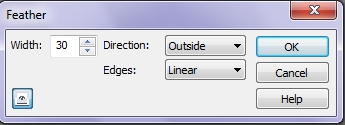
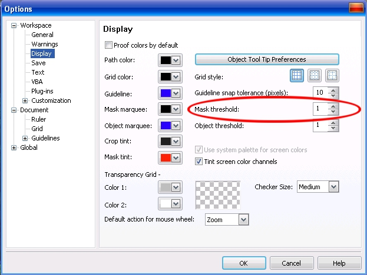

# Команда Feather (Размыть края)

Размывание выбранной области изменяет прозрачность пикселей, смежных с рамкой выделения. Любой эффект или команда, примененная к выбранной области постепенно прекращает свое действие при переходе к защищенной области. Чтобы увидеть результат применения размывания к выбранной области, примените размывание, а затем из меню **Mask** (Маска) выберите команду _Рисовать по маске_, чтобы можно было просмотреть выделение в черно-белом виде. Обратите внимание, что размывание отображается как постепенный переход в черный цвет по мере приближения к защищенной области, которая изображена черным цветом.

Размывка краев выделенной области выполняется командой **Mask > Mask Outline > Feather** (Маска > Абрис маски > Размыть края), в результате выполнения которой появляется одноименное диалоговое окно (рис. 1).

**Для применения размывания к пикселям вокруг рамки выделенной области:  
**

1\. Выполните команду **Mask > Mask Outline > Feather** (Маска > Абрис маски > Размыть края).  
2\. Введите значение в счетчике **Width** (Ширина).  
3\. Выберите направление размывания из раскрывающегося списка **Direction** (Направление).  
Направление определяет расположение размывания относительно рамки выделения. В этом раскрывающемся списке доступны следующие виды _Направления_:

*   **Inside** (Внутри) – размытие выполняется от края редактируемой области к центру;
*   **Middle** (Среднее) – размещение одинакового числа размытых пикселей внутри и снаружи края редактируемой области;
*   **Outside** (Снаружи) – размытие выполняется от края редактируемой области наружу;
*   **Average** (Усредненное) – выбор всех пикселей в области, заданной в поле **Width** (Ширина), и присвоение им всем средних значений цвета

4\. Выберите тип края из раскрывающегося списка **Edges** (Края).

Если в качестве направления было выбрано направление **Average** (Усредненное), то раскрывающийся список **Edges** (Края) недоступен.  
Если выбрано направление **Average** (Усредненное), то размывание выполняется непосредственно между внутренними и наружными пикселями рамки выделения.

В списке **Edges** (Края) можно выбрать между **Curved** (Скругленными) и **Linear** (Прямыми) углами размывки.  
Кнопка в виде глаза, в левом нижнем углу, обеспечивает предварительный просмотр действия команд прямо в окне документа. В нем красным цветом будет показана маскированная область, получающаяся в результате действия команды.

Результат размывки краев выделения далеко не всегда заметен на экране по положению рамки выделения. Photo-Paint предоставляет вам выбор положения рамки выделения. Она может располагаться по контуру, соответствующему полностью выделенным пикселам, частично выделенным пикселам или по любому промежуточному значению. Положение рамки задается на странице **Display** (Монитор) диалогового окна **Options** (Параметры), изображенном на рис. 2, с помощью параметра **Mask threshold** (Порог маски).

Этот параметр позволяет осуществлять точную настройку положения рамок выделения для доступных областей, края которых размыты. Выберите порог в диапазоне от 1 до 255\. При значении порога, равном 255, рамка выделения располагается на самых прозрачных пикселях размытого края выделения, т.е. на наиболее близких к центру рамки. При значении порога, равном 1, рамка выделения располагается на самых непрозрачных пикселях размытого края выделения, т.е. на наиболее удаленных от центра рамки.  
Размывка краев выделений применяется практически всегда при создании монтажей из изображений.