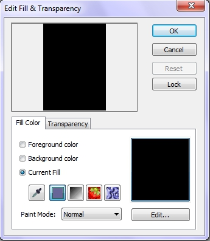
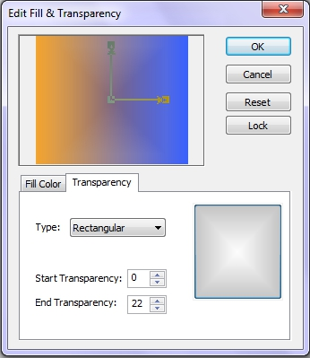

# Команда Fill (Залить) в Corel PHOTO-PAINT

Для заливки изображения, выделенных областей и объектов, в PHOTO-PAINT есть специальная команда в меню **Edit** (Правка). В отличие от инструмента _Заливка_, при выполнении команды, не появляется Панель свойств для изменения параметров. Вместо этого, появляется диалоговое окно **Edit Fill & Transparency** (Изменение заливки и прозрачности) (рис. 1). Чтобы вызвать это окно, выполните команду **Edit > Fill** (Правка > Залить).

Это диалоговое окно имеет две вкладки, **Fill Color** (Цвет заливки) и **Transparency** (Прозрачность). На вкладке **Fill Color** (Цвет заливки) можно определить не только заливку, но и отредактировать существующую. В случае применения _Однородной заливки_, можно с помощью переключателей в качестве цвета заливки выбрать **Foreground color** (Цвет переднего плана) или **Background color** (Цвет фона).

В области просмотра (вверху) и области образца цвета (внизу справа), отображается текущий цвет заливки. Для изменения цвета заливки, нажмите кнопку **Edit** (Изменить). Появится диалоговое окно, соответствующее текущему типу заливки, в данном случае **Uniform Fill** (Однородная заливка), в котором вы можете выбрать необходимый цвет. Цвет можно также взять из изображения с помощью _Пипетки_.

Можно изменить тип заливки, нажав соответствующую кнопку на вкладке **Fill Color** (Цвет заливки). Задав тип заливки, нажмите кнопку **Edit** (Изменить), чтобы выбрать подходящий образец и отредактировать его параметры Здесь же можно задать режим наложения, выбрав его в раскрывающемся списке **Paint Mode** (Режим рисования).

При использовании команды **Edit > Fill** (Правка > Залить) можно контролировать уровень и узор прозрачности. Элементы управления прозрачностью заливки находятся на вкладке **Transparency** (Прозрачность) (рис. 2). В раскрывающемся списке **Type** (Тип), можно выбрать тип прозрачности, который определяет «узор» прозрачности. Если вы посмотрите на список типов, то увидите, что они точно такие же, как типы градиентной заливки. В верхней части окна, в области просмотра, помимо просмотра влияния собственно самой прозрачности, есть возможность изменять прозрачность (но не степень прозрачности) с помощью управляющих маркеров. В зависимости от типа прозрачности, меняются и элементы управления в окне просмотра.

Вы можете не только менять, уменьшать или увеличивать размер «области» прозрачности в области просмотра, но и перемещать прозрачность в какую-либо часть изображения, что позволяет делать более прозрачной определенное место в изображении. Например, если вы хотите сделать более прозрачным нижнюю часть изображения, вы можете это сделать переместив начальную точку прозрачности вниз.

Прозрачность можно регулировать, регулируя прозрачность начальной точки – **Start Transparency** (Прозрачность в начале) и конечной – **End Transparency** (Прозрачность в конце).