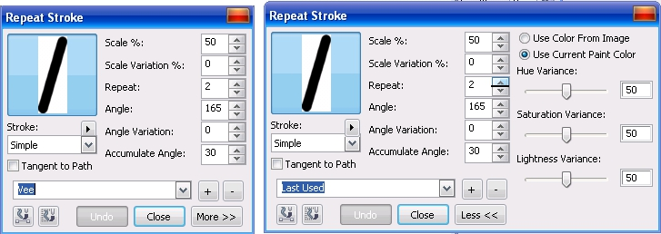
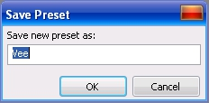
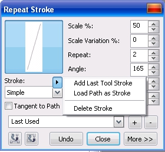

# Команда Repeat Brushstroke (Повторить мазок кисти) в Corel PHOTO-PAINT

В Corel PHOTO-PAINT имеется еще одна команда относящаяся к инструменту **Paint** (Кисть). Хотя она и не использует этот инструмент непосредственно для выполнения мазка, но использует его для создания образца. Инструмент _Повтор мазка кисти_ позволяет сохранить и повторно применить мазки, выполненные любой кистью. Применять это средство целесообразно тогда, когда вам нужно будет применить при работе один и тот же мазок не один раз или получить определенный эффект с помощью кисти.

Для того, чтобы команда **Repeat Brushstroke** (Повторить мазок кисти) стала доступной, нужно сначала выбрать инструмент **Paint** (Кисть). Для применения _Повтора мазка кисти_, вам необходимо сначала выбрать кисть и настроить ее параметры: размер; форму; цвет и т. д. После этих подготовительных действий, выполните команду **Edit > Repeat Brushstroke** (Правка > Повторить мазок кисти). Конечно, порядок действий может быть несколько иным, это зависит от того, что вы хотите сделать. Если вы хотите применить команду **Repeat Brushstroke** (Повторить мазок кисти) к выбранной вами кисти, то порядок действий будет именно таким, как я только что написал. Однако, если вы решили применить эту команду не к кисти, а к мазку, то нужно создать сначала мазок, а затем использовать команду **Repeat Brushstroke** (Повторить мазок кисти). В любом случае, появится диалоговое окно **Repeat Stroke** (Повтор мазка) (рис. 1).

На рис. 1 показано диалоговое окно **Repeat Stroke** (Повтор мазка) без отображения дополнительных параметров (слева) и это же окно с дополнительными параметрами (справа).

Начните знакомиться с этим диалоговым окном с раскрывающегося списка заготовок, в нижней части окна. Выберите любой вариант, например, **Vee**. Нажмите кнопку **Repeat stroke along path** (Повторить мазок вдоль пути), указатель мыши примет вид перьевой ручки и щелкните где-нибудь в окне изображения. Появится мазок, в виде английской буквы «V». Поэкспериментируйте с другими вариантами из этого списка. Набор заготовок входящий в состав PHOTO-PAINT весьма невелик, но вы можете его дополнить своими. Для этого создайте свой мазок, например, в виде буквы «W» и нажмите кнопку **Добавить** в виде значка «**+**», рядом со списком. В открывшемся диалоговом окне **Save Preset** (Сохранение заготовки) (рис. 2), в поле **Save new preset as** (Сохранить заготовку как) введите название заготовки и нажмите **ОК**.

Созданная таким образом заготовка добавиться в раскрывающийся список. Можно созданный мазок кисти сохранить, как контур (путь), по которому будут в дальнейшем строиться мазки любыми кистями. Для этого сделайте мазок необходимой формы и в диалоговом окне вызовите меню **Stroke** (Мазок) (рис. 3).

В этом меню выберите команду **Add Last Tool Stroke** (Добавить последний мазок) и в появившемся диалоговом окне **Export Path** (Экспортировать путь) присвойте имя пути и нажмите кнопку **Export** (Экспорт). В результате созданный вами новый путь добавится в раскрывающийся список **Stroke** (Мазок).

Не закрывая диалогового окна **Repeat Stroke** (Повтор мазка) перейдите в окно изображения и сделайте щелчок мышью. В результате создается одна или несколько линий из выбранной вами кисти. С помощью счетчиков в этом диалоговом окне вы можете изменять различные параметры для получения нужного эффекта, например, количество повторов мазка, угол поворота и т. д. Для доступа к дополнительным параметрам, нажмите кнопку **More** (Больше) (рис. 1 справа). Здесь вы можете задать параметры для изменения цвета. Не закрывая это диалоговое окно, вы можете отменять создаваемые мазки с помощью кнопки **Undo** (Отменить).

Вы можете также загрузить любой созданный вами ранее путь с помощью команды **Load Path as Stroke** (Загрузить путь как мазок). В открывшемся диалоговом окне **Open Path** (Открыть путь) выберите файл созданного вами пути.  
Флажок **Tangent to Path** (По касательной к пути) позволяет создавать мазки располагающиеся вдоль пути по касательной к нему.  
Если созданный и сохраненный мазок вам больше не нужен, вы можете его удалить, выбрав в меню команду **Delete Stroke** (Удалить мазок).