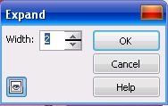
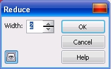
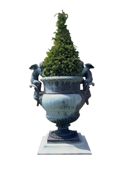
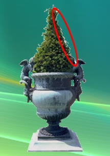
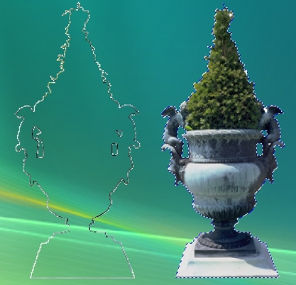
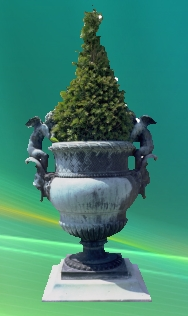

# Команды Expand (Расширить) и Reduce (Уменьшить) в Corel PHOTO-PAINT

Можно расширить или сократить размер редактируемой области на заданное количество пикселей по всему контуру. Рамка выделения сдвинется внутрь или наружу на заданное количество пикселей. Команды **Expand** (Расширить) и **Reduce** (Уменьшить) открывают похожие диалоговые окна (рис. 1 и 2), в которых находится единственное поле ввода. В нем указывается количество пикселов, на которое надо увеличить или уменьшить выделение.

**Для расширения редактируемой области на заданное количество пикселей:  
**

1\. Выполните команду **Mask > Mask Outline > Expand** (Маска > Абрис маски > Расширить).  
2\. В поле **Width** (Ширина) введите количество пикселей.

**Для сокращения редактируемой области на заданное количество пикселей:**

1\. Выполните команду **Mask > Mask Outline > Reduce** (Маска > Абрис маски > Уменьшить).  
2\. В поле **Width** (Ширина) введите количество пикселей.

На рис. 3 показано изображение, которое я решил использовать в качестве примера.

Для наглядности действия команды **Reduce** (Уменьшить), я размещу это изображение на абстрактном фоне. Так как исходное изображение расположено на белом фоне, то выделить его не составит большого труда с помощью инструмента **Magic Wand Mask** (Маска волшебной палочкой). Для этого в режиме **Additive mode** (Аддитивный режим) надо выделить сначала белый фон снаружи, а потом с внутренней стороны ручек каменной вазы. Потом инвертируем маску, **Mask > Invert** (Маска > Инвертировать) и скопируем выделение, **Edit > Copy** (Правка > Копировать). Открываем изображение с абстрактным фоном и вставляем изображение из буфера обмена (рис. 4).

Содержимое буфера обмена вставляется в новое изображение в виде объекта, что видно в докере **Objects** (Объекты). Новый объект окружен рамкой в виде «марширующих муравьев». Если рамка не видна, выполните команду **Object > Marquee Visible** (Объект > Показывать рамку). На рис. 4 видно, что по бокам зелени видна белая граница (граница в правой части обведена овалом), что совершенно не украшает полученный результат. Чтобы избавится от нее, создадим маску из объекта, для чего нажмите **Ctrl + M**. Затем выполним команду **Mask > Mask Outline > Reduce** (Маска > Абрис маски > Уменьшить), а в поле **Width** (Ширина) установим значение равным 1 и нажмем **ОК**.

Теперь нам нужно избавится от белой границы по контуру растения. Для этого создадим объект из выделенной области – **Object > Create > Object: Cut Selection** (Объект > Создать > Объект: Вырезать выделение). В докере **Objects** (Объекты) появится еще один объект. Можно сразу удалить получившийся объект, нажав кнопку **Delete** (Удалить) в нижней части докера. Но что-бы получить представление о том, что мы получили в итоге выполненных действий, сначала переместите объект в сторону (рис. 5).

На рис. 5 видно, что в результате наших действий, сначала была создана маска, а потом уменьшена на 1 пиксель и звтем создан объект. Этот объект выглядит в виде тонкого контура повторяющего форму вставленного из буфера объекта. Это наглядно показывает работу команды **Reduce** (Уменьшить). Аналогичным образом работает и команда **Expand** (Расширить). Теперь можно этот объект в виде тонкой рамки удалить. Окончательный вариант изображения показан на рис. 6.

Как видно на рис. 6, новые границы (очертания) объекта гораздо лучше, чем были сразу после вставки из буфера обмена. Белый ореол вокруг объекта исчез. Подобные действия приходится довольно часто выполнять, при создании композитных изображений в сочетании с различными вариантами размытия краев.