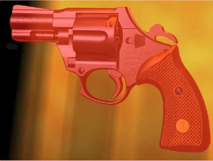

# Команды Invert, Grow (Распространить) и Similar (Подобное) в Photo-Paint

### Команда Invert (Инвертировать)

Мы уже познакомились с инструментами маски и некоторыми командами из меню **Mask** (Маска). Теперь продолжим знакомство с командами этого меню и областью их применения.  
Как говорилось ранее, часто бывают ситуации, когда для выделения какого-либо объекта, удобней выделять не сам объект, а окружающий его фон. На рис. 1 представлен такой случай. Для выделения револьвера потребуется немало усилий, несмотря на кажущуюся простоту его конструкции. И хотя окружающий его фон не полностью однороден, его выделение займет намного меньше времени и сил. Для выделения фона достаточно воспользоваться инструментом **Magic Wand Mask** (Маска волшебной палочкой) с низким значением **Tolerance** (Допуска), в пределах от 4 до 8\. Несколько щелчков инструментом на фоне в режиме **Additive mode** (Аддитивный режим), позволяют выделить практически весь фон. Однако фон под нижней частью ствола пришлось выделять с помощью инструмента **Brush Mask** (Маска кисти). И тем не менее, выделение фона заняло не больше минуты.

Теперь мы можем познакомиться с нерассмотренной ранее командой, но часто используемой. Это команда **Invert** (Инвертировать). Как видно на рис. 1, при просмотре в режиме **Mask Overlay** (Наложение маски), после создания маски, револьвер оказался защищенной областью, а фон – редактируемой. Для того чтобы сделать револьвер редактируемой областью, а фон защищенной, выполните команду **Mask > Invert** (Маска > Инвертировать) (рис. 2).

Теперь вы можете при желании изменить оттенок револьвера, например придав ему более «стальной» (т. е. серый) оттенок (рис. 3). Я для этого использовал фильтр **Hue/Saturation/Lightness** (Оттенок/Насыщенность/Яркость).

### Команды Grow (Распространить) и Similar (Подобное)

Эти команды доступны в **Mask Outline** (Абрис маски) меню **Mask** (Маска). Их можно применять при создании выделенных областей на основе цвета или цветовых тонов, однако, поскольку они не предоставляют такого количества параметров и вариантов просмотра, как команда **Color Mask** (Цветовая маска), я их редко использую. У команды **Grow** (Распространить) и **Similar** (Подобное) есть два общих свойства: обе требуют начала работы с активной выделенной областью и обе учитывают значение параметра **Tolerance** (Допуск) инструмента **Magic Wand Mask** (Маска волшебной палочкой) при определении того, насколько необходимо увеличивать размеры выделенной области.

Команда **Grow** (Распространить) выделяет только те участки изображения, которые граничат с исходной выделенной областью, в то время как команда **Similar** (Подобное) анализирует все изображение и выделяет все пиксели, которые соответствуют критериям, определяемым параметром **Tolerance** (Допуск) инструмента **Magic Wand Mask** (Маска волшебной палочкой).

Исходя из вышесказанного следует вполне логичный вывод – обе эти команды целесообразно использовать в сочетании с инструментом **Magic Wand Mask** (Маска волшебной палочкой). Однако при их использовании следует помнить, что при увеличении выделенной области, могут быть выделены совершенно неожиданные участки изображения, поэтому применять их лучше при выделении однородных цветов и контрастных к остальным участкам изображения. Пример такого изображения и созданная маска приведен на рис. 4\. В данном примере была выделена желтая дискета, а после этого применена команда **Mask > Mask Outline > Similar** (Маска > Абрис маски > Подобное), в результате вторая желтая дискета выделилась автоматически.

