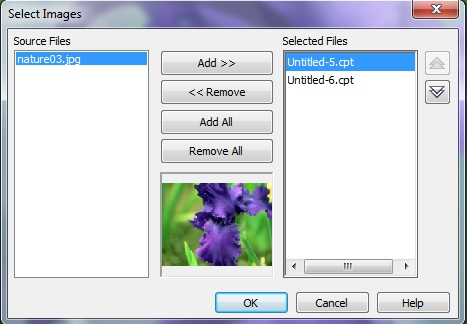
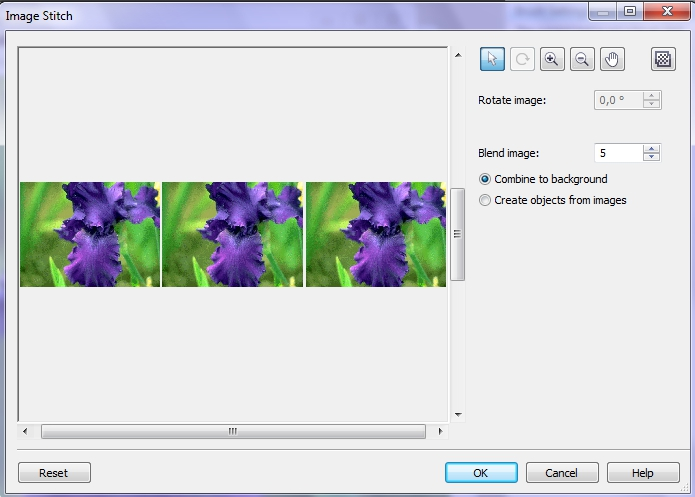
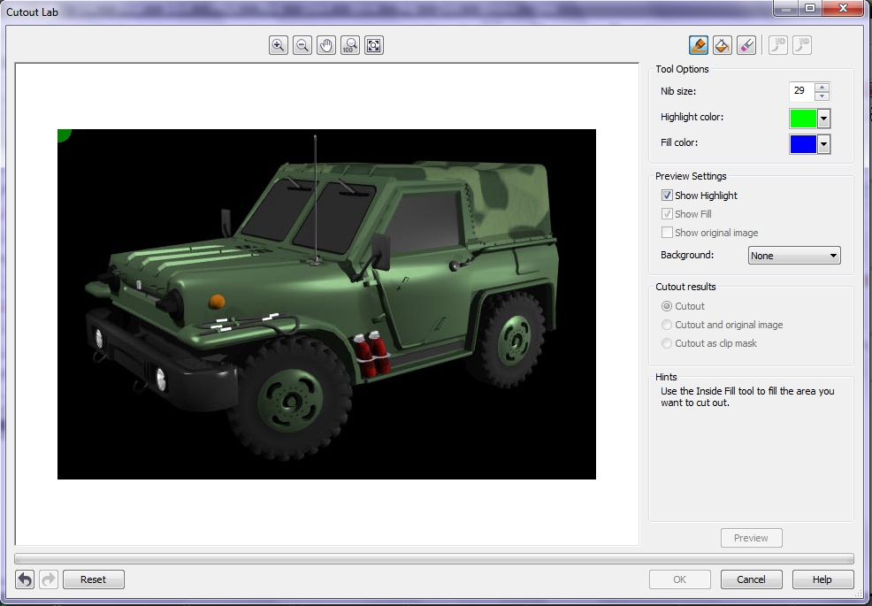
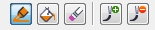

# Команды Stitch и Cutout Lab

### Команда Stitch (Объединить)

В Corel Photo-Paint есть замечательная команда – **Stitch** (Объединить) из меню **Image** (Изображение). Она предназначена для соединения нескольких изображений в одно целое изображение. В более ранних локализованных версиях Photo-Paint можно было встретить другое название этой команды – _**Сшить**_. Примеры использования этой команды вы встречаете повсюду в этой книге, где скриншоты состоят из нескольких изображений. Для применения этой команды необходимо, чтобы все объединяемые изображения были открыты. Photo-Paint не может объединить изображения сохраненные на диске, но не открытые в данный момент.

Для объединения нескольких изображений в одно, выполните команду **Image > Stitch** (Изображение > Объединить). Photo-Paint выведет диалоговое окно **Select Images** (Выбор изображений) (рис. 1).

В списке **Source Files** (Исходные файлы) появятся открытые в настоящий момент документы, в том числе и несохраненные. Щелкнув в списке на именах необходимых для объединения файлов, нажмите кнопку **Add** (Добавить). Выбранные файлы появятся в списке **Selected Files** (Выбранные файлы). Если вам необходимо добавить сразу все файлы, нажмите кнопку **Add All** (Добавить все). Соответственно, если вы хотите исключить из списка выбранных файлов какой-то из них, нажмите кнопку **Remove** (Удалить) или **Remove All** (Удалить все) для удаления всех файлов из списка. В правой части окна расположены две кнопки в виде спаренных треугольников. Эти кнопки позволяют изменить порядок следования файлов в списке **Selected Files** (Выбранные файлы). Очередность файлов в этом списке влияет на взаимное расположение изображений в следующем окне – **Image Stitch** (Объединение изображений). Эта очередность не имеет принципиального значения, однако делает более удобной работу в окне **Image Stitch** (Объединение изображений). После выбора необходимых файлов в окне **Select Images** (Выбор изображений), щелкните **ОК** для перехода в следующее диалоговое окно (рис. 2).

Элементы управления в окне **Image Stitch** (Объединение изображений) не вызовут у вас каких-либо затруднений, они интуитивно понятны. Набор кнопок в верхней правой части окна служат для масштабирования и манипуляций с изображениями в окне предварительного просмотра. Вы можете размещать их в нужном вам порядке, перетаскивая на нужное место и поворачивать. Если вы разместите изображения внахлест, чтобы изображения перекрывали друг друга, то часть одного изображения во время объединения будет обрезана.

Счетчик **Blend image** (Перетекание изображения) служит для задания количества перекрывающихся пикселей, которое Photo-Paint будет использовать для создания плавного перехода изображений. Естественно, если вы просто объединяете разные изображения для того, чтобы получить одно из набора разных фотографий, не перекрывающих друг друга, то этот счетчик остается не задействованным.

Переключатели **Combine to background** (Объединить с фоном) и **Create objects from images** (Создать объекты из изображений) весьма полезны при объединении. Первый из них, позволяет сразу получить готовое изображение, а второй дает вам возможность в дальнейшем редактировать отдельные части объединенного изображения, как объекты.

Если вы расположили изображения в окне предварительного просмотра неудачно, вы можете вернуться к исходному положению и начать комбинировать заново, нажав кнопку **Reset** (Сброс).

### Обрезка изображений с помощью Cutout Lab (Лаборатории вырезов)

В Photo-Paint имеется еще одно средство обрезки изображений, которое называется **Cutout Lab** (Лаборатория вырезов), хотя мне больше нравится название _Лаборатория обрезки_. Название этого средства говорит само за себя. С его помощью можно выполнять обрезку изображений. Вся процедура обрезки выполняется в диалоговом окне (рис. 3), которое вызывается командой **Image > Cutout Lab** (Изображение > Лаборатория вырезов).

В верхней части окна расположен ряд кнопок для изменения масштаба и панорамирования обрезаемого изображения. Элементы управления предназначенные непосредственно для обрезки, расположены в верхней правой части диалогового окна (рис. 4).

Перечислим кнопки, расположенные на этой панели, в порядке их следования слева направо:

*   **Highlighter** (Выделение) – служит для выделения границ вырезаемого объекта;
*   **Inside Fill** (Внутренняя заливка) – служит для заполнения области, которую нужно вырезать;
*   **Eraser** (Ластик) – служит для удаления заливки или выделения;
*   **Add Detail** (Инструмент добавления деталей) – служит для восстановления обрезанной части изображения;
*   **Remove Detail** (Инструмент удаления деталей) – служит для расширения обрезаемого участка изображения.

Теперь рассмотрим порядок действий в этом окне для обрезки изображения.

**Для обрезки изображения с помощью Cutout Lab (Лаборатории вырезов):**

1\. Выполните команду **Image > Cutout Lab** (Изображение > Лаборатория вырезов).  
2\. В счетчике **Nib size** (Размер кончика) установите размер инструмента **Highlighter** (Выделение).  
3\. В диалоговом окне **Cutout Lab** (Лаборатория вырезов) нажмите кнопку **Highlighter** (Выделение) и обведите вырезаемую часть изображения.  
4\. Щелкните кнопку **Inside Fill** (Внутренняя заливка) и залейте выделенную с помощью инструмента **Highlighter** (Выделение) часть изображения. Для этого просто щелкните внутри выделенной части.  
5\. Нажмите кнопку **Preview** (Просмотр).  
6\. Щелкните кнопку **ОК**.

Для обрезки части изображения не обязательно (хотя желательно) обводить вырезаемый объект как можно точнее. Однако, если вы обрезали немного лишнего или наоборот, в область обрезки попала смежная часть изображения, не стоит сразу нажимать кнопку **Reset** (Сброс) или кнопку _Отмены_. Для исправления этой ситуации служат кнопки **Add Detail** (Инструмент добавления деталей) и **Remove Detail** (Инструмент удаления деталей). Как вы догадались, инструмент **Add Detail** (Инструмент добавления деталей) используется в тех случаях, когда вы обрезали лишнее. Просто начинайте закрашивать те участки, которые были случайно «удалены» при обрезке. Photo-Paint восстановит «удаленные» фрагменты. Соответственно, если вы обрезали меньше задуманного и вам нужно «удалить» необрезанные части, используйте инструмент **Remove Detail** (Инструмент удаления деталей). Этот инструмент подобно ластику сотрет части изображения, которые требуется обрезать (удалить).

В окне **Cutout Lab** (Лаборатория вырезов) имеется несколько дополнительных параметров служащих для большего удобства в работе. Они не влияют на результат обрезки. В области **Preview Settings** (Параметры просмотра) вы можете выбрать один из вариантов того, как будет выглядеть в окне предварительного просмотра результат обрезки.

Соответственно в области **Cutout Results** (Результаты выреза) вы можете указать Photo-Paint, как он должен представить вырезанную часть.

Если вы забыли назначение того или иного элемента управления или последовательность действий, Photo-Paint проведет вас по всем этапам работы, показывая по ходу подсказки в области **Hints** (Советы). Здесь же можно увидеть подсказку по выбранному в окне инструменту.