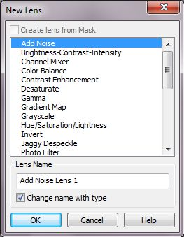
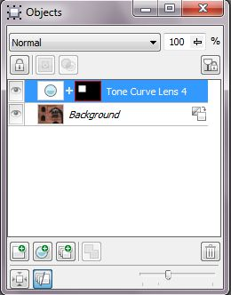
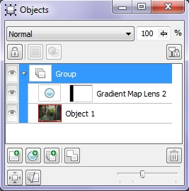

# Линзы в Corel PHOTO-PAINT

В Corel Photo-Paint имеется особый тип объектов, называемый _Линзами_. Линзы являются аналогом корректирующих слоев в Photoshop. Применение линз разнообразно, от коррекции всего изображения до облегчения создания масок. Они применяются как отдельно, так и в комплексе с масками и каналами. Чтобы полностью рассказать о создании и использовании масок в Photo-Paint, необходимо сначала рассказать о линзах. После рассмотрения этого средства Corel Photo-Paint, мы вернемся опять к рассмотрению использования масок. Но теперь мы будем рассматривать их не только в отдельности или перед использованием фильтров, а в комплексе с использованием линз и каналов.

Линзы в Photo-Paint можно сравнить с прозрачным слоем, накладываемым поверх изображения. Но в тоже время они служат для внесения изменений (коррекции) изображения или объектов. Линзы имеют общие свойства с фильтрами из меню **Adjust** (Настройка) и в то же время обладают свойствами объектов. Размер линзы можно менять, перемещать и трансформировать инструментом **Object Pick** (Выбор объекта) в пределах изображения, редактировать и т. д. В любой момент вы можете изменить параметры линзы или удалить ее. Если требуется произвести сложную коррекцию, сочетающую и тональную, и цветовую, то линзы окажут вам неоценимую услугу. Ведь если нужно последовательно применить несколько инструментов коррекции, то после применения первого из них исходное изображение (если, конечно, не сохранять в отдельных файлах каждый этап) будет утрачено. Вы можете наложить поверх изображения любое количество объектов возможных типов и управлять каждым объектом в отдельности.

Более того, с помощью линзы вы можете вносить изменения не только во все нижележащие объекты, но и только в один (предыдущий) объект или даже только в его часть.

Чтобы создать линзу, выполните команду **Object > Create > New Lens** (Объект > Создать > Создать линзу) или нажмите кнопку **New Lens** (Создание линзы) в нижней части докера **Objects** (Объекты). Эта команда открывает диалоговое окно **New Lens** (Создание линзы), в котором приведен перечень доступных типов линз и строка ввода имени линзы **Lens Name** (Название линзы) (рис. 1).

Среди типов линз вы найдете все известные вам инструменты цветовой и тоновой коррекции, ретуши и некоторые специальные эффекты. Выберите интересующий вас тип, щелкнув на его строке в списке. Внизу диалогового окна находится флажок **Change name with type** (Изменять имя при изменении типа), установка которого приводит к тому, что Photo-Paint автоматически присваивает название линзы в поле **Lens Name** (Название линзы). Этот флажок сбрасывается автоматически, как только вы начнете вводит в поле свое название линзы вместо автоматически сгенерированного. При создании еще одной новой линзы, Photo-Paint его вновь автоматически установит.

Когда вы нажмете кнопку **OK**, Photo-Paint откроет диалоговое окно, соответствующее выбранному типу линзы. Оно должно быть вам уже знакомо, поскольку такое же диалоговое окно открывает и одноименная команда из главного меню. Если, например, вы выбрали линзу **Tone curve** (Цветовая кривая), то откроется диалоговое окно **Tone curve** (Цветовая кривая), которое мы уже рассматривали.

Если вы перед созданием линзы, создали маску, то в диалоговом окне **New Lens** (Создание линзы), станет активным флажок **Create lens from Mask** (Создавать линзы из маски). В этом случае созданная линза будет иметь форму и размеры выделенной области.

После этого Photo-Paint создаст новый объект – линзу, который появится и в докере **Objects** (Объекты), как показано на рис. 2\. Размер объекта-линзы точно совпадает с размером изображения. Другими словами, линза действует на все изображение. Это условие будет соблюдаться до тех пор, пока вы не поменяете размер линзы. В докере, миниатюра линзы показывает ее размеры. Как видно на рисунке, линза выглядит маленьким белым прямоугольником, т. к. я создал прямоугольную маску перед созданием линзы. Также, если поменять непосредственно сам размер линзы, это будет видно на миниатюре в докере.

Открыв докер **Channels** (Каналы) вы можете в нем также увидеть линзы отображаемые в виде каналов, как маски обрезки.

Основное преимущество линз в том, что вы всегда можете изменить параметры коррекции или вовсе удалить ее. Вы манипулируете только с линзами, не затрагивая пикселы самого изображения. Чтобы отредактировать эффект линзы, выделите ее в докере **Objects** (Объекты) и выберите команду **Edit Lens** (Редактировать линзу) в меню **Object** (Объект) или выбрав эту команду в контекстном меню линзы. Эта команда откроет диалоговое окно соответствующего фильтра, из меню которого вы можете выбрать другой тип линзы. Таким образом, команда **Edit Lens** (Редактировать линзу) позволяет изменить не только параметры эффекта линзы, но даже и ее тип. Если, например, вы использовали для коррекции линзу **Gamma** (Гамма), но впоследствии обнаружили, что ее средств недостаточно, просто измените ее тип на **Contrast enhancement** (Увеличение контрастности) и подкорректируйте контраст.

Линза действует на все объекты лежащие ниже, и фон. Часто действие линзы нужно ограничить каким-то одним объектом. Это достигается созданием группы, в которой маской служит корректируемый объект, а вторым объектом – линза (рис. 3). Чтобы создать группу, линзу следует поместить прямо над объектом, выделить их в докере **Objects** (Объекты) удерживая нажатой клавишу **Shift**, а затем в контекстном меню выбрать команду **Group** (Сгруппировать). В докере появится пиктограмма группы, подтверждающая ее создание.

На этом мы закончим знакомство с линзами и будем в дальнейшем рассматривать их применение в сочетании с другими средствами Photo-Paint на конкретных примерах.