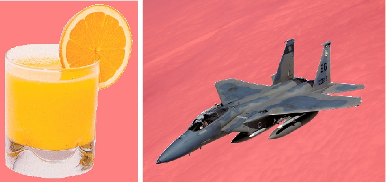
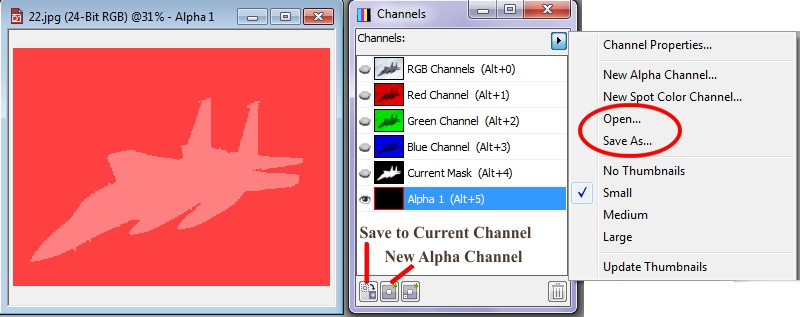
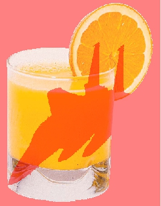
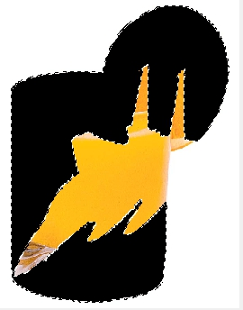

# «Манипуляции» с масками и альфа-каналами в Corel PHOTO-PAINT

### Загрузка масок и альфа-каналов

После сохранения масок и/или альфа-каналов, их можно использовать повторно. Канал выделения также нужно сохранить, при сохранении изображения в файле, формат которого поддерживает информацию о каналах выделения. Это хорошая возможность, использовать сохраненную маску или альфа-канал, вместо того, чтобы создавать их заново.

Для загрузки маски из альфа-канала в открытом изображении, достаточно выполнить команду **Mask > Load > _Название канала_** (Маска > Загрузить > _Название канала_). Дело в том, что пока вы не создадите альфа-канал, в меню не будет доступных каналов для загрузки маски. Вместо этого, в меню **Mask > Load** (Маска > Загрузить), вы увидите неактивную команду **Alpha Channel Load List** (Список загрузки альфа-каналов). Как только будет создан хотя бы один альфа-канал, он появится в меню, вместо упомянутой выше неактивной команды. Если таких каналов несколько, они все будут перечислены в меню **Mask > Load** (Маска > Загрузить).

Для загрузки альфа-канала с диска, в меню докера **Channels** (Каналы) выберите команду **Open** (Открыть). В диалоговом окне **Load an Alpha Channel from Disk** (Загрузка альфа-канала с диска) выберите файл сохраненного альфа-канала и нажмите кнопку **Import** (Импорт). Альфа-канал появится в докере, в списке каналов.

Если сохраненный альфа-канал был создан в другом изображении с иными размерами, то при открытии он растянется или сожмется, чтобы покрыть целиком активное изображение. При этом, если вы загрузите маску из этого канала, то пропорции выделения могут измениться.

Кроме загрузки маски, как альфа-канала, можно загрузить с диска непосредственно саму, ранее сохраненную маску. Для этого выполните команду **Mask > Load > Load From Disk** (Маска > Загрузить > Загрузить с диска).

При загрузке маски с диска, указатель мыши примет вид перекрестия с «прикрепленной» к нему маской. Вам незачем беспокоиться о том, чтобы точно разместить маску, Photo-Paint разместит ее сам в нужном месте.

### Добавление и вычитание формы канала выделения из выделения

Канал выделения может быть использован для добавления или удаления участков из текущей выбранной области. Добавляемый или вычитаемый участок задается значением оттенка серого цвета канала выделения (между 0 и 255, от черного до белого цвета). Для использования данной процедуры нужно поместить выделение в окно изображения.

**Для добавления или вычитания формы канала выделения из текущего выделения:**

1\. Откройте изображение и создайте маску.  
2\. Откройте докер **Channels** (Каналы).  
3\. В меню докера **Channels** (Каналы) выберите команду **Open** (Открыть) и выберите файл с сохраненным каналом.  
4\. При активном инструменте выделения включите режим **Additive mode** (Аддитивный режим), **Subtractive mode** (Режим вычитания) или **Overlap mode** (Режим наложения) на _Панели свойств_.  
Режим **Additive mode** (Аддитивный режим) объединяет все нечерные пиксели канала выделения с текущей выбранной областью изображения. Режим **Subtractive mode** (Режим вычитания) удаляет такие пиксели из выбранной области. Режим **Overlap mode** (Режим наложения) добавляет пиксели к текущей выбранной области, но исключает все перекрывающиеся области.  
5\. Выполните команду **Mask > Load > Alpha 1** (Маска > Загрузить > Альфа 1).

Объединение канала выделения с текущей выбранной областью приводит в зависимости от выбранного режима либо к расширению, либо сокращению или изменению формы рамки. Канал выделения при этом не изменяется, изменяется только текущее выделение.

### Изменение и обновление канала выделения

Все возможности по изменению выделений, доступные в режиме **Paint On Mask** (Рисовать по маске), также доступны и для изменения каналов выделения.  
Когда канал выделения является единственным отображаемым в окне изображения, изображение – серого цвета. Если одновременно с ним один из цветовых каналов или все являются видимыми, то он выглядит как подкрашивание невыделенного с красным оттенком.

**Для изменения или обновления канала выделения:**

1\. Откройте докер **Channels** (Каналы).  
2\. Щелкните мышью на миниатюре с изображением канала, который нужно изменить.  
Канал выделения автоматически появится в окне изображения, если до сих пор его там не было и теперь его можно редактировать.  
3\. Для изменения характеристик канала выделения используйте любой инструмент Corel Photo-Paint и команды.  
В докере **Channels** (Каналы) обновится миниатюра канала.

Чтобы вам было понятней, о чем было рассказано и было легче разобраться с рассмотренными манипуляциями, рассмотрим пример. На рис. 1 показаны два исходных изображения. В обеих изображениях создана маска и включен режим **Mask Overlay** (Наложение маски), чтобы было лучше видно выделенную область.

**Шаг 1.** В файле с изображением самолета (маска уже создана), в докере **Channels** (Каналы) нажимаем кнопку **New Alpha Channel** (Создать альфа-канал) (рис. 2).

На рис. 2, изображение самолета с созданной маской и альфа-каналом. Справа показан соответствующий изображению докер **Channels** (Каналы), с выделенным альфа-каналом и меню докера. Внизу указаны кнопки **New Alpha Channel** (Создать альфа-канал) и **Save to Current Channel** (Сохранить в текущий канал).

**Шаг 2.** После создания канала сохраняем маску в канал, для чего щелкните в докере на канале и нажмите кнопку **Save to Current Channel** (Сохранить в текущий канал) в докере **Channels** (Каналы) (рис.2).

**Шаг 3.** Теперь нам нужно сохранить полученный канал выделения на диск. Для этого в меню докера выполняем команду **Save As** (Сохранить как) и сохраните канал в файле формата **.cpt**.

**Шаг 4.** Открываем изображение со стаканом сока и создаем маску, как показано на рис. 1.

**Шаг 5.** В меню докера **Channels** (Каналы) выбираем команду **Open** (Открыть) и загружаем созданный (сохраненный) на шаге 3 канал. В докере появится канал и ему автоматически будет присвоено имя **Alpha 1** (Альфа 1).

**Шаг 6.** Так как вы после создания маски, не переключались на другие инструменты, то у вас должен быть активным один из инструментов выделения. На _Панели свойств_ щелкните кнопку **Subtractive mode** (Режим вычитания). Выполните команду **Mask > Load > Alpha 1** (Маска > Загрузить > Альфа 1) (рис.3).

После вычитания маски загруженной из канала, из ранее созданной маски, получилась маска показанная на рис. 4\. Я залил ее черным цветом, чтобы было отчетливо видно, что из существующей маски, была «вырезана» (вычтена) фигурка самолета.

