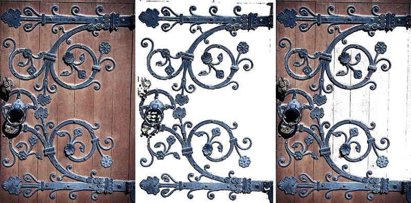

# Маски в Photo-Paint

Редактировать изображения можно двумя способами – глобально и локально. Глобальное редактирование влияет на все изображение или активный объект. При локальном редактировании перед применением фильтра создается выделенная область. Поэтому, если вы захотите совершить какие-либо действия с отдельным объектом или частью растрового изображения, вам придется предварительно указать границы этого объекта или фрагмента. Эта операция называется _выделение_, а сам фрагмент изображения – _выделенной областью_. Примеры обоих подходов к редактированию представлены па рис. 1\. При отсутствии выделенной области Photo-Paint всегда работает глобально и изменяет параметры всех пикселей изображения.

На рис. 1, слева направо: исходное изображение, глобальное применение фильтра, локальное применение фильтра

Маски – инструмент, позволяющий использовать большинство возможностей Corel PHOTO-PAINT по ретушированию. Маски применяются для выбора изменяемой области изображения. Такая область называется _редактируемой_ (_выделенной_). Остальная часть изображения защищается _маской_ от изменений и называется _защищенной областью_. Выделив любой объект в изображении или область, вы тем самым маскируете остальную его часть. Поэтому термины: _выделение_ и _маска_, по сути синонимы. Другими словами, говоря «_создать выделение_» и «_создать маску_», мы подразумеваем одно и то же. Однако _защищенная_ (_маскированная_) _область_ и _выделенная область_ соответствуют разным частям изображения.

**Редактируемая** (_выделенная_) область – область изображения, которая не защищена текущей маской и, как следствие, доступна для редактирования. На выделенную область влияет ис-пользование инструментов рисования и редактирования, спецэффектов и команд меню **Adjust** (Настройка). При применении функции **Mask Overlay** (Наложение маски) область выделения остается прозрачной.

Степень изменений, которые должны коснуться выбранной области или ее части, можно выбрать. Это достигается заданием прозрачности выделения.

После определения редактируемой области в ней можно рисовать, ее можно копировать, использовать в ней различные спецэффекты или способы коррекции, не изменяя при этом остальной части изображения. Редактируемую область можно преобразовать в объект или сделать ее свободной от изображения, чтобы ее можно было перемещать, не затрагивая при этом само изображение. Маски можно использовать для создания необычных эффектов или замены цвета на изображении.

### Так что же такое маска?

Маска похожа на трафарет. Она закрывает изображение и имеет «отверстия», позволяющие изменять области, которые через них видны. Если говорить техническим языком, то маска является изображением с 8-ми битовыми значениями оттенков серого цвета, наложенное поверх другого изображения. Значение оттенка серого цвета можно изменять от 0 до 255 для любого пикселя маски. Область маски со значением цвета пикселей 0 (черный) полностью защищает изображение от изменений. Область, пиксели которой имеют значение 255 (белый), полностью открыта для проведения изменений. Степень изменения пикселей можно определить, задав их значение в промежутке от 1 до 255.

При просмотре маски в режиме **Paint On Mask** (Рисовать по маске) она отображается в черно-белом режиме в окне изображения. Защищенная область изображается черным цветом, а изменяемая область – белым цветом. Переключатель режима **Paint On Mask** (Рисовать по маске) можно найти в меню **Mask** (Маска). Частично защищенные пиксели также входят в редактируемую область и изображаются оттенками серого.

### Рамка маски

Рамка маски – это контур редактируемой области, изображаемый пунктирной линией, похожей на «колонну марширующих муравьев». Она отделяет редактируемую область от защищенной области изображения. Расположение рамки можно изменить, чтобы сделать удобными изменения редактируемой области. Эти изменения выполняются при помощи установки порога чувствительности рамки в диалоговом окне **Options** (Параметры) меню **Tools** (Инструменты).

### Наложение маски

Еще один способ разграничения редактируемой и защищенной областей заключается в подкрашивании невыделенной части изображения. Первоначально режим Наложения маски изображается прозрачным листом с красной затушевкой, покрывающим все изображение. Прозрачная область является _редактируемой_ (выбранной) и, таким образом, позволяет производить изменения изображения. Красные затушеванные области имеют различные степени защиты в зависимости от насыщенности красного цвета. Чтобы включить Наложение маски, выберите из меню **Mask** (Маска) команду **Mask Overlay** (Наложение маски) или нажмите соответствующую кнопку на панели инструментов **Mask/Object** (Маска/Объект). В диалоговом окне **Options** (Параметры) на странице **Display** (Экран) можно изменять цвет подкрашивания защищенной области.

### Как работает маска

Маска располагается на слое выше слоя изображения. Рамку маски можно перемещать, поворачивать, наклонять и растягивать, не затрагивая само изображение. Маска существует временно. Если ее не сохранить в канале маски или на диске, или не сохранить изображение в файле, формат которого поддерживает информацию о выделении, она пропадет после закрытия изображения. Маска пропадает всегда при щелчке мышью вне выбранной области. Если для создания маски потрачено значительное время, то рекомендуется сохранить ее в канале маски или на диске.

### Режимы выделения

Существует четыре режима работы с масками. Режим **Normal** (Стандарт) является режимом по умолчанию и применяется при первоначальном создании маски. Другие режимы используются для добавления или удаления участков из текущей выбранной области. Они позволяют настраивать форму выделенной области и создавать сложные выделения с несколькими выбранными областями.

В PHOTO-PAINT имеет семь инструментов выделения и множество команд, располагающихся в меню **Mask** (Маска), специально предназначенных для работы с масками. Помимо этого, в PHOTO-PAINT имеется панель инструментов **Mask/Object** (Маска/Объект).