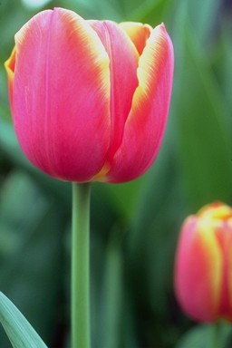
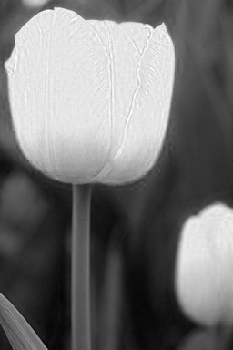
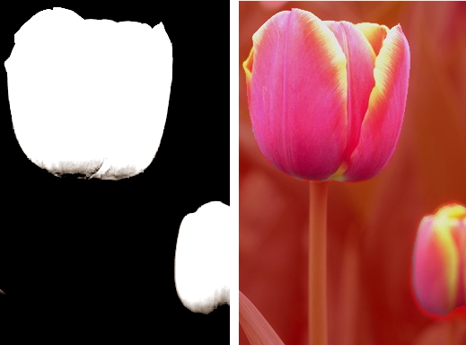
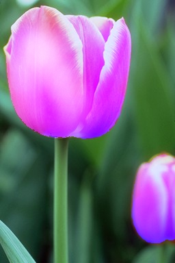

# Маскирование с помощью каналов

Приходилось ли вам смотреть на фотографию и думать: «Ну и как мне выделить это?». Основная "хитрость" состоит в изучении изображения и выявления среди всех цветовых каналов такого, который оказывается наиболее удачной отправной точкой при создании маски.

Начнем мы с создания достаточно простой маски, чтобы вы получили представление о том, как это делается и какие инструменты при этом используются. В качестве примера используем фотографию цветка, показанного на рис. 1\. Нам следует найти канал, в котором цветы будут выглядеть самыми контрастными на фоне зеленых стеблей и листьев. Для этого начните с изучения каналов в докере **Channels** (Каналы). Как переключаться между каналами для их просмотра, вы уже знаете.

После изучения каналов, вы наверняка быстро обнаружите, что самый контрастный канал – это красный (рис. 2).

После предварительного определения самого контрастного канала, можно разбить изображение на составляющие его каналы, с тем, чтобы использовать его для создания маски. Выполните команду **Image > Split Channels to > RGB** (Изображение > Разбить каналы на > RGB). Закройте не нужные вам в работе окна зеленого и синего каналов. Теперь для добавления контраста воспользуемся фильтром **Tone Curve** (Цветовая кривая). Откройте диалоговое окно фильтра и добавьте контрастности (рис. 3).

После применения фильтра (рис. 4), контраст изображения будет достаточным, чтобы легко создать маску. Однако в нижнем левом углу изображения и в самом верху, остались светлые области, которые нужно также сделать черными. Для этого выберите инструмент **Paint** (Кисть). При необходимости в области **Color control area** (Области управления цветом), восстановите настройки по умолчанию.

На _Панели свойств_ инструмента **Paint** (Кисть) установите нужный размер кисти и при необходимости задайте в счетчике **Feather** (Размытие) значение равным нулю. Закрасьте светлые участки изображения за пределами цветов жесткой черной кистью. Теперь самое время создать маску.

В этой ситуации вы вольны выбрать любой инструмент, какой вам больше по душе. Я для создания маски выбрал инструмент **Magic Wand Mask** (Маска волшебной палочкой). Так как контраст велик и за пределами цветов, однородный черный цвет, вы можете спокойно установить на _Панели свойств_ большое значение параметра **Tolerance** (Допуск). Я установил значение _Допуска_ равным 17, хотя в данном конкретном случае можно выбрать и другое значение. Выбрал для создания маски режим **Additive mode** (Аддитивный режим) и за несколько щелчков мышью выделил оба цветка. После этого можно сохранить полученную маску на диск с помощью знакомой нам уже команды **Save Mask To Disk** (Сохранить на диск) из меню **Mask** (Маска).

Теперь можно вернуться к исходному изображению и загрузить сохраненную на диске маску, выполнив команду **Mask > Load > Load From Disk** (Маска > Загрузить > Загрузить с диска) (рис. 4).

На рис. 4, слева – изображение красного канала после применения фильтра **Tone Curve** (Цветовая кривая). Справа -- исходное изображение после загрузки с диска созданной маски. Маска показана в режиме **Overlay** (Наложение маски).

После загрузки маски, вы можете применить к выделенной области любые изменения на свой выбор. В качестве примера, я закрасил цветы кистью, выбрав в качестве цвета краски, синий цвет и установив на _Панели свойств_ инструмента **Paint** (Кисть), _прозрачность_ 70% и выбрав режим наложения **Add** (Добавление).

Конечный результат показан на рис. 5.

