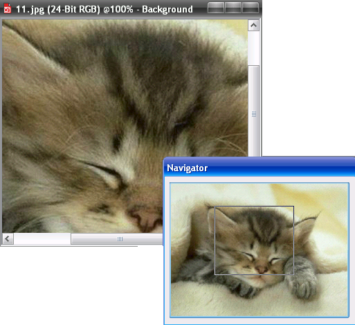

# Навигатор PHOTO-PAINT

Еще одно довольно удобное средство перемещения по документу — кнопка **Navigator** (Навигатор). Она находится в нижнем правом углу окна документа и становится доступной, когда изображение не умещается целиком в окне документа.

После нажатия и удерживания кнопки Navigator (Навигатор), появляется миниатюра изображения с рамкой внутри и значком в виде перекрестия. Перемещая рамку, вы одновременно перемещаетесь в окне документа. Поместите рамку так, чтобы она была на интересующем вас участке. После того, как вы отпустите кнопку мыши, **PHOTO-PAINT** покажет в окне документа именно этот фрагмент.