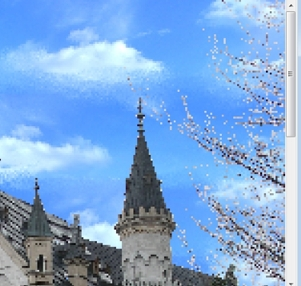

# Обработка краев объекта в Corel PHOTO-PAINT

Часто возникает необходимость изменить края объекта для подчеркивания или сглаживания границы между объектом и фоном. Например, желательно, чтобы объект выглядел контрастно, когда он является изображением на Web-странице, на котором пользователи могут щелкнуть для получения доступа к другому сайту.  
В Corel Рhoto-Рaint есть несколько функций, позволяющих изменять края объекта за одну операцию. Они освобождают пользователя от необходимости редактировать все пиксели на краях объекта по отдельности. Выделяющая рамка объекта очень полезна для определения границы объекта, но она может мешать при редактировании края объекта. Можно скорректировать положение выделяющих рамок для объектов с мягкими краями, т.е. с краями, которые были размыты или сглажены и включают полупрозрачные пиксели.

**Размывание**

Процедура размывания смягчает и сглаживает края объекта. Это делается путем постепенного увеличения прозрачности пикселей, расположенных по краю объекта. Нужно указать ширину размываемой части объекта и необходимый градиент изменения прозрачности. Градиент, называемый типом края, может быть линейной или нелинейной функцией расстояния. Размывание уменьшает четкость краев объекта и вызывает потерю некоторых деталей. Можно использовать размывание для создания эффекта сглаживания жесткого края объекта или для улучшения вида объекта со сглаженными, но недостаточно гладкими краями. Размывание затрагивает больше пикселей, чем сглаживание.

**Повышение резкости**

Процедура повышения резкости противоположна размыванию. Эта функция делает края объекта более четкими и выделяет их из остального изображения путем увеличения резкости. Процедура основана на изменении оттенков и степени прозрачности для пикселей вдоль краев объекта, на которых нужно разместить выделяющую рамку. Прозрачность пикселей, расположенных по обе стороны от этой новой выделяющей рамки, меняется в зависимости от того, входят или не входят пиксели в объект.

**Бахрома**

Иногда края объектов, созданных путем выделения засорены «случайными» пикселями. Это особенно заметно, когда выделенный фрагмент используется для создания объекта, окруженного пикселями разной яркости и цвета. Функция Бахрома позволяет заменить в полосе заданной ширины цвет «случайных» пикселей на цвет пикселей объекта. Объект, обработанный этой функцией, более плавно сливается с фоном и не создается впечатления, что он просто перенесен откуда-то.

**Удаление матового**

Две команды Удаление матового из объекта используются для изменения прозрачности уже в какой-то мере прозрачных пикселей объекта. Команда _Удалить черное матовое_ делает полупрозрачные пиксели более прозрачными путем деления RGB-значения пикселей объекта на соответствующие коэффициенты прозрачности. Команда _Удалить белое матовое_ увеличивает непрозрачность объекта путем умножения RGB-значения пикселей объекта на соответствующие коэффициенты прозрачности.

### Размывание краев объекта

1\. Выделите объект.  
2\. Выполните команду **Object > Feather** (Объект > Размыть края).  
3\. Введите нужное значение (в пикселях) в счетчике **Width** (Ширина).  
4\. В раскрывающемся списке **Edges** (Края) щелкните на необходимом типе края. В этом списке можно выбрать тип края **Linear** (Линейные) или **Curved** (Скругленные).  
Тип края определяет тип градиента изменения прозрачности пикселей в процессе размывания. Можно выбрать линейную или криволинейную функцию изменения прозрачности. При задании линейного типа градиента прозрачность увеличивается равномерно от минимума до максимума. При использовании криволинейной функции прозрачность изменяется по S-образной кривой. То есть, в начале размываемого края прозрачность увеличивается медленно, в центре - сильнее, а в конце - опять медленно. В результате размывание выглядит более компактным.  
5\. Щелкните **ОК**.

Для того чтобы увидеть, как будет выглядеть объект после внесения изменений, нажмите кнопку _Просмотр_ в диалоговом окне **Feather** (Размытие).

### Удаление черного или белого края объекта

1\. Выделите объект.  
2\. Выполните команду **Object > Matting > Remove Black Matte** (Объект > Края > Удалить черное матовое) или **Object > Matting > Remove White Matte** (Объект > Края > Удалить белое матовое).  
3\. Повторите операции при необходимости.

**Пример.**

Наконец дошла очередь до примера, который я обещал написать. Это пример по замене неба в изображении. Я решил его несколько разнообразить, к тому же у меня не оказалось под рукой двух подходящих друг к другу изображений. В результате, на мой взгляд, пример от этого только выиграл. Перед его рассмотрением скажу несколько слов по этому поводу. Я могу с уверенностью сказать, что найдутся многие, кто скажет, что рассмотренный в примере метод «попахивает мазохизмом» и так никто не делает. Но я отчасти специально не стал подыскивать изображения, в результате чего, конечный результат можно было бы получить гораздо быстрее и легче.  
Постановка задачи ясна, мы будем менять небо в одном изображении, с «непривлекательным» небом на другое, более симпатичное небо, взятое из другого изображения. Исходные изображения показаны на рис. 1.

Как видно из рисунка, главная проблема – размеры изображений. Причем изображение замка я уменьшил в 2 раза перед созданием скриншшота. Другими словами, изображения между собой были, как «слон и Моська». На изображении с замком небо выглядит тускло и невзрачно, что мы сейчас и исправим.

**Шаг 1**.

Первым делом займемся замком. Для этого:  
1\. Откройте изображение с замком.  
2\. Выполните команду **Object > Create > From Background** (Объект > Создать > Из фона).  
3\. На панели **Toolbox** (Набор инструментов), в группе инструментов **Interactive/Transparency Tools** (Инструменты интерактивной прозрачности) выберите инструмент **Color Transparency** (Прозрачность цвета).  
4\. На _Панели свойств_ инструмента, в счетчике **Tolerance** (Допуск), установите небольшое значение параметра, например, равным 3.  
5\. Щелкните в нескольких местах неба, чтобы удалить его.  
Такой вариант удаления неба самый простой, но не всегда выполнимый, т. к. не во всех изображениях небо имеет однотонный цвет и достаточно контрастно по отношению к остальной части изображения. В результате, у вас должно получиться, как показано на рис. 2.

**Шаг 2**.

Теперь займемся изображением из которого мы позаимствуем небо. Здесь будет все намного проще. Нам не нужно будет пользоваться какими-то «замудренными» способами, чтобы получить нужный участок неба, потому что нам достаточно будет лишь его фрагмента. Воспользуемся инструментом **Rectangle Mask** (Прямоугольная маска) и просто выделим свободный кусок неба (рис. 3).

Все что нам теперь остается сделать – скопировать выделенную верхнюю часть неба в Буфер обмена.

**Шаг 3**.

По большому счету, нам больше изображение острова не понадобится и вы можете его спокойно закрыть. Теперь в изображении с замком, вставьте содержимое Буфера обмена. Вас может сразу обескуражить получившийся результат (рис. 4).

Часть неба, которая на изображении с островом занимала всю ширину изображения, тут занимает от силы половину. А сам фрагмент неба, выглядит как «блоха на теле».  
Чтобы немного выправить ситуацию, потащите за угловые маркеры, чтобы увеличить фрагмент неба. «Растягивать небо» следует до тех пор, пока его ширина не станет равной ширине изображения с замком. Попытка увеличить его до размеров, чтобы заполнить все «пустое пространство» после удаления неба, приведет к тому, что вставленное небо будет в «пиксельную клеточку».

Теперь наша цель как-то заполнить небом все пространство. Для этого:  
1\. Фрагмент неба (который является объектом) переместите в верхнюю часть изображения.  
2\. Нажмите **Ctrl + D** или выполните команду **Object > Duplicate** (Объект > Дублировать).  
3\. Перетащите дублированный объект вниз, чтобы заполнить часть изображения ниже. Вы заметите, что получается абсолютно идентичные части неба, чего в природе быть не может. Чтобы внести некоторое разнообразие в создаваемое небо, выполните команду **Object > Flip > Horizontally** (Объект > Перевернуть > По горизонтали). В результате мы получим зеркальное отображение.  
4\. Выполните пункты 2 и 3, пока не заполните все пустое пространство (рис. 5).  
Обратите внимание на докер **Objects** (Объекты), там видны все созданные нами объекты. Объект – замок находится ниже всех объектов.

**Шаг 4**.

Теперь нам нужно все фрагменты неба соединить в один объект и разместить позади замка.  
1\. Выделите в докере **Objects** (Объекты) все объекты (кроме замка), щелкая на них при нажатой клавише **Shift**.  
2\. Выполните команду **Object > Combine > Combine Objects Todether** (Объект > Объединить > Объединить объекты).  
3\. В докере **Objects** (Объекты) перетащите объект-замок вверх, чтобы он разместился поверх неба (рис. 6).

**Шаг 5**.

На этом шаге нам нужно избавиться от эффекта «повторяющегося неба». Выберите инструмент **Effect** (Эффект) на панели **Toolbox** (Набор инструментов), в группе инструментов **Brush Tools** (Инструменты кисти). На _Панели свойств_, в раскрывающемся списке **Brush category** (Категория кисти), выберите кисть **Smudge** (Размазывание) (рис. 7).

Установите значение параметра **Amount** (Стекание) равным 67 или близким к этому и обработайте прилегающие области стыков частей неба. Продолжайте делать, пока у вас не останется видимых швов. Естественно, при этом у вас активным объектом должно быть небо. В результате у вас должно получиться, как на рис. 8.

На рис. 9 видно, что результат работы инструмента **Color Transparency** (Прозрачность цвета) и соединение двух изображений не является идеальным. Вокруг веток видны серые участки. Для исправления этой ситуации в Photo-Paint и служат команды по обработке краев.

**Шаг 6**

Последний этап, придание изображению естественного вида. Для этого:  
1\. В докере **Objects** (Объекты) щелкните объект-замок, чтобы выделить его.  
2\. Выполните команду **Object > Feather** (Объект > Размыть края).  
3\. В диалоговом окне **Feather** (Размытие), в счетчике **Width** (Ширина)установите значение равным 3\. В раскрывающемся списке **Edges** (Края) выберите тип края **Linear** (Линейные). Щелкните **ОК**.  
4\. Выполните команду **Object > Matting > Remove White Matte** (Объект > Края > Удалить белое матовое).

Конечный результат показан на рис. 10.

