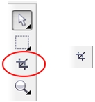
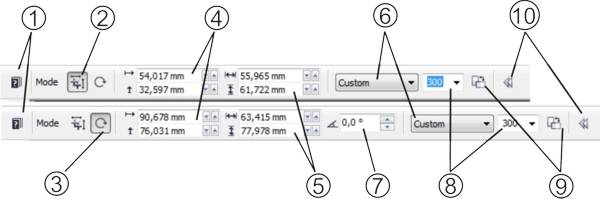
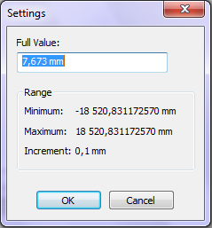
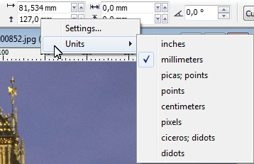

# Обрезка изображения в Corel PHOTO-PAINT

Ещё один способ изменить размеры изображения — **обрезка**. Конечно, это более «радикальный» способ по сравнению с [предыдущим](/node/2544), т.к. после обрезки остается только какая-то его часть, а не все изображение, как в предыдущем варианте. Обрезка чаще всего применяется в тех случаях, когда нужно вырезать какую-то часть изображения, отбросив все остальное. А также для обрезки рваных краев изображения. Такое обычно случается при сканировании старых фотографий со сколотой по краям эмульсией.

Для обрезки изображения используется инструмент **Crop** (Обрезка). Этот инструмент находится на панели **Toolbox** (Набор инструментов).

Использование этого инструмента очень простое — для задания области обрезки, щелкните на инструменте в панели Toolbox (Набор инструментов) и удерживая нажатой левую кнопку мыши протащите ее по диагонали поверх изображения, как бы рисуя прямоугольник. Все что находится за пределами этой прямоугольной области, будет обрезано при применении инструмента Crop (Обрезка). Все что находится внутри прямоугольной области, останется без изменения.

Визуально это так и выглядит. Вы увидите, как PHOTO-PAINT «вычерчивает» прямоугольную рамку по мере того, как вы тащите указатель мыши по изображению. Как только вы отпустите левую кнопку мыши, создание области для обрезки на этом завершится, появится рамка с манипуляторами. По умолчанию отрезаемые части изображения становятся темнее.

Если вы выделили не всю область, не в том месте, большего или меньшего размера, чем рассчитывали, не волнуйтесь – это легко исправить. Если же у вас получилось так, как вы и планировали, то остается только обрезать лишнее. Для этого _внутри_ получившейся прямоугольной рамки сделайте двойной щелчок левой кнопкой мыши. Вот и все. Обрезка завершена.

Основные действия, которые вы можете сделать при работе с инструментом **Crop** (Обрезка):

*   После создания области обрезки, с помощью манипуляторов изменить ее размеры, для чего нужно просто потянуть мышей за нужный манипулятор.
*   Поместив курсор в область рамки и перетаскивая его, вы можете переместить рамку обрезки.
*   Щелкнув один раз на области выделения, вы переведете ее в режим вращения. Пользуясь манипуляторами, поверните рамку на необходимый угол - таким образом, вы при обрезке сможете придать необходимое положение элементам кадра.

Чтобы убрать рамку обрезки ничего не меняя в изображении, достаточно сделать двойной щелчок левой кнопкой мыши за пределами рамки или выбрать другой инструмент.

Давайте рассмотрим параметры и свойства инструмента Crop (Обрезка), которые нам предоставляет PHOTO-PAINT. После выбора инструмента Crop, вид панели свойств изменится, предоставив вам возможность настройки основных свойств инструмента.

Ниже перечислены элементы управления на **Панели свойств инструмента Crop** (Обрезка):

*   1\. Кнопка **Help** (Справка) – вызывает раздел Справки по работе с инструментом Crop (Обрезка)
*   2\. Кнопка **Size** (Размер) в области переключателей режимов трансформации Mode (Режим), переключает инструмент в режим изменения размеров рамки.
*   3\. Кнопка **Rotate** (Поворот), в области переключателей режимов трансформации Mode (Режим), переключает инструмент в режим вращения рамки. В этом режиме, после обрезки, изображение будет повернуто на тот же угол, что и рамка.  
    Режимы переключаются также щелчком кнопкой мыши внутри рамки.
*   4\. Пара полей **Position** (Расположить) задает координаты геометрического центра рамки и ввод значений в полях сдвигает область обрезки.
*   5\. Поля **Size** (Размер) определяют размеры рамки.

Установить значения в группах **Position** (Расположить) и **Size** (Размер) можно обычными способами, введя значения с клавиатуры или с помощью мыши. Но для любителей экзотики есть еще одна возможность ввода значений. Щелкните в поле нужного счетчика правой кнопкой мыши. Появится меню, состоящее всего из одного пункта Settings (Параметры). Щелчком на этом единственном пункте вызовите одноименное диалоговое окно Settings (Настройка). В поле Full value (Значение) введите нужные вам значения. В этом же окне указан диапазон допустимых значений вводимого параметра и приращение.

*   6\. Раскрывающийся список **Crop size** (Размер обрезки) позволяет вам выбрать стандартный размер рамки. По умолчанию в нем установлено значение Custom (Настройка).
*   7\. При переключении в режим вращения, панель свойств меняется и появляется еще одно поле — **Angle** (Угол), в котором задается угол наклона рамки.

При переходе в этот режим, изменится и контекстное меню **Position** (Расположить). Теперь помимо команды **Settings** (Параметры), там появится подменю **Units** (Единицы измерения), где можно выбрать необходимые единицы измерения. Причем можно задать различные единицы измерения для размеров по вертикали и по горизонтали.

*   8\. В раскрывающемся списке **Crop resolution** (Разрешение обрезки) можно сразу задать разрешение области обрезки. По умолчанию оно равно разрешению изображения, но вы можете уменьшить или увеличить это значение.
*   9\. Кнопка **Change orientation** (Изменить ориентацию) позволяет изменить ориентацию с альбомной на книжную и наоборот. Каждое нажатие на нее разворачивает рамку на 90 градусов, не меняя ее размера.
*   10\. Кнопка **Hide options** (Скрыть параметры). Нажатие этой кнопки приводит к сокращению размеров Панели свойств, т.е. к скрытию отдельных элементов панели. В этом случае PHOTO-PAINT выведет на экран окно предупреждения, а стрелка на кнопке Hide options (Скрыть параметры) изменит свое направление и название самой кнопки изменится на Show options (Показывать параметры).

Данное окно содержит следующее предупреждение: «_Расширенные параметры по умолчанию были изменены. Закрытие расширенных свойств приведет к скрытию этих параметров. Скрыть эти расширенные свойства?_» и имеет единственный флажок — **Snow warning again** (Всегда показывать предупреждение). Сброс этого флажка приведет к тому, что в дальнейшем PHOTO-PAINT больше не будет вам докучать этим сообщением. Если вы все же решились скрыть расширенные параметры на Панели свойств, то нажмите кнопку ОК. Подобные окна предупреждений будут вам не раз встречаться при работе с программой. На самом деле, это предупреждение носит скорее информативный характер, чем предупреждающий о чем-то серьезном. Так что любой ваш выбор не повлечет за собой каких-то серьезных последствий.