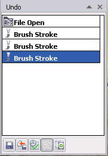
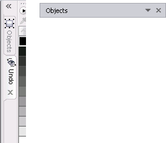

# Отмена, возврат действий и возврат изображения к предыдущему состоянию в Corel PHOTO-PAINT

Думаю, что не ошибусь, если скажу, что операция отмены действий не является для вас новостью и не вызовет у вас трудностей. PHOTO-PAINT позволяет отменить внесенные в изображения изменения типичным для всех приложений Windows способом. **Отмена действия** производится нажатием кнопки **Undo** (Отмена), на **Стандартной панели** инструментов, которая также имеет стандартный вид. Или нажатием комбинации клавиш **Ctrl + Z**.

Отмена результатов действия команды **Undo** (Отмена), выполняется командой **Redo** (Вернуть), что также является стандартной возможностью для всех приложений.  
Можно было бы на этом и закончить, если бы PHOTO-PAINT не предоставил нам дополнительные возможности по работе с этой командой.

**Corel PHOTO-PAINT** позволяет отменять действия, примененные для изображения, начиная с самого последнего. Можно отменить или вернуть такие действия, примененные для изображения, как создание объекта, эффект или преобразование. Однако невозможно отменить или вернуть действия, примененные для рабочего пространства, например изменение настроек.

Можно настроить параметры отмены, тем самым увеличив или уменьшив количество действий, которые можно отменить или вернуть.  
Чем больше действий будет занесено в список действий, которые можно отменить, тем больший объем памяти потребуется для сохранения этого списка. Можно освободить память, если удалить все действия из списка действий для отмены. По умолчанию, в PHOTO-PAINT установлено 10 уровней отмены, т.е. вы можете отменить только последние 10 действий. Максимальное количество отмен, которое вы можете задать – 99.

Для управления отменой действий, в PHOTO-PAINT имеется специальный **докер Undo** (Отмена). В русской версии CorelDRAW Graphics Suite Х5 докеры (Docker) названы Окнами настройки, однако мне привычней и удобней использовать название – Докер. Поэтому в дальнейшем Окна настройки я буду называть докерами, за исключением, когда речь о них будет идти в командах или меню. Чтобы вызвать **докер Undo** (Отмена) на экран, выполните команду **Window > Dockers > Undo** (Окно > Окна настройки > Отмена).

Прежде чем рассматривать возможности, которые нам предоставляет докер Undo (Отмена), давайте сначала рассмотрим действия, которые мы можем выполнить с самим докером. Я хочу на примере этого докера показать, что в PHOTO-PAINT можно сделать с самими докерами, чтобы в дальнейшем не останавливаться на этой теме.

_По умолчанию, все докеры располагаются по правой стороне окна (в закрепленном состоянии), рядом с цветовой палитрой. Докеры могут быть в свернутом состоянии, в виде вкладок или развернутом._

_Возможность свернуть или развернуть докер весьма удобна, т. к. позволяет при необходимости расширить пространство на экране для работы с изображением. Для разворачивания и свертывания докера в верхней части имеется кнопка в виде двойной стрелки, которая меняет свое направление в зависимости от того, развернут докер или свернут. Вы можете закрыть докер, щелкнув на кнопке закрытия, в виде крестика. Если положение докера по правой границе окна вас чем-то не устраивает, вы можете открепить его, перетащив за заголовок в рабочую область окна. Теперь в строке заголовка докера появляется маленькая кнопка в виде черного треугольника направленного вверх. Вы можете свернуть открепленный докер, как показано на изображении выше (справа). Кнопка примет вид треугольника направленного вниз. Щелчок на ней снова развернет докер. Чтобы закрепить его на первоначальном месте, перетащите его к правой границе окна. Таким образом можно закреплять и откреплять не только отдельные докеры, но и группы докеров. Некоторые докеры имеют в своем составе раскрывающиеся списки, меню и другие элементы управления. Но их назначение будет рассмотрено при описании конкретных докеров._

Итак вернемся теперь к докеру Undo (Отмена). По мере того, как вы выполняете те или иные действия, все они появляются в докере в виде списка отмены. Здесь вы можете отменить или возвратить сразу несколько действий. В докере Undo (Отмена) выберите нужное действие в списке. При отмене нескольких действий отменяется выбранное действие и все действия, стоящие в списке ниже его. При возвращении нескольких действий подряд возвращается выбранное действие, а также все действия, которые в списке находятся между выбранным действием и тем, которое было отменено в последний раз.

В нижней части докера Undo (Отмена) имеется ряд кнопок. Рассмотрим их назначение, в порядке их следования слева направо:

*   **Save Script File As** (Сохранить файл макроса как) – позволяет сохранить список действий, находящийся в списке отмены докера Undo (Отмена) в виде макроса;
*   **Revert to Last Saved** (Вернуть к предыдущей сохраненной версии) – возвращает изображение к исходному состоянию, которое оно имело в сохраненном на диске файле и отменяет все выполненные над ним действия;
*   **Checkpoint** (Контрольная точка) – создает так называемую контрольную точку, т.е. позволяет временно сохранить выполненные действия (подробности смотрите ниже в этом разделе);
*   **Restore to Checkpoint** (Восстановить контрольную точку) – восстанавливает изображение к тому состоянию, которое оно имело при создании контрольной точки;
*   **Image Duplicate** (Дублирование изображения) – создает новый файл, дубликат исходного.

В контексте данного раздела, имеет смысл подробнее рассказать о двух командах: **Checkpoint** (Контрольная точка) и **Revert to Last Saved** (Вернуть к предыдущей сохраненной версии). Первая из этих команд весьма полезна и если вы привыкнете ей пользоваться, то найдете это средство очень удобным в работе. Контрольную точку можно создать не только из докера Undo (Отмена), но и с помощью команды **Edit > Checkpoint** (Правка > Контрольная точка). Когда же лучше всего применять эту команду? Представьте себе, что вы работаете над изображением или создаете что-то с нуля. Часть работы вы уже сделали и у вас получилось то, что было нужно. Но дальнейшая работа вызывает у вас некоторые сомнения, вы не уверены, что у вас получится желаемый результат или вы еще раздумываете каким способом это сделать и возможны досадные ошибки. Вот тогда самое время создать контрольную точку. Созданием контрольной точки, вы как бы фиксируете (временно сохраняете) текущее состояние работы. Если вы продолжите работу над изображением и поймете, что сделали все не так или получилось не то, что нужно, вы сможете легко вернуть изображение к тому состоянию, когда все было еще в порядке. Для возврата изображения к тому состоянию (моменту), когда была создана контрольная точка, выполните команду **Edit > Restore To Checkpoint** (Правка > Восстановить контрольную точку). Эта команда становится активной только после того, как вы создадите контрольную точку. Если вы такой точки не создали, то и команда **Restore To Checkpoint** (Восстановить контрольную точку) будет недоступна. Если вы закроете файл, не сохранив изменений, то контрольная точка будет не доступна при следующем открытии файла. Контрольная точка доступна только во время текущего сеанса работы.

Если вы проделали множество работы и количество действий тоже велико, а результат вас совсем не впечатляет, и вы хотите начать все с начала, то вы можете вернуть изображение к исходному, сохраненному состоянию. Для этого служит команда **File > Revert to Saved** (Файл > Вернуть к сохраненной версии). В этом случае, PHOTO-PAINT выведет на экран окно, чтобы вы подтвердили ваши намерения.

Для удаления всех действий в докере Undo (Отмена) и для очистки памяти используйте команду **Edit > Purge > Undo List** (Правка > Очистить > Список отмены).