# Панели инструментов Corel PHOTO-PAINT

По умолчанию, в Corel PHOTO-PAINT X5 отображаются далеко не все панели инструментов, а только: **Standard** (Стандартная), **Property Bar** (Панель свойств), **Toolbox** (Набор инструментов) и **Status Bar** (Строка состояния). Кроме этих панелей, которые появляются в главном окне по умолчанию, в вашем распоряжении имеется еще дополнительно девять панелей, которые можно вызвать из контекстного меню любой панели, если она не находится в закрепленном состоянии.

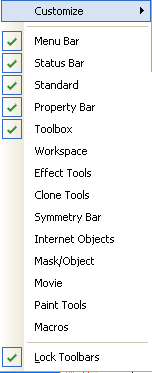

Как и в большинстве других приложений работающих под управлением Windows, панели инструментов в Corel PHOTO-PAINT X5 можно настраивать, размещать, в любом месте окна приложения, а также зафиксировать положение панели с помощью команды **Lock Toolbars** (Закрепить панели инструментов). В случае закрепления панелей, вам не удастся поменять их местоположение. Однако надо учитывать, что при вызове какой-либо панели инструментов, она появляется в окне приложения в незакрепленном состоянии. Но стоит вам перетащить ее в одно из «стандартных положений» (к любой из границ окна), то в дальнейшем изменить размещение панели не удастся до тех пор, пока вы не сбросите флажок Lock Toolbars (Закрепить панели инструментов).

Традиционно, под строкой меню располагается панель инструментов **Standard** (Стандартная), под которой находится **Property Bar** (Панель свойств). Кнопки на этой панели свойств меняются в зависимости от того, какой инструмент вы используете в данный момент и предоставляет в ваше распоряжение доступ к основным настройкам выбранного инструмента. Это очень удобно, т. к. дает вам возможность сразу же изменять необходимые параметры.

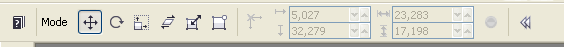

Мы не будем рассматривать подробно в этой главе панели инструментов. Ограничимся лишь кратким их описанием, достаточным для того, чтобы получить о них представление и начать работу.

Панель инструментов **Standard** (Стандартная).

Иконка        | Подсказка     | Описание
------------- | ------------- | -------------
 | New (Создать) | Нажатие этой кнопки приводит к выводу на экран диалогового окна Create a New Image (Создать Изображение) и созданию нового документа. В этом можно задать параметры для создаваемого документа.
 | Open (Открыть) | Кнопка служит для вызова диалогового окна Open an Image (Открытие изображения) и открытия сохраненного на диске документа.
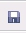 | Save (Сохранить) | Эта кнопка вызывает диалоговое окно Save an Image to Disk (Сохранение изображения на диск), в котором можно указать имя сохраняемого файла, папку на диске и тип файла.
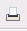 | Print (Печать) | Название кнопки говорит само за себя. Она предназначена для вызова диалогового окна Print (Печать), в котором можно настроить параметры печати и собственно печати самого документа.
 | Cut (Вырезать) | Кнопка, стандартная для всех приложений Windows и предназначена для перемещения выделенного в Буфер обмена.
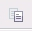 | Copy (Копировать) | Кнопка, стандартная для всех приложений Windows и предназначена для копирования выделенного в Буфер обмена.
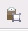 | Paste (Вставить) | Кнопка, стандартная для всех приложений Windows и предназначена для вставки содержимого Буфера обмена в документ.
 | Кнопки Undo (Отмена) и Redo (Вернуть) | Еще две кнопки, стандартные для приложений, работающих в среде Windows. Первая служит для отмены последнего действия, а вторая для отмены изменений выполненных командой Undo (Отмена).
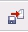 | Import (Импорт) | Кнопка Импорт служит для импорта (вставки) изображения в открытый (активный) документ.
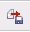 | Export (Экспорт) | Кнопка Export (Экспорт) служит для сохранения дубликата изображения в другом формате файла.
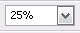 | Zoom level (Масштаб) | Кнопка Zoom level (Масштаб) служит для изменения масштаба изображения в активном окне. Раскрывающийся список предоставляет возможность выбрать степень увеличения изображения.
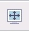 | Full-screen preview (Полноэкранный просмотр) | Нажатие этой кнопки переводит активное изображение в режим полноэкранного просмотра. Для выхода из этого режима достаточно нажать клавишу F9 или Esc.
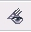 | Image-slicing grid (Сетка для разделения изображений) | Эта кнопка включает и выключает отображение сетки для разделения изображения. Эта функция применяется при подготовке документа для публикации в Web.
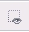 | Mask marquee (Рамка выделения) | Эта кнопка включает и отключает рамку вокруг выделенной области изображения.
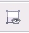 | Object marquee (Рамка объекта) | Эта кнопка включает и отключает отображение рамки вокруг объекта(ов).
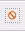 | Remove mask (Удаление маски) | Кнопка предназначена для удаления маски из изображения.
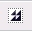 | Invert mask (Инвертировать выделение) | Эта кнопка позволяет инвертировать выделенную область. Более подробно об этом будет написано в разделе книги о масках в изображении.
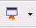 | Application launcher (Запуск приложений) | Кнопка Запуск приложений предназначена для запуска установленных в системе приложений Corel. Для получения доступа к выбору приложения, нужно щелкнуть на кнопке и из раскрывшегося списка выбрать необходимое приложение. В данном списке могут быть не только приложения входящие в состав CorelDraw Graphics Suite X5, но и другие, например, входящие в Corel DESIGNER Technical Suite и Corel WordPerfect Office, при условии, что последние установлены в системе.
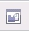 | Welcome screen (Окно приветствия) | С помощью этой кнопки вы можете вызвать Окно приветствия в любой момент.

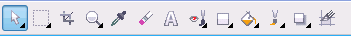

Панель **Toolbox** (Набор инструментов). На этой панели собраны инструменты, с которыми вам, собственно, и предстоит постоянно иметь дело при работе в Corel PHOTO-PAINT X5\. Помимо отдельных кнопок инструментов, на панели Toolbox (Набор инструментов) имеются кнопки, представляющие собой группы инструментов, сгруппированные по общим признакам и назначению. Кнопки, представляющие собой группу инструментов, имеют в нижнем углу небольшой черный треугольник, щелкнув на котором, можно получить доступ к остальным инструментам группы.

Каждая такая группа инструментов представлена в виде раскрывающегося списка с названиями инструментов и «горячими клавишами» им соответствующих. Однако PHOTO-PAINT позволяет облегчить доступ к инструментам нужной группы. Например, если вы в данный момент работаете с инструментами выделения, наверняка вам будет не совсем удобно каждый раз обращаться к группе инструментов и выбирать из нее нужный. Гораздо удобней на мой взгляд, чтобы эти инструменты находились на виду, на панели инструментов. Чтобы это сделать, щелкните правой кнопкой мыши на любой панели и выберите из контекстного меню команду **Lock Toolbars** (закрепить панели инструментов), чтобы сбросить одноименный флажок. Наведите указатель мыши на границу группы, чтобы он принял вид четырехнаправленной стрелки и просто перетащите мышей группу в область окна изображения.  
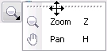  
Группа инструментов, выбранная вами приобретет вид обычной панели инструментов.

После отделения группы инструментов и преобразования ее в отдельную панель инструментов, она появляется в списке панелей. Если вам в работе уже не нужна панель, вы можете ее закрыть, щелкнув на кнопке закрытия панели. При этом группа инструментов не исчезает, вы можете по-прежнему получить к ней доступ, щелкнув треугольник в нижнем углу кнопки соответствующего инструмента.

**Application Bar** (Строка состояния). В нижней части окна приложения располагается Строка состояния. Я не могу сказать, что она слишком информативна или полезна в работе (на мой взгляд). По сравнению со Строкой состояния в CorelDraw, например, она предоставляет менее полезную информацию. Повторюсь, это лично мое мнение.

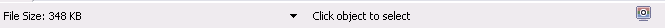

Как видно из рисунка, в строке состояния по умолчанию отображается размер открытого в данный момент документа и информация о выбранном инструменте и кнопка-переключатель Proof colors (Проверка цветов). Щелкнув на треугольной кнопке, можно вызвать меню Строки состояния, для выбора типа информации, которая будет в ней отображаться.

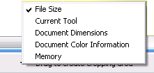

В меню доступны следующие команды:

*   File Size (Размер файла). В левой части Строки состояния будет отображаться размер открытого (активного) в данный момент файла.
*   Current Tool (Текущий инструмент). В Строке состояния будет отображаться название выбранного инструмента.
*   Document Dimensions (Размер документа). В Строке состояния будет виден размер открытого изображения в тех единицах измерения, которые выбраны для линеек.
*   Document Color Information (Информация о цвете документа). В Строке состояния выводится информация о глубине цвета, цветовой модели и текущем цветовом профиле.
*   Memory (Память). Отображается количество свободной памяти.

Еще один элемент главного окна – **Цветовая палитра**, будет рассмотрен дальше в этой книге.

На этом ознакомительный обзор Corel PHOTO-PAINT X5 можно закончить. Следующие главы книги будут посвящены более подробному описанию работы в PHOTO-PAINT, где вы встретите уже вкратце рассмотренные в данной, вступительной части, команды и инструменты. При рассмотрении конкретных примеров их применения, вам станет более понятным их назначение.