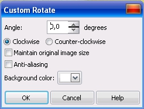

# Поворот изображения в PHOTO-PAINT

Еще одна несложная, но наиболее часто используемая при работе со сканированными изображениями операция — **поворот изображения**. Повернуть изображение можно с помощью команд в подменю **Rotate** (Поворот) меню **Image** (Изображение). В состав подменю включены четыре команды:

*   **90° Clockwise** (90° по часовой стрелке) — поворот изображения на 90° по часовой стрелке;
*   **90° Counterclockwize** (90° против часовой стрелки) — поворот на 90° против часовой стрелки;
*   **180°** — поворот изображения на 180°;
*   **Rotate Custom** (Произвольный поворот) — поворот на любой угол.

Если вам нужно развернуть изображение произвольно, т.е. на угол, отличный от перечисленных в подменю значений, выберите команду **Image > Rotate > Rotate Custom** (Изображение > Повернуть > Произвольный поворот). Появится диалоговое окно **Custom Rotate** (Произвольный поворот).

Это диалоговое окно позволяет задать угол поворота с помощью счетчика **Angle** (Угол), направление вращения с помощью переключателей **Clockwise** (По часовой стрелке) и **Counter-clockwise** (Против часовой стрелки) и фоновый цвет в раскрывающемся списке **Background color** (Цвет фона).  
Флажок **Maintain original image size** (Сохранять исходный размер изображения) отвечает за сохранение исходного размера изображения. В этом случае оно при вращении обрезается. Если флажок снят, то в результате вращения к изображению добавляются поля, размер изображения как бы увеличивается в размерах, чтобы повернутая картинка вместилась целиком. Для того чтобы после поворота линии изображения сохраняли гладкость, установите флажок **Anti-aliasing** (Сглаживание).