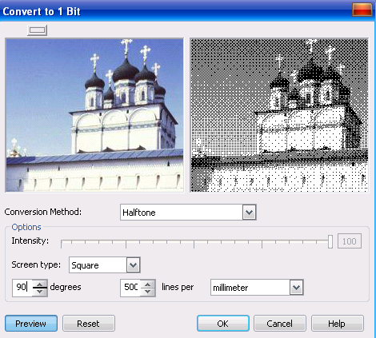
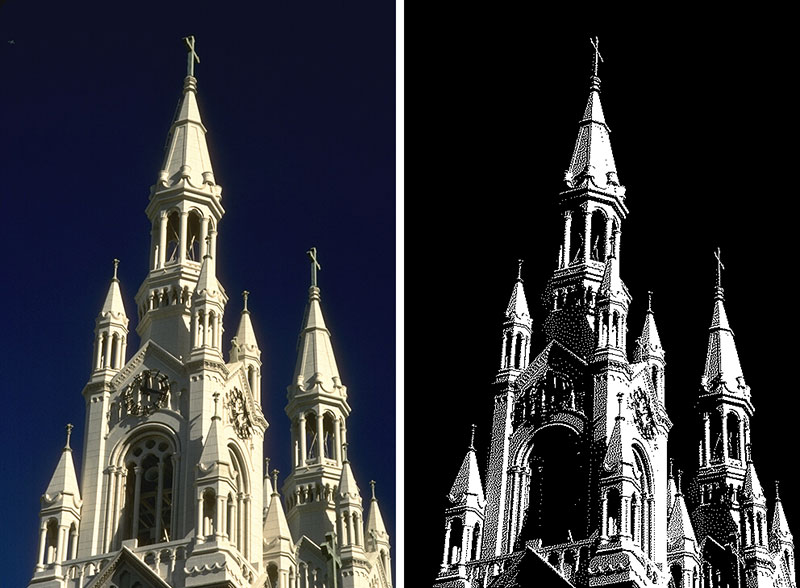

# Преобразование изображений в черно-белый цветовой режим в Corel PHOTO-PAINT

Изображения можно преобразовывать в **черно-белый** цветовой режим (1-бит), чтобы уменьшить размер файла или создать художественное оформление. Черно-белый цветовой режим отличается от режима оттенков серого. В черно-белых изображениях каждый пиксель должен быть или черным или белым, а изображения в оттенках серого могут содержать черный, белый и 254 оттенка серого цвета и подходят для создания эффекта черно-белого фото.

Я не думаю, что вы будете часто прибегать к этому виду преобразования, т.к. область применения таких изображений весьма ограничена. Однако в некоторых случаях можно использовать этот режим получить оригинальные художественные эффекты, например для придания изображению вида гравюры. Следует заметить, что далеко не всякое цветное изображение можно удачно преобразовать в черно-белое. Нужно сначала хорошо попрактиковаться, чтобы получать с помощью этого режима интересные эффекты.

Для преобразования изображения в черно-белое (1-bit), выполните команду **Image > Convert to Black and White** (1-bit) (Изображение > Преобразовать в черно-белый (1 бит)). Появится диалоговое окно **Convert to 1 Bit** (Преобразовать в 1 бит).

Для предварительного просмотра результатов, в диалоговом окне имеется область просмотра изображения до и после применения изменений. Это типичный для PHOTO-PAINT вид диалогового окна. Кнопка расположенная в верхней части, над областью просмотра, позволяет переключать отображение этой области с двухоконного варианта, на однооконный, когда будет виден только результат, а исходное изображение отображаться не будет. Это удобно, когда вы хотите сделать окно большего размера, чтобы лучше видеть результаты применяемых действий. Кроме этого, есть возможность изменять масштаб отображения прямо в диалоговом окне. Если вы наведете указатель мыши в область с исходным изображением (левое окно), то он примет вид руки. В этом случае вы можете щелчком мыши увеличить масштаб в окне просмотра, щелчок правой кнопкой мыши – уменьшает масштаб изображения. Кроме того, вы можете передвинуть изображение в окне просмотра, удерживая нажатой левую кнопку мыши, чтобы лучше рассмотреть интересующий вас участок изображения.

Однако следует отметить, что это пожалуй одно из немногих диалоговых окон в PHOTO-PAINT, не позволяющих просматривать результаты изменений непосредственно на самом изображении. В аналогичных диалоговых окнах, нажатие кнопки над областью просмотра позволяет отключить ее и видеть результаты преобразований непосредственно в окне изображения. Помимо этого, вы можете в диалоговом окне включить или отключить просмотр результатов внесенных изменений нажатием кнопки Preview (Просмотр).

При преобразовании изображений в черно-белый цветовой режим можно выбрать один из семи типов преобразования из раскрывающегося списка **Conversion Method** (Метод преобразования):

*   **Halftone** (Полутона): создание различных оттенков серого путем изменения узора черных и белых пикселей в изображении. Пикселы светлее порогового значения преобразуются в белые, а темнее — в черные. Можно выбрать тип экрана, угол для полутона, единицу измерения и количество линий на единицу измерения.
*   **Line Art** (Штриховой рисунок): создание высококонтрастного черно-белого изображения. Цвета, имеющие значение оттенков серого ниже, чем заданное пороговое значение, изменяются на черный, а цвета, имеющие значение оттенков серого выше, чем заданное пороговое значение, изменяются на белый.
*   **Ordered** (Упорядоченное): организация уровней серого в повторяющиеся геометрические узоры черных и белых пикселей. Сплошные цвета становятся ярче, а кромки изображения — четче. Чем темнее оттенок, тем большую часть узора составляют черные точки.
*   **Jarvis** (Джарвис): применение алгоритма Джарвиса для отдельных пикселей. Эта форма диффузии подходит для фотографий.
*   **Stucki** (Штуки), Floyd-Steinberg (Флойд-Штейнберг): применение алгоритмов Штуки и Флойда-Штейнберга для отдельных пикселей. Эти формы диффузии подходит для фотографий.
*   **Cardinality-Distribution** (Размерность-распределение): создание текстуры путем вычисления и распределения результата на каждый пиксель.

Для всех алгоритмов, кроме Halftone (Полутона), доступен единственный параметр. Он называется в зависимости от алгоритма или Threshold (Порог), или Intensity (Интенсивность). Этот параметр дает вам возможность контролировать соотношение черного и белого цветов в получающемся монохромном изображении. Чем выше этот параметр, тем темнее будет изображение

