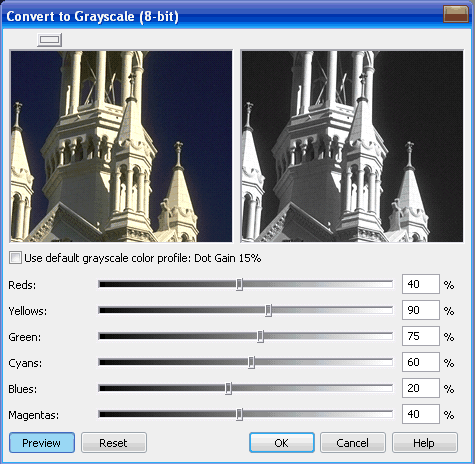
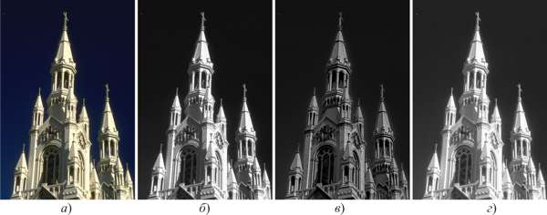

# Преобразование изображений в оттенки серого в Corel PHOTO-PAINT

Изображения в **оттенках серого** (Grayscale) очень распространены. Достаточно вспомнить о черно-белых фотографиях. Можно преобразовать неудачное цветное изображение в замечательную черно-белую фотографию. Режим Grayscale (Оттенки серого) позволяет сократить размер файла по сравнению с полноцветным и облегчить процесс печати, особенно при отсутствии цветной печати. Перевод изображения в режим Оттенки серого производится командой **Image > Convert to Grayscale (8-bit)** (Изображение > Преобразовать в оттенки серого (8 бит)). В новой версии PHOTO-PAINT эта команда усовершенствована по сравнению с предыдущими версиями. Если раньше никакие дополнительные настройки при выборе команды не задавались, то теперь при ее выполнении появляется диалоговое окно **Convert to Grayscale** (8-bit) (Преобразовать в оттенки серого (8 бит)).

Теперь преобразование цветного изображения в черно-белое стало процессом управляемым.

Единственный 8-битный канал полутонового изображения способен передавать **256 градаций серого цвета**, которыми вполне убедительно можно передать полутона.

Ползунки в этом диалоговом окне позволяют задать, насколько темным будет тот или иной цвет, при преобразовании в оттенки серого. Кроме этого, при преобразовании имеется возможность использовать цветовой профиль по умолчанию. Для этого необходимо установить флажок **Use default grayscale color profile** (Использовать цветовой профиль оттенков серого по умолчанию). При установке этого флажка, элементы управления становятся неактивными.

На изображении ниже показаны результаты преобразования цветного изображения в оттенки серого.

Как видно, данное диалоговое окно позволяет управлять процессом преобразования в оттенки серого, получая желаемые результаты. Автоматическое преобразование изображения не дало бы возможности достичь нужного эффекта (сравните варианты б и г, они очень похожи). В этом примере не ставилась задача показать все возможности преобразования или получить какой-то реалистичный результат, а лишь показать наличие возможности управлять процессом преобразования.

PHOTO-PAINT помимо стандартной 8-битовой глубиной цвета полутоновых изображений, поддерживает **16-битовую глубину цвета**, которая позволяет воспроизводить 65536 оттенков серого. Перевод в оттенках серого 16-бит производится командой **Image > Convert to > Gray-scale (16-bit)** (Изображение > Преобразовать в > Оттенки серого (16 бит)). _Для изображений этого типа доступны не все команды коррекции и эффектов._