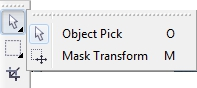
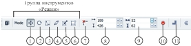
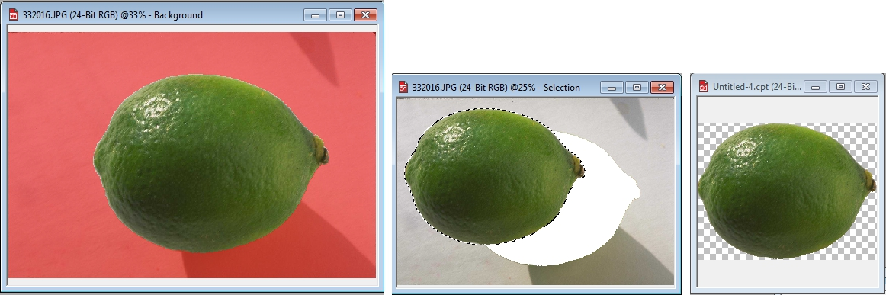
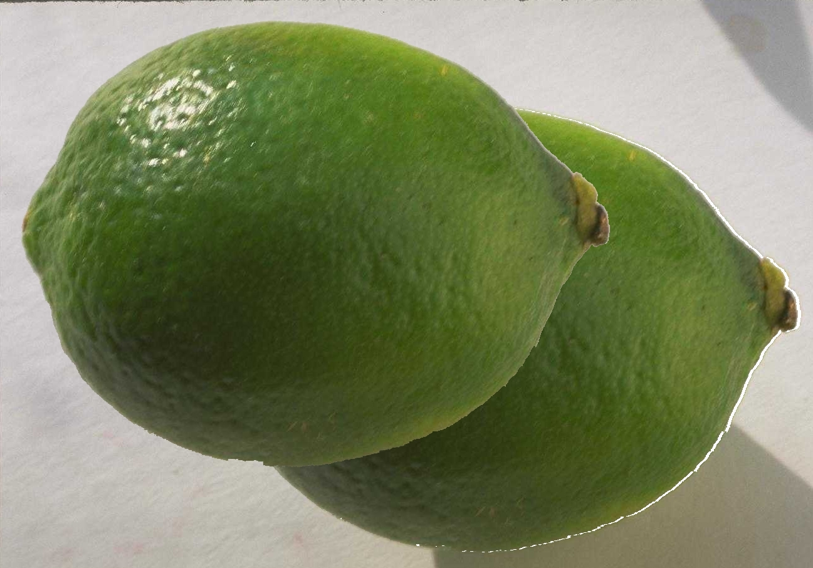
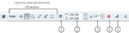
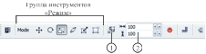

# Преобразования редактируемых областей в PHOTO-PAINT

Трансформация редактируемой области влияет на его форму. Трансформация не влияет на пиксели, содержащиеся в выделенной области. Однако, если маска свободна (в открепленном состоянии), то перед выполнением трансформации пиксели автоматически объединяются с фоном.

Рамка выделения может быть повернута, наклонена, можно изменить ее масштаб, выполнить зеркальное отображение и искажение, а также наложить на нее перспективу. Все эти преобразования можно выполнить при помощи инструмента **Mask Transform** (Преобразование маски) и связанной с ним Панели свойств. Преобразования могут быть непосредственно выполнены и в Окне изображения при помощи буксировки манипуляторов, которые отображаются на рамке выделения при работе с инструментом _Преобразование маски_. Однако, искажения и перспективу можно применить только при помощи манипуляторов непосредственно в Окне изображения. Инструмент **Mask Transform** (Преобразование маски) находится в группе инструментов **Pick Tools** (Инструменты выбора) (рис. 1).

Отобразив выделение в Окне изображения, щелкните мышью инструмент **Mask Transform** (Преобразование маски), чтобы отобразить манипуляторы. Щелкните внутри выбранной области для отображения манипуляторов вращения и наклона. Щелкните внутри выбранной области еще раз, чтобы отобразить манипуляторы искажения. Еще один щелчок приведет к отображения манипуляторов наложения перспективы.

За единицы измерения значений полей по горизонтали и по вертикали Панели свойств берутся текущие единицы измерений. Их можно изменить при помощи диалогового окна **Options** (Параметры) меню **Tools** (Инструменты).

Панель свойств инструмента **Mask Transform** (Преобразование маски) показана на рис. 2\. Набор элементов управления на Панели свойств изменяется, в зависимости от выбранного режима. На рис. 2 представлена Панель свойств для режима **Position and size** (Положение и размеры). Не зависимо от выбранного режима, набор кнопок группы **Mode** (Режим) остается неизменным. Ниже перечислены эти кнопки:

1\. Кнопка режима **Position and size** (Положение и размеры) – переключает инструмент в этот режим, в котором можно менять размеры и положение рамки выделения.

2\. Кнопка режима **Rotate** (Поворот) – переключает инструмент в этот режим, в нем можно повернуть или наклонить рамку выделения.

3\. Кнопка режима **Scale** (Масштаб) – переключает инструмент в этот режим, в котором можно изменить размеры рамки выделения, путем масштабирования.

4\. Кнопка режима **Skew** (Наклон) – переключает инструмент в режим **Skew** (Наклон), который аналогичен режиму **Rotate** (Поворот), за исключением того, что в этом режиме нельзя задать угол поворота рамки.

5\. Кнопка режима **Distort** (Искажение) – переключает инструмент в данный режим, в котором можно изменить форму рамки выделения.

6\. Кнопка режима **Perspective** (Перспектива) – переключает инструмент в режим **Perspective** (Перспектива), в котором можно к рамке выделения применить эффект перспективы.

Далее перечислены элементы управления для режима **Position and size** (Положение и размеры) (рис. 2):

7\. Кнопка **Relative position** (Относительное положение) – позволяет позиционировать положение рамки выделения относительно ее текущего положения.

8\. Группа счетчиков **Position** (Расположить) – позволяет задать точное размещение рамки выделения.

9\. Группа счетчиков **Scale** (Масштаб) – задает размер рамки выделения.

10\. Кнопка **Apply transformation** (Применение преобразования) – служит для применения тех изменений, которые были заданы в других элементах управления.

11\. Кнопка **Feathers a mask** (Размытие краев маски) – вызывает диалоговое окно **Feather** (Размытие), в котором можно задать ширину и направление размытия краев редактируемой области.

Рассмотрим теперь более подробно, какие преобразования можно выполнить с маской после ее создания и при использовании инструмента **Mask Transform** (Преобразование маски) в режиме **Position and size** (Положение и размеры).

После создания выделенной области, вы можете переместить ее в другое место, при этом часть изображения внутри рамки переместится вместе с ней (рис. 3 в центре).

На рис. 3 слева направо: исходная маска, включен режим **Mask Overlay** (Наложение маски); перемещенная редактируемая область; новое изображение созданное из выделенной части изображения.

Как видно из рисунка, часть фона была как бы «вырезана» при перемещении редактируемой области. Чтобы это сделать, сразу после создания маски, поместите указатель мыши внутрь рамки и отбуксируйте ее в другое место. Часть изображения внутри рамки переместится вместе с ней. Переместить редактируемую область можно также с помощью клавиш управления курсором. Вы можете также «открепить» маску, а затем переместить ее на новое место. При этом перемещается не только сама рамка выделения, но и ее содержимое (рис. 4). Чтобы это сделать, выполните команду **Mask > Float** (Маска > Освободить), а затем отбуксируйте рамку на новое место в изображении.

После создания маски, вы можете скопировать ее в Буфер обмена и затем создать на ее основе новый файл. Для этого выполните команду **File > New From Clipboard** (Файл > Создать из буфера обмена). В результате будет создан новый файл с изображением выделенной области (рис. 3 справа).

Основные преобразования маски выполняются после активизации инструмента **Mask Transform** (Преобразование маски). Как только вы его активируете, вокруг редактируемой области появится прямоугольная ограничивающая рамка с восемью манипуляторами. Изменения размеров редактируемой области могут быть непосредственно выполнены и в Окне изображения при помощи буксировки манипуляторов. Вы можете изменить размеры выделенной области, введя необходимые значения в группу счетчиков **Scale** (Масштаб). После ввода необходимых значений нужно нажать кнопку **Apply transformation** (Применение преобразования), чтобы изменения вступили в силу.

Вы также можете изменить расположение рамки выделения в окне изображения. Для этого введите требуемые значения в группе счетчиков **Position** (Расположить). Значения в этой группе счетчиков показывают позицию левой и верхней границ редактируемой области от начала координат. Если нажать кнопку **Relative position** (Относительное положение), то за начало координат будет принят левый нижний угол ограничивающей рамки, хотя на линейках начало координат останется неизменным. При перемещении редактируемой области, ее новое расположение становится исходным, а в группе счетчиков **Position** (Расположить) значения становятся равными нулю. Задание новых значений в этой группе счетчиков приведет к смещению относительно последнего положения ограничивающей рамки.  
Назначение кнопки **Feathers a mask** (Размытие краев маски) будет рассмотрено ниже.

### Вращение рамки выделения

В режиме вращения, инструмент **Mask Transform** (Преобразование маски) имеет отдельный набор элементов управления на Панели свойств (рис. 5).

Кнопки группы **Mode** (Режим) такие же, как и на Панели свойств в режиме **Position and size** (Положение и размеры). Как говорилось ранее, эта часть Панели свойств остается неизменной для всех режимов, поэтому мы не будем их перечислять, а остановимся только на элементах управления характерных для режима **Rotate** (Поворот).

1\. Кнопка **Relative center** (Относительно центра) – позволяет задать новое положение центра вращения относительно текущего положения.

2\. Группа счетчиков **Position** (Расположить) – позволяет задать координаты центра вращения.

3\. Счетчик **Rotation angle** (Угол поворота) – задает угол, на который нужно повернуть рамку выделения.

4\. Кнопка **Apply transformation** (Применение преобразования) – служит для применения тех изменений, которые были заданы в других элементах управления.

5\. Кнопка **Feathers a mask** (Размытие краев маски) – вызывает диалоговое окно **Feather** (Размытие), в котором можно задать ширину и направление размытия краев редактируемой области.

**Для вращения рамки при помощи Панели свойств**

1\. Откройте всплывающее меню **Pick Tools** (Инструменты выбора) (рис. 1) и выберите инструмент **Mask Transform** (Преобразование маски).  
На выделяющей рамке появятся восемь манипуляторов.

2\. На Панели свойств выберите режим **Rotate** (Поворот).

3\. Введите значения координат центра вращения по горизонтали и по вертикали в группе счетчиков **Position** (Расположить).

4\. Нажмите кнопку **Relative center** (Относительно центра), чтобы отсчет координат производился относительно текущего центра вращения.

5\. Введите угол поворота в счетчике **Rotation angle** (Угол поворота).

6\. Нажмите кнопку **Apply transformation** (Применение преобразования), чтобы зафиксировать результаты трансформации в окне изображения.

**Для вращения в окне изображения**

1\. Выберите инструмент **Mask Transform** (Преобразование маски).  
На выделяющей рамке появятся восемь манипуляторов.

2\. Щелкните мышью на выбранной области.  
На углах рамки появятся четыре манипулятора вращения.

3\. Буксируйте угловой манипулятор до тех пор, пока не достигнете нужного угла поворота.

4\. Дважды щелкните мышью на выбранной области, чтобы зафиксировать вращение, либо вне рамки, чтобы отменить его.

По умолчанию рамка поворачивается вокруг своей центральной точки, которая представлена на экране в виде значка центра трансформации. Центр вращения можно переместить при помощи буксировки.

### Режим Scale (Масштаб)

Этот режим применяется для изменения размеров выбранной области путем масштабирования. При переходе в этот режим, элементы управления на Панели свойств также меняются (рис. 6).

Практически все элементы управления на Панели свойств такие же, как у предыдущих, за исключением двух:

1\. Кнопка **Maintain ratio** (Cохранять соотношения сторон) – позволяет сохранять пропорции при изменении размеров выделенной области.

2\. Группа счетчиков **Scale** (Масштаб) – позволяет изменить размер редактируемой области, указав необходимые значения в этих счетчиках. Однако в отличие от режима **Position and size** (Положение и размеры), здесь размеры задаются в процентах от первоначального размера.

**Для изменения масштаба рамки с помощью Панели свойств**

1\. Откройте всплывающее меню **Pick Tools** (Инструменты выбора) (рис. 1) и выберите инструмент **Mask Transform** (Преобразование маски).  
На выделяющей рамке появятся восемь манипуляторов.

2\. На Панели свойств выберите режим **Scale** (Масштаб).

3\. В группе счетчиков **Scale** (Масштаб) введите значения коэффициента масштабирования По горизонтали и/или По вертикали.

4\. Нажмите кнопку **Maintain ratio** (Cохранять соотношения сторон) для изменения масштаба с сохранением пропорций.

5\. На Панели свойств нажмите кнопку **Apply transformation** (Применение преобразования), чтобы зафиксировать результаты трансформации.

**Для изменения масштаба непосредственно в окне изображения**

1\. Выберите инструмент **Mask Transform** (Преобразование маски).  
На выделяющей рамке появятся восемь манипуляторов.

2\. Буксируйте угловой манипулятор до тех пор, пока не достигнете нужного масштаба.

3\. Дважды щелкните мышью на выбранной области, чтобы зафиксировать изменение масштаба, либо вне рамки, чтобы отменить его.

**Для выполнения зеркального отражения непосредственно в окне изображения**

1\. Выберите инструмент **Mask Transform** (Преобразование маски).  
На выделяющей рамке появятся восемь манипуляторов.

2\. Буксируйте средний манипулятор, пока не достигнете такого же манипулятора на противоположной стороне рамки.  
Чтобы рамка выделения не изменила размер, держите нажатой клавишу **Сtrl**, пока буксируете манипулятор мышью.

3\. Дважды щелкните мышью на выбранной области чтобы зафиксировать результаты трансформации, либо вне рамки, чтобы отменить их.

### Режим Skew (Наклон)

Панель свойств для этого режима имеет всего два элемента управления – кнопку **Apply transformation** (Применение преобразования) и группу счетчиков **Position** (Расположить).  
Наклон рамки можно выполнить при помощи органов управления Панели свойств или при помощи непосредственного манипулирования рамкой в окне изображения.

**Для наклона рамки с помощью Панели свойств**

1\. Откройте всплывающее меню Pick Tools (Инструменты выбора) (рис. 1) и выберите инструмент **Mask Transform** (Преобразование маски).  
На выделяющей рамке появятся восемь манипуляторов.

2\. На Панели свойств выберите режим **Skew** (Наклон).

3\. Введите значение расстояний по горизонтали и по вертикали в группе счетчиков **Position** (Расположить), на которые нужно выполнить наклон рамки.

4\. На Панели свойств нажмите кнопку **Apply transformation** (Применение преобразования), чтобы зафиксировать результаты трансформации.

**Для наклона рамки непосредственно в окне изображения**

1\. Выберите инструмент **Mask Transform** (Преобразование маски).  
На выделяющей рамке появятся восемь манипуляторов.

2\. Щелкните мышью на выбранной области.

3\. Буксируйте манипулятор наклона, т. е., прямую двунаправленную стрелку, в одном из ее направлений.

4\. Дважды щелкните мышью на выбранной области, чтобы зафиксировать наклон, или вне области, чтобы отменить изменения.

### Режим Distort (Искажение)

В этом режиме инструмент **Mask Transform** (Преобразование маски) не имеет элементов управления на Панели свойств.

**Выполнение искажений рамки выделения**

1\. Откройте всплывающее меню **Pick Tools** (Инструменты выбора) (рис. 1) и выберите инструмент **Mask Transform** (Преобразование маски).  
На выделяющей рамке появятся восемь манипуляторов.

2\. На Панели свойств выберите режим **Distort** (Искажение).  
На выбранной области, на каждом угле рамки появятся направленные по диагонали стрелки.

3\. Буксируйте стрелки, пока не добьетесь нужного эффекта.

4\. Дважды щелкните кнопкой мыши на выбранной области, чтобы зафиксировать искажения, или вне ее, чтобы отменить их.

### Режим Perspective (Перспектива)

В этом режиме инструмент **Mask Transform** (Преобразование маски) не имеет элементов управления на Панели свойств.

**Наложение перспективы на рамку выделения**

Наложение перспективы позволяет рамке выглядеть трехмерной, создавая иллюзию глубины.

**Для наложения перспективы на рамку выделения:**

1\. Откройте всплывающее меню **Pick Tools** (Инструменты выбора) (рис. 1) и выберите инструмент **Mask Transform** (Преобразование маски).  
На выделяющей рамке появятся восемь манипуляторов.

2\. Щелкайте мышью на выбранной области, пока на каждом угле рамки не появятся манипуляторы в виде пустых кругов.

3\. Буксируйте один из манипуляторов, пока не получите требуемого эффекта.  
Противоположный манипулятор также движется, но он движется в противоположном направлении.

4\. Дважды щелкните мышью на выбранной области, чтобы зафиксировать результаты введения перспективы, либо вне рамки, чтобы отменить их.