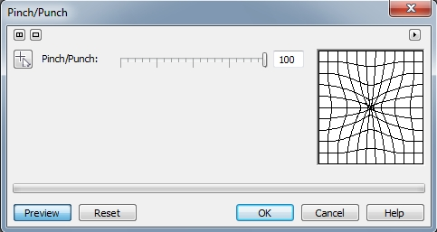

# Прочие фильтры группы 3D Effects

### Эффект Perspective (Перспектива)

Фильтр **Perspective** (Перспектива) (рис. 1) позволяет придавать изображению трехмерную глубину, как если бы оно располагалось на плоскости.

**Для применения фильтра Perspective (Перспектива):**

1\. Выполните команду **Effects > 3D Effects > Perspective** (Эффекты > Трехмерные эффекты > Перспектива).  
2\. В области **Type** (Тип) щелкните на одном из переключателей **Perspective** (Перспектива) или **Shear** (Перекос).

*   Тип **Perspective** (Перспектива) позволяет одновременно перемещать два узла по направлению к или от друг от друга.
*   Тип **Shear** (Перекос) поддерживает расстояние между двумя узлами, позволяя одновременно перекашивать изображение.

3\. Установите флажок **Best fit** (Подогнать под размер), чтобы все части изображения помещались в окне изображения.

### Эффект Pinch/Punch (Вдавливание/выдавливание)

Фильтр **Pinch/Punch** (Вдавливание/Выдавливание) деформирует изображение путем либо «вдавливания» его по направлению от наблюдателя, либо «выдавливая» его по направлению к наблюдателю. Отрицательные значения соответствуют эффекту выдавливания; положительные значения соответствуют эффекту вдавливания. Диалоговое окно фильтра **Pinch/Punch** (Вдавливание/Выдавливание) показано на рис. 2.

Для применения эффекта **Pinch/Punch** (Вдавливание/Выдавливание)

1\. Выполните команду **Effects > 3D Effects > Pinch/Punch** (Эффекты > Трехмерные эффекты > Вдавливание/Выдавливание).  
2\. Переместите ползунок **Pinch/Punch** (Вдавливание/Выдавливание) для задания интенсивности проявления эффекта.  
3\. Для изменения положения эффекта, укажите центральную точку, нажав кнопку в виде курсора с крестиком и щелкните в нужном месте окна изображения.

### Эффект Sphere (Сфера)

Эффект **Sphere** (Сфера) очень похож на эффект **Pinch/Punch** (Вдавливание/Выдавливание). С помощью обеих фильтров можно достичь практически идентичного результата. Однако фильтр **Sphere** (Сфера) деформирует изображение, как бы накладывая его на внутреннюю или внешнюю поверхность сферы. Диалоговое окно фильтра **Sphere** (Сфера) представлено на рис. 3.

Элементы управления в этом диалоговом окне такие же, как и в фильтре **Pinch/Punch** (Вдавливание/Выдавливание), однако в дополнение имеется группа переключателей **Optimaze** (Оптимизировать). Использовать переключатель **Speed** (Скорость) лучше при малых значениях параметра **Persentage** (Процент). Соответственно переключатель **Quality** (Качество) лучше использовать при больших значениях **Persentage** (Процент), что позволяет немного «компенсировать» последствия «искажения» изображения. Однако принципиального значения при малых значениях **Persentage** (Процента) выбор переключателей не имеет.

### Эффект The Boss (Бобышка)

Фильтр **The Boss** (Бобышка) создает возвышенный участок на изображении на основе краев защищенной области выделения. При работе с фильтром можно управлять шириной, высотой и гладкостью возвышенного края. Кроме того, можно управлять яркостью, резкостью, силой, направлением и углом источника света.

**Для применения трехмерного эффекта Boss (Бобышка) к краям выделения:  
**  
1\. Создайте маску в нужной области изображения.  
2\. Выполните команду **Effects > 3D Effects > The Boss** (Эффекты > Трехмерные эффекты > Бобышка).  
3\. Проделайте следующее:

*   На вкладке Edge (Край) (рис. 4) переместите ползунок **Width** (Ширина) для задания ширины скоса. Скос представляет собой область вокруг выделенного объекта, наклоненную для создания впечатления трехмерного пространства.

*   Переместите ползунок **Height** (Высота), чтобы установить глубину скоса.
*   Переместите ползунок **Smoothness** (Сглаживание), чтобы установить резкость краев скоса. Низкие значения соответствуют получению более резких краев, но могут также выявить промежуточные этапы создания рельефа. Высокие значения удаляют шероховатые края, делая их округлыми.
*   Выберите из раскрывающегося списка **Drop off** (Падение) тип: **Gaussian** (По Гауссу), **Flat** (Плоский) или **Mesa** (Плато). Область вне изображения является смежной области действия эффекта скоса.

*   На вкладке **Lightning** (Освещение) (рис. 5) переместите ползунок **Brightness** (Яркость), чтобы установить яркость бликов скоса.

*   Переместите ползунок **Sharpness** (Резкость), чтобы установить резкость бликов скоса.
*   Переместите диск **Direction** (Направление), чтобы установить направление света, падающего на скос.
*   Переместите диск **Angle** (Угол), чтобы установить угол освещения.

**Для сохранения пользовательского стиля рельефного края:**

1\. Создайте пользовательский стиль _Бобышки_ (рельефа), используя предыдущую процедуру.  
2\. Нажмите кнопку «Плюс» рядом с раскрывающимся списком **Presets** (Заготовки).  
3\. В диалоговом окне **Save Preset** (Сохранение заготовки) в поле **Save new preset** (Сохранить заготовку как) наберите имя заготовки и нажмите **ОК**.

**Для загрузки заготовки стиля Бобышки:**

1\. Создайте маску в нужной области изображения.  
2\. Выполните команду **Effects > 3D Effects > The Boss** (Эффекты > Трехмерные эффекты > Бобышка).  
3\. Выберите заготовку стиля из раскрывающегося списка **Presets** (Заготовки).

**Для удаления заготовки стиля Бобышки (рельефного края):**

1\. Создайте маску в нужной области изображения.  
2\. Выполните команду **Effects > 3D Effects > The Boss** (Эффекты > Трехмерные эффекты > Бобышка).  
3\. Выберите удаляемую заготовку стиля из раскрывающегося списка **Presets** (Заготовки).  
4\. Нажмите кнопку «Минус».  
5\. Нажмите кнопку **Да**.

Еще один элемент управления на вкладке **Edge** (Край), о котором мы не говорили – флажок **Invert** (Инвертировать). Этот флажок инвертирует созданный эффект, размещая рельефный край не снаружи выделенной области, а внутри.

### Эффект Zig Zag (Зигзаг)

Фильтр **Zig Zag** (Зигзаг) искажает изображение путем сгибания его линий, которые проходят от центра изображения к его краю. Этот эффект образует "волны" прямых линий и углов, которые, как кажется, скручивают изображение от его центра наружу. Диалоговое окно фильтра **Zig Zag** (Зигзаг) показано на рис. 6.

**Для применения эффекта Zig Zag (Зигзаг):**

1\. Выполните команду **Effects > 3D Effects > Zig Zag** (Эффекты > Трехмерные эффекты > Зигзаг).  
2\. Включите один из переключателей в области **Type** (Тип).

*   Функция **Pond Ripples** (Рябь на пруду) искажает изображение перекрывающимися концентрическими кругами.
*   Функция **Out from center** (От центра) приводит к более однородному распространению кругов по изображению, чем в случае функции **Pond Ripples** (Рябь на пруду).
*   Функция **Around center** (Вокруг центра) позволяет лучше управлять искажением.

3\. Переместите ползунок **Waves** (Волны), чтобы задать число волн.  
4\. Переместите ползунок **Strenght** (Сила), чтобы установить интенсивность, а также место появления гребней и впадин волн от искажения.  
5\. Переместите ползунок **Damping** (Затухание) вправо для уменьшения волн или влево – для увеличения. Ползунок **Damping** (Затухание) становится доступен при выборе переключателя **Around center** (Вокруг центра).

Переключатели в области **Optimize** (Оптимизировать) позволяют регулировать качество полученного результата.