# Прочие фильтры группы Distort (Искажение)

### Фильтр Swirl (Завиток)

Фильтр **Swirl** (Завиток) (рис. 1) создает закручивающийся вихрь искажения на изображении в соответствии с направлением и углом, задаваемым пользователем.

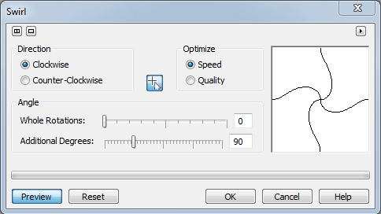

Изображение закручивается вокруг фиксированного центра в направлении по часовой или против часовой стрелки, совершая заданное целое число оборотов. Низкие значения в шкале **Whole Rotations** (Полных оборотов) приводит к появлению эффекта закручивания, а более высокие вызывает концентрический, отражательный эффект.

### Фильтр Tile (Плитка)

Фильтр **Tile** (Плитка) уменьшает размеры изображения и воспроизводит его в виде фрагментов мозаики на сетке. При перемещении ползунков **Horizontal tiles** (Плитки по горизонтали) и **Vertical tiles** (Плитки по вертикали) в диалоговом окне, вводимые значения показывают число изображений, дублированных по каждой оси. Вы можете использовать эффект **Tile** (Плитка) наряду с заливкой цветом для создания фона или получения обоев для страниц Web или рабочего стола Windows.

### Фильтры Wet Paint (Жидкая краска) и Wind (Ветер)

**Фильтр Wet Paint (Жидкая краска)**

Фильтр **Wet Paint** (Жидкая краска) (рис. 2) создает иллюзию, что изображение представляет собой еще мокрую от краски картину.

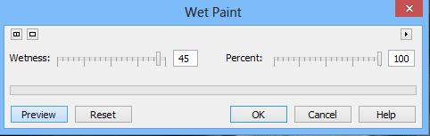

Эффекты могут быть различными и колебаться от неуловимых изменений в освещенности цветов до полос жидкой краски, стекающих по изображению. При работе с ним устанавливается процент и степень влажности. Ползунок **Percent** (Процент) управляет размером потеков. Ползунок **Wetness** (Влажность) управляет диапазоном затрагиваемых цветов. Отрицательные значения влажности определяют стекание более темных цветов, положительные стекание более светлых цветов.

**Фильтр Wind (Ветер)**

Фильтр **Wind** (Ветер) (рис. 3) размывает изображение в определенном направлении, создавая эффект ветра, дующего на изображение. При работе с ним задается направление, непрозрачность и сила воздействия ветра.

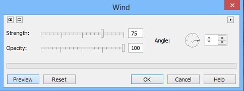

### Фильтр Whirlpool (Ворс)

Фильтр **Whirlpool** (Ворс) накладывает на изображение узор из плавных обтекающих линий. Имеется несколько готовых образцов эффектов, которые могут использоваться или настраиваться пользователем. Могут быть созданы и собственные пользовательские эффекты при помощи задания длины ворса, интервала, закручивания и нажима. Диалоговое окно фильтра **Whirlpool** (Ворс) представлено на рис. 4.

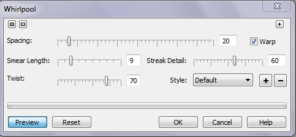

**Для применения фильтра Whirlpool (Ворс):**

1\. Выполните команду **Effects > Distort > Whirlpool** (Эффекты > Искажение > Ворс).  
2\. Переместите ползунок **Spacing** (Интервал) для задания частоты завихрений.  
3\. Переместите ползунок **Smear** Length (Длина ворса) для задания длины жидких струй. Чем длиннее ворсинка, тем более гладким будет кручение. Короткие ворсинки могут привести к появлению шума.  
4\. Переместите ползунок **Twist** (Закручивание) для управления методом кручения. Высокие значения производят эффект жидкого потока вокруг центра вращения, напоминающего водоворот, а низкие значения приводят к тому, что жидкость вырывается из закручивающихся струй в виде фонтанов.  
5\. Переместите ползунок **Streak Detail** (Детализация) для задания уровня смазывания.  
6\. Установите флажок **Warp** (Перекос) для искажения пикселей в изображении вдоль траекторий вращения.

Должен заметить, что результат применения заготовок эффектов в этом фильтре к какому-либо изображению может не вдохновить вас, т. к. частенько ничего толкового из этого не получается. Однако с помощью этого фильтра можно получить отличные текстуры для создания абстрактного фона или сделать заготовки для последующего создания заливок. Естественно, для этого надо попрактиковаться с различными настройками фильтра и с различными вариантами изображений. Плюс к этому, как это часто бывает, оригинальные результаты получаются при использовании этого эффекта в сочетании с другими фильтрами Photo-Paint.

Прежде, чем мы рассмотрим короткие примеры с применением этого фильтра, замечу, что к большому сожалению, справочная система в Photo-Paint практически не содержит сколь-нибудь полезной информации о эффектах в программе. Очень кратенькое описание и все. Никакой помощи или толковых подсказок для пользователя там нет.

Начнем с очень простого примера по созданию абстрактного фона.  
1\. Создайте новый документ. Хотя размер значения не имеет, но наверно будет правильней создать документ одинаковой высоты и ширины. Разрешение можно выбрать 96 **dpi** или выше. Цвет фона также значения не имеет.  
2\. Выберите инструмент **Fill** (Заливка), нажав клавишу **F**. На _Панели свойств_ выберите тип **Texture** (Текстура), щелкнув соответствующую кнопку. Затем щелкните на **Панели свойств** кнопку **Edit fill** (Изменить заливку). В диалоговом окне **Texture Fill** (Заливка текстурой), в раскрывающемся списке **Texture library** (Библиотека текстур), выберите вариант **Styles** (Стили). В списке **Texture list** (Список текстур) выберите текстуру **Surfaces 5C** (Поверхности – 5-цв.) (рис. 5). Щелкните **OK**. Залейте изображение.

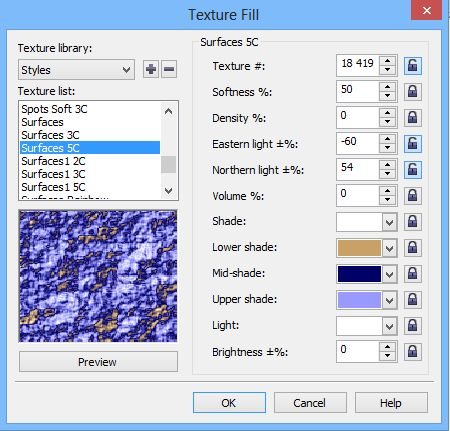

3\. Выполните команду **Effects > Distort > Whirlpool** (Эффекты > Искажение > Ворс) (рис. 6).

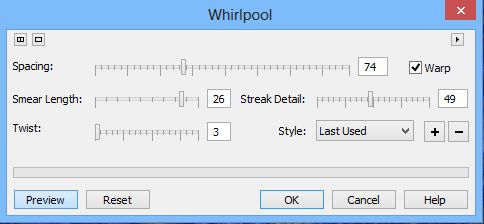

Получим вот такую текстуру (рис. 7).

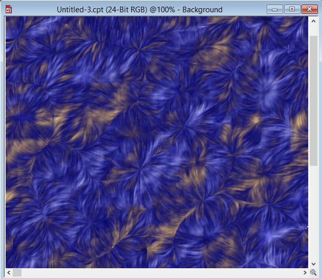

Теперь рассмотрим другой пример с использованием фильтра **Whirlpool** (Ворс).

1\. Создайте новый документ. Я выбрал размер 1000х1000 **px** и разрешение 96 **dp**i. Фон белый.  
2\. Выберите инструмент **Fill** (Заливка), нажав клавишу **F**. На _Панели свойств_ выберите тип **Texture** (Текстура), щелкнув соответствующую кнопку. Затем щелкните на _Панели свойств_ кнопку **Edit fill** (Изменить заливку). В диалоговом окне **Texture Fill** (Заливка текстурой), в раскрывающемся списке **Texture library** (Библиотека текстур), выберите вариант **Styles** (Стили). В списке **Texture list** (Список текстур) выберите текстуру **Sky 2 Colors** (2-цветное небо). А в области настройки заливки, в счетчике **Density %:** (Плотность %), установите значение 50\. Нажмите **ОК** (рис. 8).

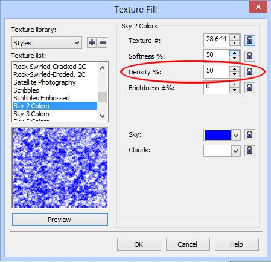

Залейте изображение.  
3\. Преобразуем изображение в оттенки серого. Для этого выполните команду **Adjust > Grayscale** (Настройка > Оттенки серого). Настройки в окне диалога оставьте по умолчанию. Конечно, можно было это сделать в окне **Texture Fill** (Заливка текстурой), но лучше все-таки с помощью фильтра **Grayscale** (Оттенки серого).  
4\. Теперь модифицируем наше изображение с помощью фильтра **Scraperboard** (Скребок). Выполните команду **Effects > Art Strokes > Scraperboard** (Эффекты > Художественные мазки > Скребок) (рис. 9).

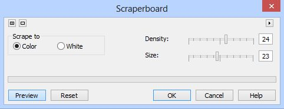

Получим в результате такое изображение (рис. 10).

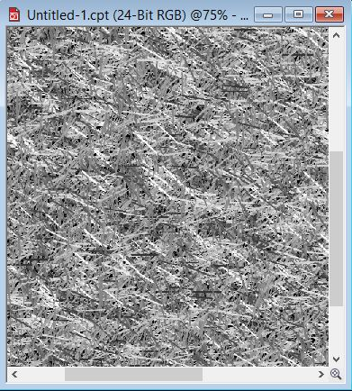

5\. Применяем фильтр **Whirlpool** (Ворс): **Effects > Distort > Whirlpool** (Эффекты > Искажение > Ворс) (рис. 11).

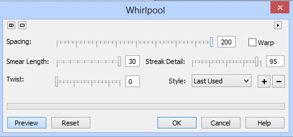

В результате получим рис. 12.

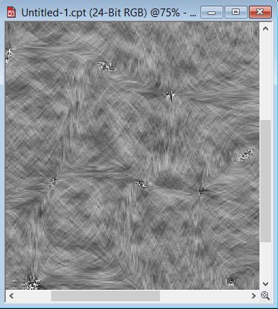

6\. Нам нужно сейчас превратить изображение из оттенков серого в цветное. Для этого воспользуемся фильтром **Hue/Saturation/Lightness** (Оттенок/Насыщенность/Яркость) (рис. 13). Обратите внимание, что переключатель в области **Channels** (Каналы), установлен в положение **Grayscale** (Оттенки серого).

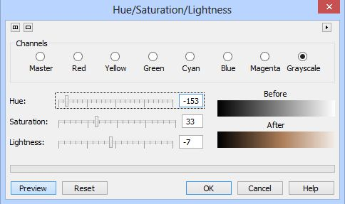

В итоге получим вот такую текстуру (рис. 14).

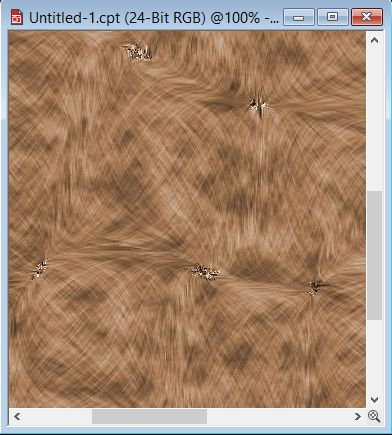

Чем-то отдаленно напоминает шерсть или какую-то ткань. Тут получились некоторые «надрывы» серого цвета, их видно на скриншоте. Т. к. изображение было уменьшено перед созданием скриншота, то аналогичные серые участки не видно, но они есть в других местах и разного размера.

Их можно удалить с помощью инструмента **Effect** (Эффект). Используйте для этих целей тип кисти – **Smear** (Смазывание). Я выбрал в раскрывающемся списке **Nib shape** (Форма кончика) мягкую кисть (рис. 15) и увеличил размер кисти до 100.

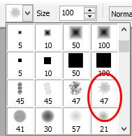

Обрабатывать такие места нужно очень осторожно, делая небольшие мазки кистью в разных направлениях. Можно по желанию и дальше модифицировать эту текстуру, но я этого делать в рамках данного раздела не буду.  
В заключение обсуждения фильтра **Whirlpool** (Ворс) скажу, что применять этот фильтр можно в самых разных ситуациях, но не забывать, что лучше всего применять его в сочетании с другими фильтрами. Кроме того, когда вы немного с ним попрактикуетесь, то заметите, что даже незначительное изменение любого из параметров, может довольно сильно сказаться на конечном результате. Но когда вы поэкспериментируете различные комбинации эффектов, то найдете весьма полезным этот фильтр.