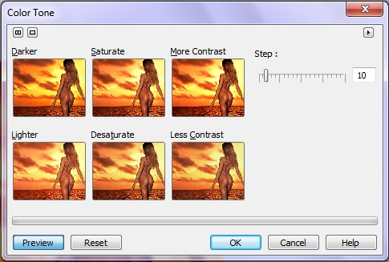

# Прочие фильтры меню Adjust (Настройка) Corel Photo-Paint

### Фильтр Color balance (Баланс цветов)

Для вызова фильтра используется команда **Adjust > Color Balance** (Настройка > Баланс цветов). Он предназначен для настройки цветового баланса изображений. Диалоговое окно состоит из двух областей. Флажки группы **Range** (Диапазон) (рис. 1) устанавливают тоновый интервал, на котором проводится балансировка цветов: тени, средние тона или света. Флажок **Preserve luminance** (Сохранять светлые области) позволяет сохранять яркости пикселов при настройке компонентов. Ползунки группы **Color channel** (Цветовой канал) управляют балансировкой цветов. Их смещение влево смещает баланс в сторону цветов **CMY**. Смещение вправо увеличивает содержание дополнительных к ним цветов **RGB**.

### Фильтры Color hue (Цветовой оттенок) и Color tone (Цветовой тон)

Я решил объединить рассмотрение этих двух фильтров в одном разделе, т. к. элементы управления в диалоговых окнах сходны. Они также имеют то сходство между собой, что их основное назначение, коррекция всего изображения. Эти фильтры практически не применяются при работе с масками и предназначены для глобальной коррекции, а не для тонкой обработки изображения.

Используйте диалоговое окно **Color Hue** (Цветовой оттенок) (рис. 2) для просмотра и применения изменений оттенка изображения с помощью набора миниатюрных копий изображения, на которых будет показан эффект применения различных цветов. Если щелкнуть по верхнему ряду миниатюр, к изображению будут применены цветовые значения **RGB** (красный, зеленый, синий), если по нижнему – цветовые значения **CMY** (голубой, пурпурный, желтый). В области настройки с помощью флажков можно задать диапазон цветовых значений, которые будут затронуты при корректировке. Чтобы не изменились значения яркости цветов, установите флажок **Preserve luminance** (Сохранять светлые области).

**Применение смещения оттенков с помощью фильтра Color Hue (Цветовой оттенок)**

1\. Выполните команду **Adjust > Color Hue** (Настройка > Цветовой оттенок).

2\. Установите флажки для задания диапазона затрагиваемых значений.

3\. Переместите ползунок **Step** (Шаг) для задания применяемого уровня цвета.

4\. Щелкните на одной из миниатюр, чтобы применить показанный на ней эффект.  
Три верхние этикетки позволяют добавить, соответственно, красный, зеленый или синий цвет, а три нижние - голубой, пурпурный или желтый.

5\. Примените дополнительные корректировки, щелкая по другим миниатюрам.

Фильтр **Color Tone** (Цветовой тон) (рис. 3) содержит набор управляющих элементов для корректировки тона, он позволяет наглядно выполнить коррекцию нажатием кнопок миниатюр примеров. Можно скорректировать яркость, насыщенность и контрастность изображения.

**Для корректировки яркости, насыщенности и контрастности:**

1\. Выполните команду **Adjust > Color Tone** (Настройка > Цветовой тон).

2\. Переместите ползунок **Step** (Шаг) для настройки интенсивности каждого изменения. Более высокие значения дают более сильный эффект.

3\. Нажмите кнопки эффектов, которые хотите применить. Результаты аккумулируются.