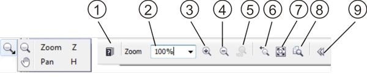

# Просмотр изображения в PHOTO-PAINT

Я не открою Америку, если скажу, что работа с масштабом изображения для удобного просмотра и редактирования — самое часто выполняемое действие при работе с изображениями. **PHOTO-PAINT**, как и аналогичные программы, предоставляет в ваше распоряжение целый ряд возможностей по изменению масштаба и просмотру изображения.

Самый простой способ изменения масштаба изображения – использование колесика мыши. Единственная особенность этого способа заключается в том, что PHOTO-PAINT увеличивая масштаб изображения, «приближает» для лучшего просмотра ту область изображения, в которой находится указатель мыши. Можно увеличивать масштаб изображения и с помощью клавиатуры, клавишей **F2**. В этом случае изображение увеличивается от центра. Для уменьшения масштаба, нажимайте **F3**.

Так же, в PHOTO-PAINT имеется инструмент **Zoom** (Масштаб), располагающийся на панели **Toolbox** (Набор инструментов).

Работа с инструментом **Zoom** (Масштаб) не вызовет у вас каких-либо затруднений. Щелчок левой кнопкой мыши увеличивает масштаб, правой — уменьшает. Панель свойств имеет в своем составе следующие кнопки:

1.  Кнопка **Help** (Справка), вызывает раздел Справки, соответствующий выбранному инструменту.
2.  Раскрывающийся список **Zoom level** (Уровень масштаба), предоставляет возможность выбора масштаба от 2 до 3200 %.
3.  Кнопка **Zoom In** (Крупнее). Нажатие этой кнопки увеличивает масштаб точно также, как и в случае использования клавиши F2.
4.  Кнопка **Zoom Out** (Мельче). Нажатие кнопки вызывает уменьшение масштаба.
5.  Кнопка **Zoom 100 %** (Масштаб 100%). Делает масштаб изображения равным 100%.
6.  Кнопка **Zoom to previous zoom level** (Предыдущий масштаб). Нажатие этой кнопки позволяет вернуться к предыдущему значению масштаба.
7.  Кнопка **Zoom to fit** (Все объекты F4). Изменяет масштаб изображения таким образом, чтобы оно полностью уместилось в окне документа.
8.  Кнопка **Zoom to print** (Масштаб для печати). Переключает значение масштаба по размеру отпечатка.
9.  Кнопка **Hide options** (Скрыть параметры). Нажатие этой кнопки приводит к скрытию дополнительных параметров на Панели свойств.

Раскрывающийся список **Zoom level** (Уровень масштаба) кроме численных значений, имеет несколько дополнительных вариантов масштабирования: **To Fit** (Уместить всю); **1 to 1** (1х1); **To Width** (По ширине); **To Height** (По высоте).

*   **To Fit** (Уместить всю) – изменяет масштаб отображения таким образом, чтобы в окне документа поместилось все изображение.
*   **1 to 1** (1х1) – размеры изображения на экране и на бумаге должны совпадать. Если вы создали какой-либо объект и установили его размер в 100 мм, то и на экране он должен иметь тот же размер. Для того чтобы добиться точного соответствия размеров в масштабе 1х1, вам следует откалибровать размеры монитора.
*   **To Width** (По ширине) – в окне документа будет видна вся ширина изображения.
*   **To Height** (По высоте) – в окне документа будет видна вся высота изображения.

Кроме кнопок на Панели свойств инструмента Zoom (Масштаб), на Стандартной панели инструментов имеется **Zoom level** (Уровень масштаба) и кнопка **Full-screen preview** (Полноэкранный просмотр). Раскрывающий список Zoom level (Уровень масштаба) идентичен тому, который имеется на Панели свойств, за исключением того, что он всегда остается доступным независимо от того, какой инструмент вы используете. Если вы хотите раскрыть изображение на весь экран, то воспользуйтесь кнопкой Full-screen preview (Полноэкранный просмотр), хотя гораздо удобнее использовать соответствующую клавишу – **F9**. Нажатие этой клавиши переведет изображение в режим полноэкранного просмотра, а повторное нажатие F9 — обратно в нормальный режим просмотра.

Еще один способ, который вы будете возможно часто использовать при работе с инструментом Zoom (Масштаб), это увеличение необходимой вам в данный момент области изображения. Для этого вам нужно просто обвести нужный участок изображения при нажатой левой кнопке мыши. Во время перетаскивания мыши, PHOTO-PAINT создаст рамку, которая облегчит выбор области для просмотра. Выбранная таким образом вами область увеличится в масштабе на все окно документа.

По достижению максимальной степени увеличения, вы увидите на экране мелкую сетку. Это – пиксельная сетка. Каждая ячейка этой сетки соответствует одному пикселю изображения.

При увеличенном масштабе отображения, когда изображение не помещается полностью в окне документа, используйте полосы прокрутки. Однако можно использовать и колесико мыши. Если вы при прокрутке колесика мыши будете удерживать нажатой клавишу **Alt**, то вместо изменения масштаба, изображение будет «прокручиваться» по вертикали, а при зажатом **Ctrl** — по горизонтали.

Для перехода к другой части увеличенного изображения воспользуйтесь инструментом **Pan** (Панорама). Переключатся между инструментами Zoom (Масштаб) и Pan (Панорама) удобнее с помощью клавиатуры. Для инструмента Zoom (Масштаб), это клавиша **Z**, а для инструмента Pan (Панорама) – клавиша **Н**. После того как инструмент Pan (Панорама) активизирован, нажмите левую кнопку мыши и, не отпуская ее, перемещайте мышь. При этом изображение будет перемещаться вслед за указателем.

И в заключение, еще один способ масштабирования изображения, для тех, кто по каким-то причинам не использует колесико мыши. Можно плавно изменять масштаб изображения при активном инструменте Zoom (Масштаб), удерживая нажатой клавишу **Alt**, нажмите левую кнопку мыши. При этом движение мыши вперед приведет к увеличению масштаба, назад – к уменьшению.