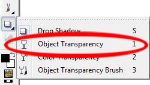
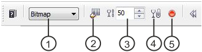
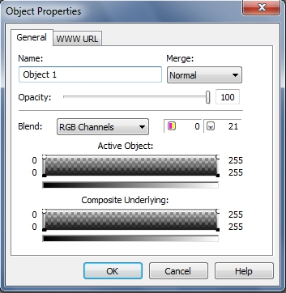
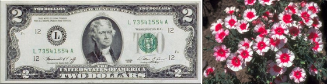
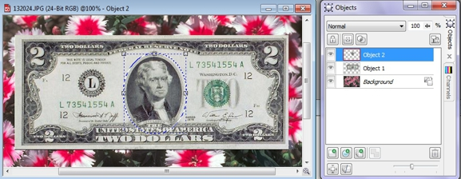
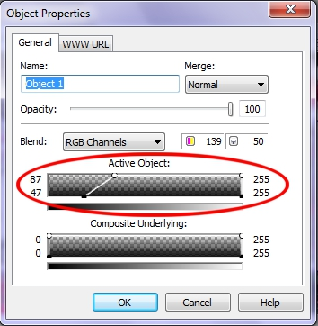
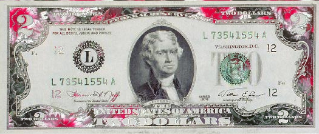

# Прозрачность объектов в PHOTO-PAINT

Для создания различных композитных изображений часто приходится манипулировать прозрачностью объектов, для создания определенных эффектов, эффекта плавного перехода одного объекта в другой и т. п. В Photo-Paint для этих целей имеется целый ряд средств. Некоторые из них мы уже рассматривали. Хотя можно сразу оговориться, что для использования прозрачности не нужно каких-то особых навыков, глубоких познаний. Конечный результат больше зависит от ваших личных предпочтений, т. е. какой вариант вы выберите сами, так конечное изображение и будет выглядеть. А управление прозрачностью в Photo-Paint пожалуй одно из наиболее несложных действий.

Самый простой способ изменить прозрачность всего объекта, это настроить прозрачность всего объекта в докере **Objects** (Объекты) с помощью параметра **Opacity** (Непрозрачность), о котором мы говорили в [главе V](http://cdrpro.ru/node/2822). И хотя об этом параметре мы говорили вскользь, рассматривать его подробно нет особого смысла, т. к. с ним все предельно просто и вы сами немного поэкспериментировав с ним, поймете где и как его использовать, и на что он влияет. Однако применять этот параметр приходится не так уж и часто, т. к. он влияет на весь объект, а обычно приходится изменять прозрачность в определенных частях объекта или по его краям. Единственно, что я напомню, так это, что значения параметра меняются от 0 до 100\. Значение 100 соответствует полной непрозрачности объекта, а значение равное 0 делает объект совершенно прозрачным.  
А сейчас мы познакомимся с другими инструментами Photo-Paint, позволяющими придать объекту прозрачность. В Photo-Paint их два и еще одно, менее очевидное средство, о котором мы поговорим в этом разделе, но чуть ниже.

### Инструмент Object Transparency (Прозрачность объекта)

Инструмент **Object Transparency** (Прозрачность объекта) находится на панели **Toolbox** (Набор инструментов), в группе инструментов **Interactive/Transparency Tools** (Инструменты интерактивной прозрачности) (рис. 1).

Этот инструмент оказывает влияние на прозрачность всего объекта. Он имеет некоторое сходство с командой **Fill** (Заливка) из меню **Edit** (Правка). _Панель свойств_ этого инструмента (рис. 2) также позволяет выбрать тип прозрачности из раскрывающегося списка **Fill type** (Тип заливки).

1\. Раскрывающийся список **Fill type** (Тип заливки) – позволяет выбрать тип заливки применяемый к объекту и в то же время выбрать тип прозрачности.  
2\. Кнопка **Edit fill** (Изменить заливку) – позволяет редактировать заливку в соответствующих диалоговых окнах. Кнопка становится активной при выборе в раскрывающемся списке типов заливок **Bitmap** (Растр) или **Texture** (Текстура).  
3\. Счетчик **Transparency** (Прозрачность) – позволяет задать степень (значение) прозрачности объекта.  
4\. Кнопка **Apply to clip mask** (Применить для маски обрезки) – изменяет прозрачность не затрагивая сам объект. О масках обрезки будет рассказано ниже в этой главе.  
5\. Кнопка **Apply changes** (Применить изменения) – используется для применения изменений, настроенных с помощью параметров _Панели свойств_.

Элементы управления на _Панели свойств_ и их назначение весьма очевидны, однако раскрывающийся список **Edit fill** (Изменить заливку) несколько специфичен, особенно если учесть его название. На самом деле, в этом списке задается не тип заливки, а тип прозрачности (раньше этот список так и назывался) и лишь последние два пункта имеют отношение к заливке. Сам инструмент также носит на мой взгляд, не совсем правильное название. Наверно было бы правильно назвать его _Интерактивной прозрачностью объекта_.

Этот инструмент используется для слияния (перетекания) объекта с фоном или с другим объектом, другими словами, можно использовать перетекание прозрачности. Эту процедуру можно применить сразу к нескольким объектам. Она выполняется поочередно для всех выделенных объектов, в соответствии с их положением относительно выбранных начальной и конечной точек. Можно выбрать различные формы перетекания прозрачности, например, линейную, радиальную, коническую и текстурную.

**Для слияния объекта с фоном:**

1\. Выделите один или несколько объектов.  
2\. На панели **Toolbox** (Набор инструментов), в группе инструментов **Interactive/Transparency Tools** (Инструменты интерактивной прозрачности) выберите инструмент **Object Transparency** (Прозрачность объекта).  
3\. В _Панели свойств_ в раскрывающемся списке **Fill type** (Тип заливки) выберите форму перехода. Этот тип прозрачности и будет применен к объекту при слиянии его с фоном.  
Над объектом (объектами) появится путь перехода с начальной и конечной точками. Начальная точка обозначается квадратом, конечная - стрелкой.  
4\. Установите уровень прозрачности для начальной и конечной точек заливки, выделив нужную точку и установив нужное значение в счетчике **Transparency** (Прозрачность).  
По умолчанию уровень прозрачности начальной точки устанавливается на 0 (полностью непрозрачно), а конечной - на 100 (полностью прозрачно).  
5\. Скорректируйте переход прозрачности, выполнив одну или обе описанные ниже операции:  
Буксируйте начальную и конечную точки в другие позиции. Перетекание прозрачности будет изменяться в соответствии с каждым изменением позиций этих точек.  
Нажмите на кнопку мыши в той позиции, где должна быть начальная точка, и буксируйте туда, где хотите поместить конечную точку. После этого переход прозрачности будет обновлен.  
6\. Если вы удовлетворены результатом, нажмите кнопку **Apply changes** (Применить изменения) на _Панели свойств_ или выберите другой инструмент.

Начальная и конечная точки могут располагаться в любом месте изображения, не обязательно на объекте. В любом случае, реальное изменение прозрачности можно увидеть только в границах объекта.

### Инструмент Object Transparency Brush (Кисть прозрачности объекта)

Этот инструмент полезно использовать в том случае, когда вам нужно более точно контролировать процесс применения прозрачности, имеется ввиду случай, когда вам нужно сделать прозрачной определенную часть объекта. Применение этого инструмента было рассмотрено в примере выше, в этой главе.  
Этот инструмент также находится на панели **Toolbox** (Набор инструментов), в группе инструментов **Interactive/Transparency Tools** (Инструменты интерактивной прозрачности). _Панель свойств_ этого инструмента напоминает «гибрид» между _Панелью свойств_ инструмента _Кисть_ и _Панелью свойств_ инструмента **Object Transparency** (Прозрачность объекта). Поэтому мы не будем останавливаться на подробном описании этого инструмента, т. к. его элементы управления идентичны тем, которые нам уже встречались ранее в других инструментах.  
Немного поэкспериментировав с этим инструментом, вы найдете его достаточно легким и очень удобным в использовании.

### Управление прозрачностью с помощью диалогового окна Object Properties (Свойства объекта)

В Photo-Paint имеется еще одно средство управления прозрачностью. Однако оно находится в несколько неочевидном месте и имеет довольно замысловатый вид и элементы управления. Однако оно достаточно гибкое и позволяет достичь интересных результатов и получать интересные эффекты.  
Чтобы получить доступ к этому средству, в докере **Objects** (Объекты), выделите объект и щелкните на нем правой кнопкой мыши. В открывшемся меню выберите пункт **Properties** (Свойства). В результате чего откроется диалоговое окно **Object Properties** (Свойства объекта). Мы частично уже рассматривали это окно в [главе V](http://cdrpro.ru/node/2822). Однако там я только вскользь упомянул о нем. Теперь мы рассмотрим его подробнее, а точнее его вкладку **General** (Общие) (рис. 3). Часть элементов управления не требует особого разъяснения, это поле **Name** (Имя) и раскрывающийся список **Merge** (Слияние), а также ползунок **Opacity** (Непрозрачность). В частности, этот же элемент управления имеется в самом докере **Objects** (Объекты).  
Назначение остальных элементов управления этого диалогового окна не столь очевидно при первом взгляде.

Как видно из рисунка, в этом диалоговом окне имеется два «замысловатых» элемента управления: **Active Object** (Активный объект) и **Composite Underlying** (Совмещение изображений).  
Вот как раз эти элементы управления и позволяют управлять прозрачностью объекта или может даже лучше было бы сказать, слиянием или переходом одного объекта в другой.  
Оба эти элемента управления имеют по четыре управляющих точки, расположенных по углам серых прямоугольников.

Вы можете использовать оси Х (управляющие точки) графиков **Active Object** (Активного объекта) и **Composite Underlying** (Совмещения изображений) чтобы указать значения для пикселей объекта на шкале от 0 (черный) до 255 (белый). Значения по оси Y указывают значения прозрачности пикселей от 0 (прозрачный) до 100 (непрозрачный). Пиксели _Активного объекта_ выпадающие за пределы указанного диапазона скрыты, таким образом пиксели нижележащего объекта становятся видимыми.

Кроме управления прозрачностью всего объекта, можно определить прозрачность пикселей определенного канала, выбрав нужный канал из раскрывающегося списка **Blend** (Доля). Чтобы лучше понять действие элементов управления этого окна, рассмотрим пример.  
Давайте создадим симпатичный «цветочный доллар». Для этого используем два исходных изображения – изображение доллара и изображение цветов (рис. 4).

Исходное изображение доллара меньше, чем изображение с цветами (на рисунке цветы были уменьшены). Это то, что нам подходит.  
1\. Выделите доллар любым инструментом выделения. Я использовал инструмент **Rectangle Mask** (Прямоугольная маска).  
2\. Скопируйте выделенный доллар в Буфер обмена и затем вставьте в изображение с цветами. Теперь, вставленный доллар виден в докере **Objects** (Объекты), т. к. Photo-Paint вставил его, как объект. Переместите доллар так, чтобы он расположился желаемым образом, т. е. над нужной частью изображения цветов.  
Наша задача – сделать прозрачными темные области доллара, там, где на нем узор. Однако нам нужно предотвратить применение прозрачности к портрету по центру банкноты.  
3\. Для этого выделите портрет. Можно использовать инструмент **Ellipse Mask** (Эллиптическая маска) и сделать маску не соблюдая большой точности. Если вы выделите немного больше, чем сам портрет, ничего страшного.  
4\. Создадим из выделенной области объект: **Object > Create > Object: Copy Selection** (Объект > Создать > Объект: Копировать выделение). В докере **Objects** (Объекты) теперь два объекта (рис. 5).

5\. Щелкните в докере **Objects** (Объекты) на объекте – доллар, чтобы выделить его. Затем щелкните на нем правой кнопкой мыши и выберите пункт **Properties** (Свойства). В открывшемся диалоговом окне **Object Properties** (Свойства объекта) перетащите верхнюю левую управляющую точку элемента вправо, пока значение параметра не станет равным 87\. Далее перетащите левый нижний маркер вправо, до значения 47 и щелкните **ОК** (рис. 6).

Пара слов о том, что мы только что сделали. Т. к. нам нужно было сделать прозрачными темные части изображения доллара, то поэтому мы и выбрали левые управляющие точки, которые соответствуют пикселям со значениями от 0 и выше. Кроме этого, нас интересовал только объект-доллар, поэтому нам достаточно было изменить значения только в элементе управления **Active Object** (Активный объект).  
6\. Теперь соединим объекты с фоном. Выполните команду **Object > Combine > Combine All Objects With Background** (Объект > Объединить > Объединить все объекты с фоном).  
7\. И последний шаг – обрезка изображения по размеру доллара. Полученный результат показан на рис. 7.

