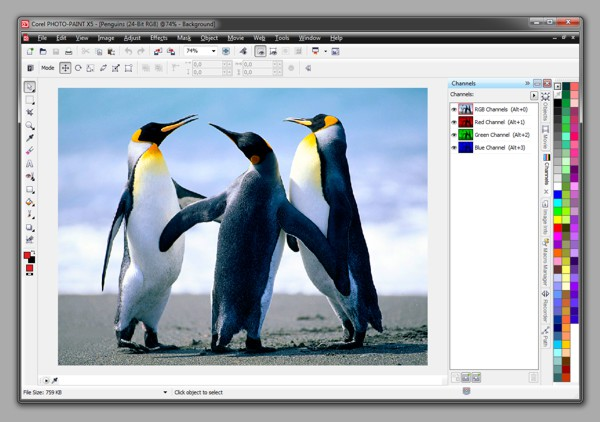

Книга по Corel PHOTO-PAINT X5
=======

**CorelDRAW Graphics Suite Х5** предназначен для работы с растровыми и векторными иллюстрациями, и включает несколько самостоятельных приложений, каждому из которых отведена своя роль. Они могут использоваться как по отдельности, так и совместно. Все программы, входящие в состав пакета, имеют удобный и легкий в освоении интерфейс.

Данная книга является попыткой заполнить огромный пробел, который возник в результате практически полного отсутствия, на нашем рынке, книг по **Corel PHOTO-PAINT**. Есть достаточно много книг описывающих пакет CorelDRAW Graphics Suite, в которых дается краткое описание возможностей PHOTO-PAINT и принципы работы с ним, но этого не всегда достаточно, особенно для начинающих пользователей и тех, кто хочет научиться на практике использовать возможности этого замечательного продукта от **компании Corel**.

Конечно, в одной книге невозможно описать все возможности Corel PHOTO-PAINT, а так же способы применения различных инструментов этой программы. Поэтому, о некоторых из них упоминается лишь вскользь. Однако, была сделана попытка раскрыть как можно больше возможности этой программы. Основное внимание уделено описанию и практическому применению тех инструментов и фильтров, с которыми пользователям приходится работать чаще всего.

Включенные в книгу примеры и иллюстрации, помогут освоить и применять на практике возможности, которые предоставляет нам графический редактор **Corel PHOTO-PAINT Х5**.

_Автор: Воронин Александр Петрович   
Редакция: Александр (aka Sancho)   
Лицензия: CC-BY-NC-ND 4.0 International_

_**Исходный код книги:**   
[github.com/cdrpro/book-pp](https://github.com/cdrpro/book-pp)_

Последнюю версию книги можно найти по адресу: [cdrpro.ru/links](http://cdrpro.ru/links/)   
[Читать онлайн](https://cdrpro.gitbooks.io/pp-book/content/).
