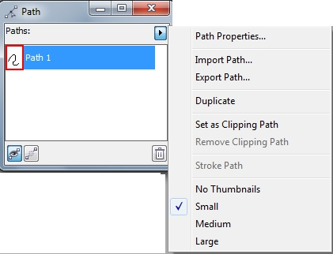
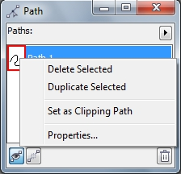
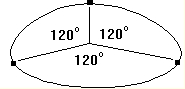
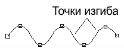
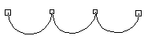

# Редактирование и использование путей в PHOTO-PAINT

### Докер Path (Путь)

Помимо _Панели свойств_ и команд меню, инструмент **Path** (Путь) имеет свой докер, предоставляющий доступ к некоторым дополнительным командам. Хотя в самом докере практически отсутствуют элементы управления и сам он выглядит весьма скромно, все же в меню докера имеются команды, доступные только в нем. Докер **Path** (Путь) и его меню представлены на рис. 1.

Как видно из рисунка, с помощью меню докера вы можете выполнить _**Импорт**_ и _**Экспорт**_ пути, дублировать путь или сделать мазок кисти вдоль пути.  
Кроме этого вы можете менять размер миниатюр в докере или отключить их отображение вообще, выбрав команду **No Thumbnails** (Нет эскизов).

Помимо команд меню самого докера, вы можете получить доступ к контекстному меню пути, щелкнув на нем в докере правой кнопкой мыши (рис. 2). В контекстном меню вы также найдете команду для дублирования пути. С помощью этого же меню, вы можете удалить путь, если он вам в работе больше не нужен.

Команда **Properties** (Свойства) в контекстном меню, является аналогом команды **Path Properties** (Свойства пути) из меню докера. Выбор и той и другой команды приводит к появлению диалогового окна **Path Properties** (Свойства пути), в котором имеется одно единственное поле **Path Name** (Имя пути), где вы можете присвоить пути необходимое название, вместо стандартного **Path 1** (Путь 1).  
Команды меню докера **Import Path** (Импортировать путь) и **Export Path** (Экспортировать путь) приводят к появлению одноименных диалоговых окон. Вы можете выбрать файл для загрузки его, как пути при импорте или сохранить путь в другом формате файла – при экспорте.

### Редактирование пути

Редактирование путей несложно. Все инструменты редактирования путей расположены на _Панели свойств_.  
Существует много способов редактирования пути. Можно криволинейные сегменты преобразовать в прямолинейные и обратно, добавить, удалить и преобразовать узлы, разбить путь на два, соединить и разъединить узлы, перемещать сегменты, узлы и управляющие точки. Благодаря этой гибкости всегда можно придать пути необходимую форму.

### Добавление и удаление узлов пути

Добавление узлов необходимо в тех случаях, когда перемещением существующих узлов не удается придать пути требуемую форму. Удаление узлов необходимо для того, чтобы избавиться от связанных с ними нежелательных углублений или выступов на пути.  
Существуют три эмпирических правила для определения необходимости добавления или удаления узлов.  
Для кривых, изгибающихся в одном направлении, необходимо по одному узлу на каждые 120 градусов (рис. 3).

Для кривых с гладким изменением направления изгиба необходимо по одному узлу, по крайней мере, на каждые две точки, в которых меняется направление изгиба (рис. 4).

Для кривых с резкими изменениями изгиба (с изломами) необходимо по острому узлу на каждый излом (рис. 5).

**Добавление к пути одного узла**

Добавление узлов полезно при изменении формы пути, особенно в тех случаях, когда существующие сегменты, узлы и управляющие точки не позволяют получить необходимый результат.

Для добавления узла к пути:

1\. Выберите инструмент **Path** (Путь) на панели **Toolbox** (Набор инструментов), в группе инструментов **Shape Tools** (Фигура).  
2\. На _Панели свойств_ щелкните на кнопке **Shape** (Фигура).  
3\. Щелкните на узле, находящемся на конце сегмента, на котором предполагается поместить новый узел.  
4\. Щелкните на кнопке **Add node** (Добавить узел).  
Посредине выбранного сегмента появится новый узел.

**Добавление к пути нескольких узлов одновременно**

1\. Выберите инструмент **Path** (Путь) на панели **Toolbox** (Набор инструментов), в группе инструментов **Shape Tools** (Фигура).  
2\. На _Панели свойств_ щелкните на кнопке **Shape** (Фигура).  
3\. Выберите узлы, между которыми необходимо добавить новые узлы, для чего нужно щелкнуть на каждом из них при нажатой клавише **Shift**.  
4\. Щелкните на кнопке **Add node** (Добавить узел).  
Посредине каждого выбранного сегмента добавится по узлу. Новые узлы также будут выбраны.  
5\. Еще раз щелкните на кнопке **Add node** (Добавить узел) для повторного добавления узлов посредине каждого выбранного сегмента.

**Удаление узла**

Удаление близко расположенных узлов и сегментов помогает упростить сложные пути. Их следует удалять также для сглаживания нежелательных выступов.

Для удаления узла:

1\. Выберите инструмент **Path** (Путь) на панели **Toolbox** (Набор инструментов), в группе инструментов **Shape Tools** (Фигура).  
2\. На _Панели свойств_ щелкните на кнопке **Shape** (Фигура).  
3\. Щелкните на узле.  
4\. Щелкните на кнопке **Delete node** (Удалить узел).

Положение удаляемого узла определяет изменение формы кривой.  
Используя множественный выбор узлов, можно удалить несколько узлов сразу.

### Соединение узлов и разбиение пути

Для замыкания незамкнутого пути или для объединения двух физически отдельных компонентов пути может потребоваться соединить узлы.  
Разбиение пути может потребоваться для превращения замкнутого пути в незамкнутый или для разделения пути на отдельные части, чтобы, например, затем обвести их кистью.

**Разбиение пути**

Разбить путь можно только в узле. Если необходимо разбить путь в точке, где нет узла, сначала добавьте узел. При разбиении пути в месте, где находится соответствующий узел, добавляется еще один узел. До тех пор, пока один или оба эти узла остаются на прежнем месте, они перекрываются.

Для разбиения пути:

1\. Выберите инструмент **Path** (Путь) на панели **Toolbox** (Набор инструментов), в группе инструментов **Shape Tools** (Фигура).  
2\. На _Панели свойств_ щелкните на кнопке **Shape** (Фигура).  
3\. Щелкните на узле, находящемся в том месте, где необходимо разбить путь.  
4\. Щелкните на кнопке **Break node** (Разъединить узел).

**Соединение двух узлов**

Соединяемые узлы должны находиться на свободных концах сегментов пути. При соединении отстоящих друг от друга узлов соединение происходит в точке, находящейся посредине между ними.

Для соединения двух узлов:

1\. Выберите инструмент **Path** (Путь) на панели **Toolbox** (Набор инструментов), в группе инструментов **Shape Tools** (Фигура).  
2\. На _Панели свойств_ щелкните на кнопке **Shape** (Фигура).  
3\. Выберите для соединения два узла.  
4\. Щелкните на кнопке **Join nodes** (Соединить узлы).

### Изменение типа узлов и сегментов

Перемещение, добавление и удаление узлов не всегда достаточно для придания пути необходимой формы. И инструмент **Path** (Путь) и _Панель свойств_ предоставляют дополнительные средства преобразования прямолинейных сегментов в криволинейные и обратно, а также средства для изменения типа узлов.

**Типы узлов**

Узлы бывают трех типов: сглаженные, симметричные и острые.

У сглаженных узлов две управляющие точки и собственно узел лежат на прямой. При этом управляющие точки могут располагаться на различных расстояниях от узла. Сглаженные узлы используются в том случае, когда необходимо гладкое сопряжение смежных сегментов пути. Узел, соединяющий два прямолинейных сегмента, не может быть сглаженным.  
У симметричных узлов управляющие точки и собственно узел также лежат на прямой линии, но расстояния от управляющих точек до узла одинаковые. Этим обеспечивается одинаковый изгиб по обе стороны узла. Симметричные узлы следует использовать в тех случаях, когда необходима одинаковая кривизна сегментов в окрестности узла.  
У острого узла можно перемещать управляющие точки и независимо изменять соединяющиеся в узле сегменты. Острые узлы используются для формирования острых выступов и изломов пути.  
После преобразования узла, соединяющего криволинейный и прямолинейный сегменты, в сглаженный узел можно перемещать управляющую точку на стороне криволинейного сегмента только вдоль воображаемой прямой, содержащей прямолинейный сегмент. У сглаженного узла угол между отрезками управляющих точек всегда составляет 180 градусов, но длину этих отрезков можно регулировать независимо.

**Изменение типа узла**

При изменении типа узла изменяется поведение присоединенных к нему сегментов в процессе изменения формы пути. Сразу после смены типа узла форма пути может измениться не очень заметно. Отличие проявится при перемещении управляющих точек. За один раз можно изменить тип нескольких узлов.

Для изменения типа узлов:

1\. Выберите инструмент **Path** (Путь) на панели **Toolbox** (Набор инструментов), в группе инструментов **Shape Tools** (Фигура).  
2\. На _Панели свойств_ щелкните на кнопке **Shape** (Фигура).  
3\. Щелкните на узле (или узлах).  
4\. Щелкните на одной из кнопок **Sharp curve** (Резкая кривая), **Smooth curve** (Сглаживание кривой) или **Symmetrical curve** (Симметрическая кривая) на _Панели свойств_.

**Изменение типа сегмента на прямолинейный или криволинейный**

При создании пути каждый раз выбирается тип изображаемых сегментов: одни сегменты рисуются прямолинейными, другие криволинейными. При изменении формы пути можно изменить тип любого криволинейного сегмента на прямолинейный и наоборот. За один раз можно изменить тип нескольких сегментов.

Для изменения типа сегмента на прямолинейный или криволинейный:

1\. Выберите инструмент **Path** (Путь) на панели **Toolbox** (Набор инструментов), в группе инструментов **Shape Tools** (Фигура).  
2\. На _Панели свойств_ щелкните на кнопке **Shape** (Фигура).  
3\. Щелкните на одном или нескольких узлах, лежащих на сегментах, тип которых требуется изменить.  
4\. Щелкните на одной из кнопок **To line** (К линии) или **To curve** (К кривой).

Если была выбрана кнопка **To curve** (К кривой), то вид прямолинейного сегмента не изменяется. Однако если выбрать узел на любом конце сегмента, появятся управляющие точки, свидетельствующие, что сегмент стал криволинейным.

### Использование путей

Теперь, когда известно как создаются пути, как они перемещаются, как изменяется их форма, посмотрим, как это все делается в реальной ситуации. При этом станет понятным, когда целесообразно использовать пути.

**Создание масок из путей**

Есть две ситуации, в которых может понадобиться создать выделение из пути. Когда нужно сформировать выделение со сложной рамкой, бывает легче сформировать путь, а затем превратить его в рамку выделения, чем использовать для ее создания инструмент _Выделение кистью_ или редактировать выделение после использования инструментов _Лассо_ или _Волшебная палочка_.  
Для создания маски из созданного пути выполните команду **Mask > Create > Mask from Path** (Маска > Создать > Маска из пути) или щелкните на _Панели свойств_ кнопку **Mask from Path** (Маска из пути).

**Создание мазка кисти из пути**

Corel Photo-Paint позволяет обвести кистью по форме пути. Любые инструменты Photo-Paint: кисть, эффект, Ластик, Заменитель цвета и Распылитель объектов – могут быть использованы и настроены для обвода пути и создания на изображении мазков прецизионно точной формы.

**Обвод пути мазком кисти**

Команда **Repeat Brushstroke** (Повторить мазок кисти), находящаяся в меню **Edit** (Правка), позволяет сохранять мазки кисти и их атрибуты для последующего использования. Сохраненные мазки кисти могут быть повторены вдоль пути. Заданное число повторений мазка равномерно распределяется вдоль пути. Можно задать угол между мазком и направлением пути, установить использование накопленных углов, масштабировать сохраненный мазок, задать вариацию размера мазков, накладываемых на путь и накладывать мазки по касательной к пути. При накладывании мазков на путь можно также использовать вариацию цвета. Подробности об использовании команды **Repeat Brushstroke** (Повторить мазок кисти) см. в [главе IV](../Komanda-Repeat-Brushstroke-Povtorit-mazok-kisti-v-Corel-PHOTO-PAINT/index.md).

Однако перед использованием команды **Repeat Brushstroke** (Повторить мазок кисти), необходимо создать путь, затем на панели **Toolbox** (Набор инструментов) выбрать инструмент _Кисть_ и выполнить команду **Object > Edit Path > Brushstroke from Path** (Объект > Редактировать путь > Мазок кисти из пути). В диалоговом окне **Repeat Stroke** (Повтор мазка) выберите команду **Add Last Tool Stroke** (Добавить последний мазок), чтобы сохранить мазок для использования его в будущем.

Пример применения инструмента **Path** (Путь), см. [здесь](http://cdrpro.ru/node/3006).