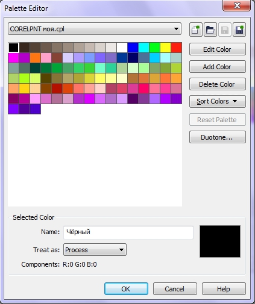

# Редактор палитры в Corel Photo-Paint

В Corel Photo-Paint для создания новых и редактирования существующих палитр используется **Palette Editor** (Редактор палитр). Для вызова редактора выполните команду **Window > Color Palettes > Palette Editor** (Окно > Цветовые палитры > Редактор палитр). С помощью **Редактора** вы можете получить доступ ко всем инструментам управления цветом в палитре. Рассмотрим элементы управления **Редактора палитр**.

В верхней части окна, в раскрывающемся списке, вы можете выбрать одну из сохраненных вами цветовых палитр. Набор кнопок справа от списка позволяет создать, открыть или сохранить палитру, либо сохранить ее под другим именем или в другой папке.

Для реализации дополнительных сервисных функций, кроме перечисленных, **Редактор палитры** имеет ряд кнопок:

*   **Edit Color** (Изменить цвет) – вызывает окно диалога **Select Color** (Выбор цвета), в котором вы можете изменить выбранный вами цвет. Работа с окном **Select Color** (Выбор цвета) будет описана в книге ниже;
*   **Add Color** (Добавить цвет) – вызывает то же самое окно **Select Color** (Выбор цвета), но в этом случае в палитру добавляется новый цвет;
*   **Delete Color** (Удалить цвет) – удаляет из палитры выбранный вами цвет;
*   **Sort Color** (Сортировать цвета) – раскрывает список позволяющий отсортировать цвета в палитре по одному из признаков перечисленных в этом списке;
*   **Reset Palette** (Сброс палитры) – возвращает палитру к исходному состоянию;
*   **Duotone** (Двухцветное) – открывает диалоговое окно **Duotone** (Двухцветный), в котором вы можете синтезировать цвета в модели **Grayscale** (Оттенки серого).

В **Редакторе палитр** вы можете изменить порядок следования цветов в палитре. Для этого в области просмотра перетащите мышью цветовую ячейку на новое место. В поле **Name** (Имя), вы можете присвоить имя выбранному цвету. Это очень удобно. Если вам не нравится отображение числовых значений компонента цвета вместо названий, как это реализовано в палитре по умолчанию, вы можете присвоить имя и тогда при наведении указателя мыши на палитре, будет отображаться название.

В области **Selected Color** (Выбранный цвет) кроме просмотра образца выбранного вами цвета, можно видеть числовые значения компонентов. Причем эти значения отображаются в той цветовой модели, в которой создана палитра. В этой же области в списке **Treat as** (Рассматривать как), вы можете указать, как Photo-Paint будет интерпретировать выбранный цвет, как плашечный или триадный.