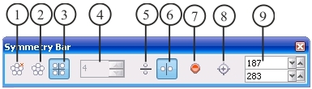
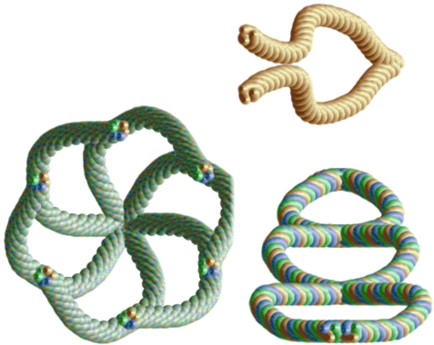

# Рисование симметричных линий в Corel PHOTO-PAINT

PHOTO-PAINT имеет дополнительный режим рисования – создание симметричных линий. Для доступа к этому режиму щелкните правой кнопкой мыши на любой панели инструментов. В контекстном меню выберите пункт **Symmetry Bar** (Шкала симметрии). Появится панель инструментов **Symmetry Bar** (Шкала симметрии) с элементами управления симметричным рисованием (рис. 1). Почему в русской версии эта панель называется _Шкала симметрии_, конечно остается загадкой.

При использовании режима _Симметрии_, при рисовании линий, PHOTO-PAINT создает точно такие же линии, расположенные симметрично относительно центра симметрии. Как только вы активизируете рисование в режиме Симметрии, появится точка дублирующая движение указателя мыши и симметрично ему расположенная. В зависимости от выбранного вами вида Симметрии, автоматически создаваемые линии будут расположены симметрично относительно вертикальной или горизонтальной оси или создаваться радиально. При выборе Радиальной симметрии, точки дублирующие поведение указателя мыши, будут расположены радиально, т. е. по окружности, радиус которой определяется интерактивно (автоматически), в зависимости от расстояния указателя мыши от центра симметрии. Панель инструментов **Symmetry Bar** (Шкала симметрии) включает в себе следующие элементы управления:

1\. Кнопка **No Symmetry** (Без симметрии) – отключает рисование в режиме симметрии.  
2\. Кнопка **Radial Symmetry** (Радиальная симметрия) – включает режим Радиальной симметрии.  
3\. Кнопка **Mirror Symmetry** (Зеркальная симметрия) – активизирует режим Зеркальной симметрии, предоставляя доступ к режимам Вертикального и Горизонтального отражения.  
4\. Счетчик **Radial Points** (Радиальные точки) – задает количество точек дублирующих движение указателя мыши. Становится доступным при включении режима **Radial Symmetry** (Радиальная симметрия).  
5\. Кнопка **Vertical Mirror** (Вертикальное отражение) – включает режим симметрии относительно горизонтальной оси.  
6\. Кнопка **Horizontal Mirror** (Горизонтальное отражение) – включает режим симметрии относительно вертикальной оси.  
7\. Кнопка **Reset Symmetry** (Сброс симметрии) – отключает режим Симметрии и сбрасывает параметры к настройкам по умолчанию.  
8\. Кнопка **Set Symmetry Center** (Установка центра симметрии) – позволяет интерактивно, с помощью мыши задать центр симметрии.  
9\. Группа счетчиков **Symmetry Center Point** (Точка центра симметрии) – позволяет задать координаты центра симметрии.

На рис. 2 показаны примеры изображений созданных с помощью инструмента **Image Sprayer** (Распылитель) в различных видах режима _Симметрии_.

