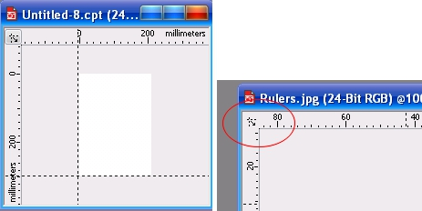
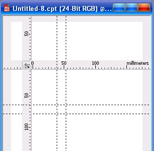
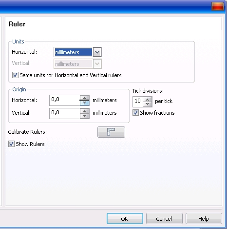
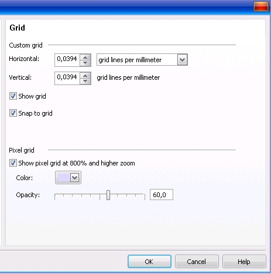
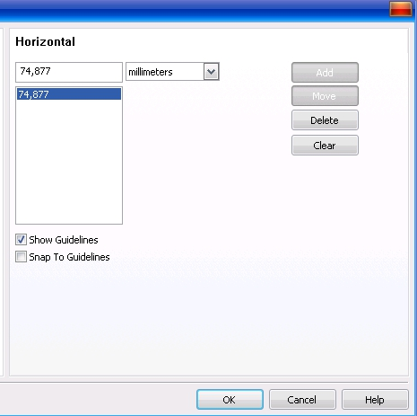

# Сетка, линейки и направляющие в Corel PHOTO-PAINT

В отличие от CorelDRAW, где линейки отображаются по умолчанию и это вполне понятно, в PHOTO-PAINT они отключены. Однако во время работы может возникнуть необходимость иметь какой-нибудь ориентир, например, при создании фигур одинаковых размеров или расположенных на одной линии. Для этих целей в PHOTO-PAINT, как и в CorelDRAW служат линейки, сетка и направляющие. Если вы уже работали в CorelDRAW, то использование и настройка этих элементов не вызовет вопросов и затруднений, т. к. они практически одинаковы в обеих приложениях, и вы можете пропустить изучение этого раздела. Если же вы никогда не занимались настройкой этих элементов или мало знакомы и с CorelDRAW и с PHOTO-PAINT, тогда эта информация для вас будет полезной.

Отображение и скрытие сетки или линеек на экране выполняется весьма просто. Просто выберите в меню **View** (Вид) одну из команд (или все) **Rulers** (Линейки), **Grid** (Сетка) или **Guidelines** (Направляющие). При выборе любой из этих команд, в меню **View** (Вид) появится флажок напротив выбранной команды. Чтобы отключить линейки, сетку или направляющие, нужно выполнить команду еще раз, при этом флажок в меню будет сброшен. В отличие от CorelDRAW, в PHOTO-PAINT вы не можете увидеть в Строке состояния координаты указателя мыши или размер рисуемой вами линии или например, прямоугольника. Ориентиром в этом случае являются маленькие серые пунктирные черточки на линейках, соответствующие текущему положению мыши и перемещающиеся по линейкам вслед за указателем. По умолчанию начало координат расположено в верхнем левом углу листа, в отличие от CorelDRAW, где начало координат приходится на нижний левый угол.

Однако, вы можете установить начало координат по своему усмотрению в любом месте окна изображения. Для этого достаточно мышей перетащить кнопку находящуюся на пересечении линеек (рис. 1 справа) в новое место. Во время перетаскивания точки пересечения линеек появится две пунктирные линии, пересечение которых соответствует началу координат (рис. 1 слева). Кроме этого, вы можете не только задать новое начало координат, но и переместить линейки на новое место, для удобства работы с ними (рис. 2). Для этого перед началом и во время перетаскивания точки пересечения линеек, нажмите и удерживайте нажатой клавишу **Shift**. Во время перетаскивания появятся двойные пунктирные линии соответствующие контурам линеек, что делает наглядным и контролируемым размещение линеек в нужном месте. Этот процесс напоминает чем-то перемещение линеек на кульмане или чертежной доске. Кроме этих предварительных настроек, PHOTO-PAINT предоставляет вам доступ к дополнительным настройкам линеек. Открыть диалоговое окно для настройки линеек можно несколькими способами: щелкнуть правой кнопкой мыши на линейке и в меню выбрать команду **Ruler Setup** (Настройка линейки); сделать двойной щелчок на линейке или с помощью команды **Tools > Options** (Инструменты > Параметры). В первых двух случаях, диалоговое окно **Options** (Параметры) сразу откроется на странице **Ruler** (Линейка). При открытии этого диалогового окна через меню **Tools** (Инструменты), нужно сначала в левой части окна перейти к разделу **Document** (Документ), а потом щелкнуть на значке в виде знака «**+**». И потом щелкнуть на странице **Ruler** (Линейка).

Страница **Ruler** (Линейка) диалогового окна **Options** (Параметры) показана на рис. 3\. В области **Units** (Единицы измерения), вы можете задать единицы измерения, разные для каждой из линеек или одинаковые для обеих. Раскрывающиеся списки **Horizontal** (По горизонтали) и **Vertical** (По вертикали) позволяют задать единицы измерения для горизонтальной и вертикальной линеек соответственно. Флажок **Same units for Horizontal and Vertical rulers** (Одинаковые единицы для обеих линеек) отвечает за то, будут ли для обеих линеек применяться одни и те же единицы измерения. При установленном флажке, раскрывающийся список **Vertical** (По вертикали) становится недоступным.

В области **Origin** (Начало координат) вы можете определить расположение нового начала координат, установив необходимые значения в счетчиках **Horizontal** (По горизонтали) и **Vertical** (По вертикали). Справа от этой области расположен счетчик **Tick divisions** (Деления через), в котором вы можете указать, сколько делений линейки будет между цифрами на ней. По умолчанию установлено значение 10, что соответствует 10 делениям на линейке между цифрами. Изменение масштаба не оказывает влияния на количество делений. Например, если вы увеличите масштаб и на линейке соседними числами будут 10 и 20 мм, то между ними будет 10 делений, уменьшив масштаб в два раза, соседними числами станут 20 и 40 мм, но количество делений останется прежним – 10\. Изменится при этом только цена деления. Флажок **Show fractions** (Дробная часть) позволяет показывать на линейках не только целые значения, но и дробные, например, 10 ½ мм. Дробная часть появляется на линейке только при большом увеличении. Отображение дробной части зависит также от единиц измерения. Например, при выборе в качестве единиц измерения сантиметров, дробная часть появится при меньшем увеличении, чем при выборе за единицу измерения миллиметров.

В нижней части страницы **Ruler** (Линейка) расположен флажок **Show Rulers** (Показывать линейки), название которого говорит само за себя. При установленном флажке, линейки отображаются, при сброшенном – нет. Кнопка **Calibrate Rulers** (Калибровка линеек) открывает диалоговое окно с линейками на весь экран. Врядли вам придется когда-нибудь их калибровать. Калибровка выполняется для соответствия размеров линейки на экране, размерам реальной линейки. Это делается, если вы хотите, чтобы 1 мм экранной линейки и самого экрана был равен 1 мм обычной линейки.

Кроме линейки, для удобства выравнивания и позиционирования объектов в PHOTO-PAINT предусмотрена сетка. Сетка – это пересекающиеся непечатаемые линии. Для отображения сетки в окне изображения, выполните команду **View** (Вид) **> Grid** (Сетка). В отличие от линейки, доступ к настройкам сетки можно получить только через меню **Tools > Options** (Инструменты > Параметры). В левой части диалогового окна **Options** (Параметры) перейдите к разделу (Доку-мент), а потом щелкните на значке в виде знака «**+**». А потом щелкните на странице **Grid** (Сетка). На странице **Grid** (Сетка) (рис. 4) имеется две области: **Custom grid** (Настраиваемая сетка) и **Pixel grid** (Сетка пикселей). В области **Custom grid** (Настраиваемая сетка), в раскрывающихся списках можно выбрать варианты для настройки интервала между линиями сетки – расстояние между линиями сетки, либо количество линий сетки на единицу измерения, а с помощью счетчиков **Horizontal** (По горизонтали) и **Vertical** (По вертикали) задать значение для выбранного вами варианта.

Установка флажка **Show grid** (Показывать сетку) выводит сетку на экран, что аналогично команде **View** (Вид) **> Grid** (Сетка), сброс флажка отключает отображение сетки. Флажок **Snap to grid** (Привязывать к сетке), включает режим привязки к узлам сетки. Включить и отключить привязку к сетке можно также с помощью команды **View > Snap To > Grid** (Вид > Привязывать к > Сетке).

В области **Pixel grid** (Сетка пикселей) вы можете включить или отключить отображение пиксельной сетки с помощью флажка **Show pixel grid at 800% and higher zoom** (Показывать сетку пикселей с масштабом 800% и выше). В пиксельной сетке, каждая клетка соответствует одному пикселю. С помощью ползунка **Opacity** (Непрозрачность) можно задать степень прозрачности линий сетки. Чем выше значение, тем более отчетливо видна сетка. В этой же области вы можете выбрать цвет линий сетки в раскрывающемся списке **Color** (Цвет).

Кроме страницы **Grid** (Сетка), настройки сетки имеются на странице **Display** (Монитор) диалогового окна **Options** (Параметры). В раскрывающемся списке **Color** (Цвет) выберите цвет, а с помощью кнопок **Grid Style** (Стиль сетки) выберите тип сетки: сплошную, пунктирную или в виде точек.

В PHOTO-PAINT, так же как и в CorelDRAW предусмотрена возможность использования направляющих. Направляющие – это вспомогательные непечатаемые линии. Однако в отличие от CorelDRAW, в PHOTO-PAINT нет наклонных направляющих и нет возможности повернуть направляющую на какой-либо угол. Для отображения направляющих выполните команду **View > Guidelines** (Вид > Направляющие), а для включения привязки – **View > Snap To > Guidelines** (Вид > Привязывать к > Направляющие). Создать направляющие можно двумя способами. Первый, с помощью линеек (линейки, естественно, должный быть видны), а второй с помощью диалогового окна **Options** (Параметры). Чтобы установить направляющую в нужном месте, включите отображение линеек и перетащите вертикальную или горизонтальную линейку, удерживая нажатой левую кнопку мыши, внутрь окна изображения. Во время перетаскивания мыши появится линия. В нужном месте отпустите кнопку мыши и направляющая будет установлена в этом месте. Направляющую можно переместить в другое место с помощью мыши. По умолчанию, активная направляющая отображается красной пунктирной линией, а неактивная синей. Когда направляющая активна, ее можно удалить, нажав клавишу **Delete**.

Для установки и настройки направляющих с помощью диалогового окна, выполните команду **Tools > Options** (Инструменты > Параметры). В диалоговом окне **Options** (Параметры), в разделе **Document** (Документ) находится подраздел **Guidelines** (Направляющие). Здесь находится две страницы **Horizontal** (По горизонтали) (рис. 5) и **Vertical** (По вертикали).

Обе страницы имеют идентичные элементы управления, поэтому мы рассмотрим только страницу **Horizontal** (По горизонтали). Верхнее поле служит для задания положения направляющих. Ниже находится список уже существующих направляющих. Раскрывающийся список служит для выбора единиц измерения координаты направляющей. В правой части находится ряд кнопок для управления направляющими. Кнопка **Add** (Добавить) служит для добавления новой направляющей. Чтобы ее добавить, нужно сначала в поле задать координату новой направляющей, только тогда кнопка **Add** (Добавить) становится активной. Для перемещения направляющей на новое место, нужно выделить направляющую в списке, а в поле вверху, изменить координату и нажать кнопку **Move** (Переместить). Для удаления направляющей, выделите ее в списке и нажмите кнопку **Delete** (Удалить). Кнопка **Clear** (Очистить) удаляет все направляющие. Флажки **Show Guidelines** (Показывать направляющие) и **Snap To Guidelines** (Привязывать к направляющим) служат для отображения направляющих и привязки к ним соответственно. На странице **Vertical** (По вертикали) эти флажки отсутствуют. После завершения настроек, чтобы изменения вступили в силу, нажмите **ОК**.